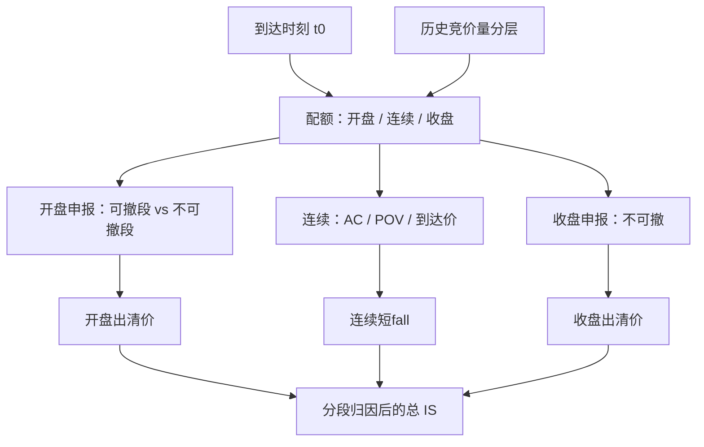

# 开盘/收盘竞价执行

    
集合竞价把一段时间的申报收成一个出清价与一笔同时刻成交；执行问题从「沿连续簿选速率」变成「在不可逐笔改价的匹配里提交多少量、以什么价格保护」，连续模型的 $v_t$ 在这里没有定义。

    <footer>—— 《上海证券交易所交易规则（2026 年修订）》对开盘、收盘集合竞价的规定；对照美股开盘 / 收盘拍卖与 MOC/LOC 实务</footer>

[上一课](/quant/participation-cap)把每桶 $v$ 限制在市场成交的 $p_{\max}$ 以内，使冲击留在校准区，并以完成时间为代价。缺口是开收盘集合竞价：那里没有沿簿扫描的 $v$，只有申报量与限价。连续最优轨迹在 9:25 或 14:57「离散化成市价」是范畴错误。本课写母单有多少应进开盘、多少进连续、多少进收盘，以及如何评价相对到达价的缺口。不重推 $p_{\max}$ 的分母口径。后课冰山默认已经分清连续速率与一次性出清。

## 问题

母单在 $t_0$ 到达，可能早于开盘、盘中或接近收盘。开盘集合竞价（上交所 9:15–9:25，其中 9:20 后不可撤）产生开盘价；收盘集合竞价（14:57–15:00，不可撤）产生收盘价。连续时段另有价格笼子。把连续最优轨迹在 9:25 或 14:57「离散化成市价」是范畴错误：竞价里没有沿簿扫描的 $v$，只有申报量与限价（或市价申报按规则转成的保护）。问题是：竞价的预期成交量、预期冲击与信息含量，与连续时段如何权衡。

收盘附近市场成交占全日很大一块，指数基金、ETF 申赎、风险预算日终对齐都会挤进来。把收盘当「免费深度」会在拥挤日付出永久冲击；完全避开收盘又可能在连续浅簿上付更多临时冲击，且跟踪指数的组合会留下收盘跟踪误差。开盘则叠隔夜信息：到达价若是昨日收盘，开盘竞价的缺口含隔夜跳空，不应记成算法冲击。

### 可撤与不可撤把博弈分成两段

A 股开盘 9:15–9:20 可报可撤，虚拟参考价与匹配量可见；9:20 后只能报不能撤。执行状态机必须分节：前半段的申报是可逆报价，后半段是承诺。把连续限价的「随时可撤」直觉带进后半段，会造成无法取消的过量。收盘三分钟同样不可撤。美股收盘拍卖的截止与不平衡信息公布时点不同，但「信息公布之后再提交」与「必须在截止前锁定」的权衡同构。规则细节以交易所现行条款为准，回测必须按生效日切换。

开盘价优先由集合竞价产生，不等于你在 9:25 的申报一定成交。量超过可匹配侧、或限价未触及出清价，就会剩到连续。完成率要按竞价规则模拟，不能按「市价一定全成」记账。

## 方法

把一日拆成三段库存：开盘竞价配额 $q_{\mathrm{o}}$、连续 $q_{\mathrm{c}}$、收盘竞价 $q_{\mathrm{e}}$，$q_{\mathrm{o}}+q_{\mathrm{c}}+q_{\mathrm{e}}=Q$（未完成另计）。配额可以静态（例如收盘不超过预期收盘量的 $p_{\mathrm{auc}}$），或随到达时刻变化：盘中到达则 $q_{\mathrm{o}}=0$；接近 14:57 则提高 $q_{\mathrm{e}}$ 或接受未完成。预期竞价量用历史同时段份额，指数调整日、期货交割日单独分层，不能用普通日均值。

限价：保护价应落在涨跌幅与有效申报范围内，并相对虚拟参考价或前收留出可成交余量。过紧的限价降低冲击也降低完成率；市价型申报把冲击交给出清价。评价用竞价成交价相对**该段决策参照**：开盘腿相对开盘前可观察的参考（前收或集合期间虚拟价，须事先指定），收盘腿相对 14:57 前的连续中点，而不是相对早盘到达价把隔夜与全日时机一锅炖。总 IS 仍可相对 $t_0$ 的 $M_0$ 加总，但归因要拆段。

$$
C=\underbrace{q_{\mathrm{o}}(P_{\mathrm{o}}-M_{\mathrm{o}}^{\mathrm{ref}})}_{\text{开盘段}}+\underbrace{C_{\mathrm{cont}}}_{\text{连续到达价}}+\underbrace{q_{\mathrm{e}}(P_{\mathrm{e}}-M_{\mathrm{e}}^{\mathrm{ref}})}_{\text{收盘段}}+\text{未完成}.
$$

连续段仍可用 AC / POV，但须在竞价开始前结束连续申报，避免两处同时承诺同一库存。T+1 下当日开盘买入不能当日收盘卖出作为回转，多空与对冲腿要按可回转工具拆开，见 [T+1](/quant/cn-tplus1)。

### 不平衡信息改变的是条件期望，不是免费期权

竞价过程中的虚拟未匹配量、美股的 imbalance feed，是公开状态。把它当作「一定要把不平衡的方向吃掉」没有依据：不平衡可以持续到出清，也可以被后至申报翻面；9:20 后 A 股不可撤，后至申报的博弈更硬。执行上允许的用法是：把公开不平衡当作条件变量，调整**自己尚未承诺**的配额与限价，并承认估计误差。不允许的是用虚假申报去制造不平衡再撤销——A 股不可撤时段本身限制了这类手法，连续时段与可撤时段的申报必须是真实交易意向。研究文献用不平衡预测开盘价，属于价格发现，不是执行虐待。

参与率在竞价里应改写为 $q/Q_{\mathrm{auc}}$，即自己申报量占预期（或实现）竞价量的比例，与连续 $p_{\max}$ 分开设。实现竞价量在成交前未知，只能用预测；预测误差使真实占比随机，应在历史日上报告该比例的分位数，而不是只报目标。

## 机制

集合竞价的机制是需求与供给曲线的一次性相交，成交价最大化成交量（及规则规定的次级键）。冲击表现为：你的申报移动出清价，对所有在该价成交的人共同发生，而不是沿队列逐笔走阔。因此边际冲击依赖于交叉弹性，大单在竞价里可能比连续更「便宜」或更「贵」，取决于有多少反向自然流。指数收盘、ETF 申赎创造一大块相对无弹性的同向流，供给曲线变陡，校准于普通日的竞价冲击会失效。

价格发现机制：隔夜信息在开盘竞价集中释放，买卖双方用申报揭示意愿。你的量参与发现，也承受发现的波动。把开盘腿做小，是把发现风险留给连续；做大，是在信息尚未被中点吸收时成交。没有免费的「等开盘后再说」——连续第一笔已经是发现后的价格，到达若在开盘前，延误已经发生。

### 与连续最优执行如何拼接

OW 的弹性在竞价里不适用：没有连续恢复的 $D_t$，只有累积申报。AC 的 $v_t$ 在竞价桶应换成块 $q_{\mathrm{auc}}$。工程拼接：连续段用体积时钟的到达价算法，在竞价前把库存降到 $Q-q_{\mathrm{auc}}$；竞价段用块优化，目标含预期出清冲击与未成交滚入下一连续或次日的成本。终端块若正碰上收盘竞价，OW / AC 的「期末清扫」应翻译成收盘申报，而不是 14:56 的连续市价再加一笔竞价——后者双付冲击。

指数与 ETF 的「必须收盘价成交」是跟踪误差约束，不是冲击最小。执行应单独报告跟踪误差与 IS，避免用贴住收盘价来掩盖相对到达价的巨大缺口。

## 边界与工程取舍

科创板、主板、基金、可转债的涨跌幅与有效申报范围不同，状态机要按品种。盘中临停复牌插入另一次集合竞价，配额表要有节点。美股、港股、A 股的不平衡披露与撤单规则不同，同一套「拍卖算法」不能跨市场复制参数。没有历史竞价逐笔申报时，只能用成交价与量做粗冲击曲线，识别弱于连续 L2。

不要用全日 VWAP 评价收盘腿：收盘量大，贴 VWAP 很容易，却可能相对 14:50 的到达价亏损。不要在样本内搜开盘/收盘比例使夏普最大。核对：分段短fall、竞价完成率、真实 $q/Q_{\mathrm{auc}}$ 分位数、指数日单独表、以及「若把收盘配额改为连续 POV」的对照。涨跌停锁定日竞价可能无反向盘，应允许放弃并记录制度未完成。

虚拟参考价是行情揭示，不是成交保证。回测用最终开盘价当所有开盘申报的成交价，会高估完成率、低估限价未成交。能用申报日志就用申报日志。

## 小结

- 开收盘竞价是一次性出清，执行变量是配额与限价，不是连续速率 $v_t$。
- A 股须按可撤 / 不可撤分段；完成率由匹配规则决定，不能按市价全成假设。
- 冲击与参与率应相对预期竞价量定义，并与连续 $p_{\max}$ 分开；指数日单独校准。
- 总缺口可相对到达价加总，归因必须拆开隔夜、连续与收盘参照。
- 公开不平衡用于条件调整未承诺的量，不是把竞价当成可操纵的价格工具。
- 出处：《上海证券交易所交易规则（2026 年修订）》第 3.4、3.5、4.1 条及深交所对应规则；连续最优执行对照 Almgren and Chriss, 2000/2001；拍卖流动性与收盘集中见执行与指数再平衡的市场结构研究。
