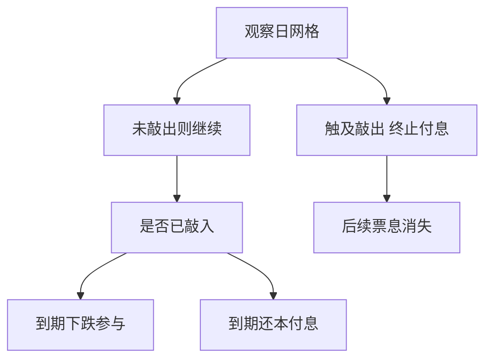

# 自动赎回 autocallable

自动赎回是离散观察上的敲出：碰到上沿就终止并支付票息，否则继续；下跌侧再叠加敲入，就变成雪球一类的零售结构。

<footer>—— 障碍与离散观察见 Broadie, Glasserman and Kou；结构分解见结构票据实务，对照境内雪球收益凭证</footer>

[上一课](/quant/cliquet-forward-start)的重置仍让合约活到最后一段。Autocallable 的缺口是**提前终止**：观察日若 $S_{t_i}\ge B_{\mathrm{out}}$，合约结束，支付本金加票息。境内雪球在此之上再加敲入看跌，前沿课 [雪球结构与定价](/quant/snowball-pricing) 已经写过完整三条终局。本课只补课程序列上的位置：把 autocall 当一般机制，与雪球条款对齐，不把雪球公式再推一遍。

## 问题

没有敲入的纯 autocall（「凤凰」一类）近似：持有债券，卖出一串离散上障碍的敲出权，用票息当期权费。有敲入则再卖一份向下敲入看跌。问题是观察网格、票息是否记忆（memory / catch-up）、以及是否允许「已敲入仍可敲出」。这些条款改变的是路径集合，不是把票息贴现成债券收益率。

把 autocallable 当 cliquet，漏掉终止：后面观察日的票息在已敲出路径上不存在，Vega 期限结构在近端观察日堆得更尖。把 autocallable 当连续障碍，漏掉离散漏检，监控课已经警告过。

### 票息是或有的，不是 coupon strip

记忆条款：若本次未敲出但上次也未付息，可能把未付票息累加到下一次敲出。这使支付依赖整段观察历史，状态要包括「已累计未付票息」与「是否已敲入」。PDE 维度立刻上去，实务以 [蒙特卡洛](/quant/mc-pricing) 为主。不要用连续 Reiner–Rubinstein 八公式去估每月观察的 autocall。

发行人在敲出日终止，切断的是投资者剩余的上侧与时间价值。票息高往往对应敲入近、挂钩高波指数、或观察稀疏。用历史敲出频率去外推票息兑现率，忽略了卖出时隐波已经把未敲出路径标贵。

## 方法

在合约列出的观察日 $\{t_i\}$ 上检查敲出；敲入按日收盘或连续，以条款为准。风险中性期望对：敲出停时的票息与本金、到期未敲出未敲入的票息、到期已敲入的下跌参与，分别贴现。模型用与香草一致的局部波动或混合，并对照随机波动——autocall 对远期偏斜与缺口（跳空越过障碍）敏感。离散观察的连续性修正可当快速报价，生产仍应在真实网格上模拟。

对冲：观察日前的数字/障碍 Gamma、敲入后的 Delta 跳变、以及票息的利率与融资。发行人侧的希腊值见 [雪球发行人的对冲](/quant/snowball-dealer-hedging)，本课不重写交易台流程。

## 机制

每条路径在观察网格上被吸收或继续。活着的路径集合随时间缩小（已敲出的不再贡献），又可能在敲入后改变支付类型。价值对 $B_{\mathrm{out}}$ 附近的密度几乎是一触即付，对 $B_{\mathrm{in}}$ 附近是敲入看跌。因此 autocallable 的隐波风险是**障碍点上的数字风险 + 剩余期限的香草风险**，不能收成一个 ATM Vega。

## 边界

跳空、停牌、涨跌停使「收盘是否触及」与连续路径不一致，合同必须定义用哪一个价。多标的最差表现（worst-of）autocall 把相关变成一等风险，篮子课的符号在这里是：相关下降，worst-of 更易敲入、更难一起敲出，结构更便宜（对卖方更贵）。不要用单资产闭式去估 worst-of。

适当性、不得宣传保本、柜台衍生品规范是约束。本课不讨论如何改写条款以绕过适当性。

## 小结

- Autocallable 是离散敲出加可选敲入；票息是或有期权费，不是债券 coupon。
- 状态含观察历史、已敲入与记忆票息；生产估值用合约网格上的模拟。
- 雪球是该类在境内的常见包装，细节不在本课重复推导。
- 出处：离散障碍修正见 Broadie, Glasserman and Kou, *Mathematical Finance*, 1997；结构分解见雪球与结构票据实务。
