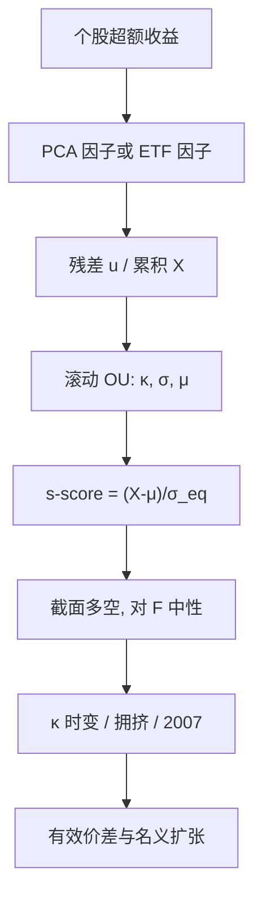

# Avellaneda-Lee 统计套利

    
用 PCA 或 ETF 抽掉收益里的共同因子，把个股残差建成 Ornstein–Uhlenbeck，用标准化分数做多空；残差的回复速度与波动都随时间变，策略在 2003–2007 前半强、危机前后结构改写。

<footer>—— Avellaneda & Lee, Statistical Arbitrage in the US Equities Market, Quantitative Finance, 2010</footer>

Avellaneda 与 Lee（AL）给出一条从截面因子到可交易残差的完整链，对象是短持有的统计套利，不是 [GGR](/quant/ggr-pairs) 那种 6 个月距离配对。PCA / SVD 的分解步骤在 [PCA 统计套利](/quant/pca-stat-arb) 里写过；本篇写**这篇 Quantitative Finance 论文作为系统**：s-score 怎么从 OU 来、ETF 因子与统计因子如何对照、他们如何处理 2007 年前后的参数时变，以及它与距离法在持有期、容量与拥挤上的差别。把 AL 简化成「做 PCA 再做空残差」，会丢掉原文真正的工程命题——残差过程不稳定。

## 问题

个股日收益的大部分方差是市场、行业与风格。GGR 用价格路径的邻近来回避估计这些因子，代价是把共同趋势留在价差里。AL 问的是另一面：若主动把共同方向抽掉，剩下的特异收益是否仍有可交易的负自相关，半衰期以日计而不是以月计。这把策略从「中期相对价值」推进到「残差流动性供给」，换手上升、对成本更敏感，也更直接暴露在量化账户的拥挤里。

他们同时试验两类 $F_t$：收益矩阵的主成分，以及行业 / 风格 ETF 的收益。问题不是哪一类在全样本夏普上赢，而是：可交易因子（ETF）是否能在样本外更稳地定义残差，统计因子是否在未命名冲击上反应更快。Khandani 与 Lo 记录的 2007 年 8 月说明，许多「正交残差」会在几天内变成同一个组合。AL 把参数时变写成核心风险，而不是脚注。

### s-score 不是普通滚动 Z-score

残差 $X_t$（累积特异收益或去均值后的水平）被建成

$$
dX_t=\kappa(\mu-X_t)\,dt+\sigma\,dW_t,
$$

均衡标准差 $\sigma_{\mathrm{eq}}=\sigma/\sqrt{2\kappa}$，交易分数

$$
s=\frac{X-\mu}{\sigma_{\mathrm{eq}}}.
$$

用 $\sigma_{\mathrm{eq}}$ 而不是样本 $\mathrm{sd}(X)$，是为了让不同半衰期的名字可比：慢回归的对有更大的均衡波动，同样的绝对偏离对应更小的 $s$，更少开仓。这与 [Z-score 开仓](/quant/zscore-entry) 里 GGR 的形成期固定 $\sigma$ 不同。$\kappa$ 接近零时 $\sigma_{\mathrm{eq}}$ 爆炸，$s$ 塌掉——原文把这当成拒绝近单位根的自动闸门。若改用短窗标准差把信号「救回」，等于关掉这道闸。

AL 的开平阈值（如 $|s|>1.25$ 开、回落到 $0.5$ 平，具体以他们文中设定为准）是工程选择，不是从无套利推出来的最优停时。成本上升时应加宽，不能把 2010 年文中的数字当成当前最优。

## 方法

日频流程可以收成四步。第一，在滚动窗口上对超额收益做 PCA，或对一组 ETF 回归，得到载荷 $\hat\beta_i$ 与残差 $u_{it}$。第二，对 $u_i$ 的累积和估 AR(1) / OU，得到 $\hat\kappa_i,\hat\sigma_i,\hat\mu_i$。第三，算 $s_{it}$，在截面上做多 $s$ 过负阈值、做空 $s$ 过正阈值的名字，并对 $F$ 中性。第四，用有效价差与参与率约束把名义压到可执行区域。ETF 版本的对冲可以用 ETF 本身完成，冲击路径有名字；PCA 版本要对载荷做跨期对齐，否则因子旋转制造无意义换手。

他们报告策略在样本前半（大约 2003 起至危机前）表现强，此后残差回归变弱、波动结构变。复制若输出一个全样本夏普，等于把不可重复的一段电子化做市红利写成永续边缘。正确的报告是分段、并在 2007 年 8 月这类窗口上单独列亏损与随后的反转。成本必须按残差策略的换手来，而不是借用 GGR 的「单边 8 bp、持有数月」。

### ETF 因子与 PCA 因子的分工

ETF 因子：可交易、可解释、对冲透明，残差里会混进 ETF 自身的溢价折价与申赎摩擦，见 [ETF 套利](/quant/etf-arb)。行业分类若与 ETF 产品线不一致，残差会留下未被 ETF 张成的行业动量。PCA 因子：跟未命名冲击快，但没有名字，滚动窗口下特征向量符号与旋转需要对齐（Procrustes 或对上期回归）。$K$ 的选择在风险模型里可以用 Bai–Ng；在 AL 里 $K$ 太大会把残差洗白，$K$ 太小会把行业留在 $u_{it}$ 里。原文同时跑两条，是承认没有唯一正确的 $F$，而不是让你每年切换到样本内更好的那条。

把高方差主成分反向交易不是 AL。AL 交易的是正交补上的均值回归；做空市场因子是另一类风险溢价赌注，拥挤结构完全不同。

## 机制

残差负自相关可以来自过度的特异订单流（库存逆转）、指数再平衡的临时冲击、非同步交易。抽掉 $F$ 之后，短持有多空近似在做截面上的流动性供给，与 [短期反转](/quant/short-term-reversal) 同族，中性化更干净。一旦残差的主导交易者变成同类 AL 账户，拥挤使残差正自相关：亏损引发同步平仓，平仓推动残差沿亏损方向走，$\kappa$ 变号。2007 年 8 月是这一机制的实现，不是「PCA 算错了」。

与 GGR 的机制对比。GGR 的利润可以来自数月尺度的相对价格回归与事件日差异化反应，容量约束在两腿 ADV 上。AL 的利润来自数日尺度的残差回归，容量约束在「中性化之后仍要买卖的特异腿」上：同样美元利润需要更大名义，因为残差波动小于原始收益。拥挤名单也不同：GGR 是形成期末那 20 对；AL 是当时 $s$ 最极端的一批名字，每天在变，但模型高度相似的账户仍会撞车。

### 参数时变是策略的一部分

$\kappa_t,\sigma_t$ 随波动体制与拥挤变。用过去 60 日估 OU，是在赌参数慢变。波动上升时 $\sigma_{\mathrm{eq}}$ 变大，$|s|$ 回落，策略自动减仓——这是一种顺周期的风险缩放。危机里若残差动量化，减仓可能仍不够，因为开着的仓会在 $s$ 维持极端时继续亏。AL 没有提供一个在 $\kappa$ 变号时仍然有效的交易规则；他们提供的是对这种现象的文档。工程上应把「残差截面相关从 0 升到 $\rho$」写成压力情景，而不是只在样本内特异相关为零时估杠杆。

## 边界与工程取舍

Quantitative Finance 2010 的样本与成本属于当时美股电子化做市环境。其后做市利润压缩、ETF 因子可交易性上升、残差策略拥挤，都改变了同一条链的净边缘。不要把文中夏普写成可部署数字。A 股涨跌停会截断残差、扭曲 SVD 载荷；融券约束让 $s>0$ 的空头腿经常缺席，截面中性只存在于信号文件里。

不要把风险 PCA 的 $K$ 直接当 AL 的 $K$。不要在因子重估日用跳变的 $s$ 开仓而不做对齐。不要用收盘 $s$ 在同一根 K 线成交。与 [PCA 统计套利](/quant/pca-stat-arb) 的分工：那篇写分解与正交补；本篇写 AL 作为带 OU 分数、ETF 对照与危机文档的交易系统。两者都不是「全市场残差都能做市」的许可证。篮子上的局部 PCA 见 [篮子 PCA 残差](/quant/pca-residual-basket)。

s-score 的估计误差在短窗口上很大。截面上同时对 $N$ 只股票估 $N$ 套 OU，极端 $s$ 会被估计噪声推高。应用 ADV 与估计不确定度做截断，而不是过线就等权满仓。

## 小结

- Avellaneda–Lee 用 PCA 或 ETF 定义残差，用 OU 的均衡波动标准化成分数再做多空；交易对象是正交补，持有期以日计。
- s-score 在 $\kappa\to 0$ 时自动关机；改用短窗标准差救回信号，会关掉这道近单位根保险。
- ETF 因子可对冲、有名字；PCA 跟得快但载荷旋转制造换手。原文同时跑两条，不是让你切换到样本内赢家。
- 2007 年类拥挤使正交残差同步移动；参数时变是核心风险，全样本夏普不可部署。
- 出处：Avellaneda and Lee, *Quantitative Finance*, 2010；量化平仓见 Khandani and Lo；方法分解见本站 [PCA 统计套利](/quant/pca-stat-arb)。
