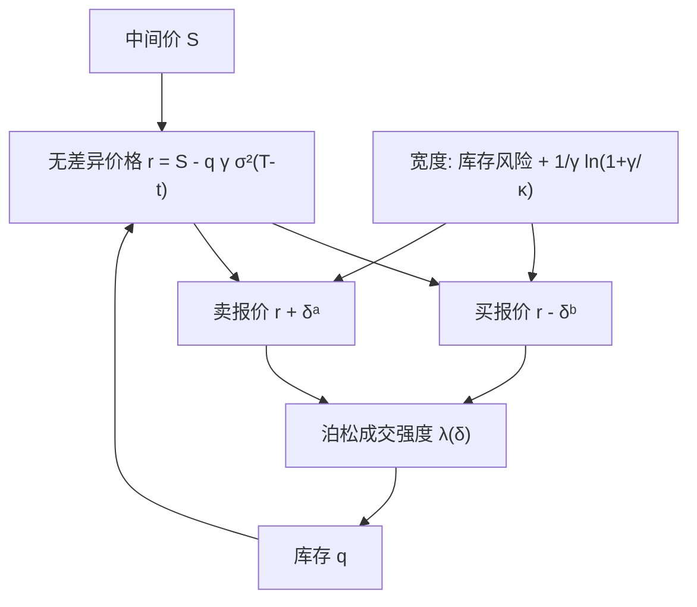

# Avellaneda-Stoikov

做市商的最优买卖报价围绕一条随库存偏移的无差异价格；价差补偿库存的扩散风险，也补偿限价单被市价单捡走的强度，目标是指数效用下终端财富与库存的权衡，而不是预测下一笔的方向。

<footer>—— Avellaneda and Stoikov, High-frequency trading in a limit order book, Quantitative Finance, 2008</footer>

[上一课](/quant/smart-order-routing)把母单配额分配到场所与订单类型，目标是条件期望下的执行质量；合成最优报价是输入，不是可执行对象——路由解决的是「去哪成交」，不是「挂多宽、往哪边偏」。连续限价簿上，做市商同时挂买、挂卖，靠价差赚钱，却被动接受成交与库存漂移。缺口是把最优报价写成存货与剩余时间的函数：中间价扩散，成交是强度随距离下降的泊松过程，目标是指数效用。结果是无差异价格相对中间价平移与库存成正比。本课写架构与一阶条件。真实市场还有逆向选择，见 [毒性流](/quant/toxic-flow)；库存偏度见下一课。

## 问题

记中间价 $S_t$ 为算术布朗（或漂移很小的扩散），做市商在 $t$ 持有库存 $q_t$ 与现金 $X_t$，终端时刻 $T$ 必须把库存按中间价或带惩罚的价格变现。他选择相对中间价的买距离 $\delta^b$ 与卖距离 $\delta^a$，使限价单以强度 $\lambda^b(\delta^b)$、$\lambda^a(\delta^a)$ 被市价单击中。每成交一笔，现金与库存跳一次，价差收入进账户，库存远离或回到零。问题是：在风险厌恶下，如何同时决定「价差开多宽」与「哪一边更激进」。

若无库存风险，竞争会把价差压到补偿被捡走的期权价值为止。有库存之后，多头不愿再买、希望别人把货买走，于是买价更保守、卖价更积极。这是存货模型的核心，与 Glosten–Milgrom 的逆向选择价差是两条线：这里即使对手完全非知情，只要库存进入效用，报价也要偏。Avellaneda–Stoikov 要给出可计算的偏度与宽度，而不是停留在「存货多了就降买价」的定性。

### 强度、距离与效用

强度取 $\lambda(\delta)=A e^{-\kappa\delta}$：挂得更远，越难成交，但每笔价差更大。$\kappa$ 概括簿的形状与市价单对价格的弹性，不是可从一档深度直接读出的物理常数。效用取指数型 $U(w)=-\exp(-\gamma w)$，使绝对风险厌恶为常数 $\gamma$，财富水平从一阶条件里消去，最优策略不依赖当前现金——这是能把报价写成 $(S,q,t)$ 之函数的关键简化。终端库存通常有惩罚，或直接按 $S_T$ 盯市再减一项 $q^2$ 的成本，以免模型鼓励在 $T$ 时仍持有巨大头寸。

指数效用加正态扩散会把库存风险收成一项 $\gamma\sigma^2 q^2(T-t)$ 量级的确定性等价。换幂效用或有限负债，偏度不再线性。论文的线性平移是这一组假设的产物，不是市场微观结构的普遍定律。

## 方法

价值函数 $u(s,x,q,t)$ 满足带跳的 HJB：中间价扩散贡献二阶导数，买卖成交以强度把状态送到 $(x\mp(s\pm\delta),q\pm 1)$。指数效用的拟解把 $u$ 写成 $-\exp(-\gamma(x+\theta(s,q,t)))$，$\theta$ 是对库存与剩余时间的无差异定价。对小库存与渐近 $\gamma\to 0$ 或对强度的特定形式，Avellaneda–Stoikov 得到

$$
r(s,q,t)= s - q\gamma\sigma^2(T-t),
$$

即无差异价格相对中间价下移（$q>0$ 时）或上移（$q<0$ 时）。最优买卖围绕 $r$ 而不是围绕 $s$：

$$
\delta^a+\delta^b = \gamma\sigma^2(T-t)+\frac{2}{\gamma}\ln\Bigl(1+\frac{\gamma}{\kappa}\Bigr).
$$

第一项随剩余时间与波动增加：持有库存的时间越长、$\sigma$ 越大，需要越宽的价差来补偿扩散。第二项随 $\kappa$ 变小而变宽：市价单对距离不敏感时，必须把报价拉远才能「买到」同等的成交强度补偿。单边距离在对称强度下平分，再叠加 $r-s$ 的平移，于是库存把整对报价朝减库存的方向 skew。

### 从 Ho–Stoll 到限价强度

Ho 与 Stoll 的经销商在买卖价上出清，存货是扩散风险的来源，最优中间价同样随存货偏移。Avellaneda–Stoikov 的新意是把「能否成交」写成距离的强度，从而价差里出现 $\ln(1+\gamma/\kappa)$ 这种执行溢价：你不是对所有来者报价，而是对随机到达的市价单提供限价期权。限价单的期权性质——免费的波动暴露直到被击中或取消——是价差不为零的原因之一，即使逆向选择为零。Guéant 等人后来用终端库存惩罚代替有限 $T$ 的扩散项，得到不显式依赖剩余时间的稳态报价，更接近全天连续做市的操作设定。

## 机制

报价有两个控制量。宽度 $\delta^a+\delta^b$ 卖的是库存方差与被选中的强度；偏度 $r-s$ 卖的是把 $q$ 拉回零的紧迫性。成交发生后 $q$ 跳一档，$r$ 立刻移动，原先较远的一侧可能变成较近，这就是存货驱动的报价修订，不必引入任何关于价值的新闻。中间价 $S_t$ 自己也会走，无差异价格跟着走，挂单距离若以 $S$ 为锚，需要不断改价——这与 [撤单、改单与队列位置](/quant/cancel-queue-position) 衔接：模型在连续时间里假定可以无成本重置距离，真实 FIFO 簿上每次改价通常丧失时间优先。

模型里没有知情者。市价单是外生泊松，强度只依赖你的距离，不依赖你的库存是否正好站在错误的一边。因此它解释不了「成交之后价格朝成交方向跳、做市商事后亏损」这一逆向选择事实；那要回到 [Glosten-Milgrom](/quant/glosten-milgrom) 或毒性流。Avellaneda–Stoikov 解释的是另一半：即便流是无毒的，风险厌恶的库存也会迫使你不对称报价，并在库存偏离时主动降低继续做市的意愿。

把生产系统里的「inventory skew」直接叫做 Avellaneda–Stoikov，只是借用结构：围绕公平价平移、宽度随波动与库存放大。原文的 $\gamma,\kappa,A,T$ 极少被诚实估计；多数实现是线性偏度加波动目标价差，理论提供的是分解，不是校准好的四个数字。

### 成交强度与库存反馈

因为 $\lambda(\delta)$ 随距离下降，偏度不只改变「谁更可能成交」，还改变期望持有时间。库存为正时卖价更近、买价更远，期望的下一笔更可能是卖，库存的漂移朝向零。这是一个均值回复的受控跳过程，回复速度由 $\kappa$ 与偏度幅度共同决定。若偏度不足，库存会像带跳的随机游走一直积到终端惩罚生效；若偏度过大，一侧几乎不再成交，做市退化成单向减仓，价差收入消失。最优偏度是在「把库存拉回来」与「两边都还留在市场上」之间的内点。

## 边界与工程取舍

算术布朗允许负价格；几何布朗或带跳的中间价会改写 $r$ 的公式。单位库存、单位成交量是为了让 $q$ 停在整数格上；真实母单大小不同，要把 $q$ 标准化到风险单位。强度与距离的指数形式是为了得到对数闭式，经验限价成交概率更接近随队列长度与 [盘口不平衡](/quant/order-imbalance) 变化，见 [排队与成交概率](/quant/fill-probability)。无成本改价与连续观察，忽略了排队资本与消息延迟。

最大的理论边界是信息。Cartea 与 Jaimungal 等把短期 alpha 或订单流预测加进 HJB，报价在存货偏度之外再叠一层对即将到来的流的规避。没有这一层，模型会在毒性升高时仍然按无条件强度挂单，直到库存被知情流打满。因此 Avellaneda–Stoikov 是做市架构里的存货模块，不是完整的市场制作理论。O'Hara 把存货与信息并列为微观结构的两条主线；本模型只承担第一条的连续时间版本。

论文标题含 high-frequency，指的是限价簿上的连续决策时钟，不是延迟套利或抢队列的工程。公式不包含共同定位、消息顺序或撮合优先级的利用；那些不属于本篇的对象。

## 小结

- Avellaneda–Stoikov（2008）在指数效用与指数成交强度下，把最优做市收成无差异价格加最优价差。
- 无差异价格相对中间价平移，幅度约 $q\gamma\sigma^2(T-t)$，这是库存偏度的来源。
- 价差含扩散风险项与强度项 $\frac{2}{\gamma}\ln(1+\gamma/\kappa)$，即使无知情交易者也可以为正。
- 模型继承 Ho–Stoll 的存货逻辑，把能否成交写成限价距离的强度。
- 连续无成本改价、外生泊松流、无逆向选择，是主要边界；毒性与队列是后续模块。
- 实务偏度规则借用这一分解，参数很少等于原文的极大似然。
- 出处：Avellaneda and Stoikov, *Quantitative Finance*, 2008；Ho and Stoll, *Journal of Financial Economics*, 1981；Guéant, Lehalle and Fernandez-Tapia, *Mathematics and Financial Economics*, 2013；Cartea, Jaimungal and Penalva, *Algorithmic and High-Frequency Trading*, 2015。
