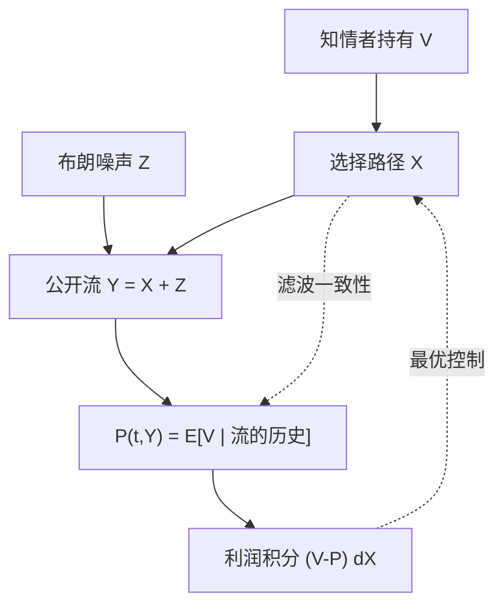

# Back 连续时间内幕交易

把知情交易写成对布朗滤波的控制问题：做市商的价格是累计订单流的函数，知情者在这条函数上选择自己的交易路径。连续时间里「线性深度」可以是均衡，也可以被非线性定价取代。

<footer>—— Back, Insider Trading in Continuous Time, Review of Financial Studies, 1992</footer>

[上一课](/quant/kyle-multiperiod)从 Kyle（1985）的多期拍卖走到连续极限，但仍借用正态线性结构：策略线性、价格对流量线性。缺口是：连续时间滤波要在怎样的概率空间上写严，知情者的控制问题如何陈述，以及**不**假设正态时均衡价格函数还是不是线性。Back（1992）把内幕交易收成连续时间的控制与滤波，而不是再切一刀单期 $\lambda$。

## 问题

Kyle 连续拍卖的启发是清楚的，技术上却留下缝：离散拍的极限、布朗噪声、知情者的容许策略类，需要一次说清。若价值不必正态，做市商的条件期望对累计流还是不是线性？若不是，知情者面对的就不是常系数冲击，最优路径也不是常系数 $\beta$。问题变成：在连续时间、以累计订单流为状态的市场上，理性定价函数 $P(t,Y_t)$ 与知情者的最优控制如何同时成立。

另一个缺口是信息到达的时间。Kyle 的 $V$ 在 $t=0$ 就固定。Back 的框架允许讨论定价函数的偏微分方程结构，为后来随机价值、随机噪声强度留下接口。本课只写 1992 年那一层：连续时间内幕、公开的是流、价格是流的函数。

### 控制对象是路径，不是一拍的数量

知情者选择的是有限变差或绝对连续的交易路径 $X$，累计公开流 $Y=X+Z$，$Z$ 是布朗型噪声。做市商在每一瞬间只看见 $Y$，设定 $P_t=E[V\mid \mathcal{F}^Y_t]$。知情者预见到整个映射 $Y\mapsto P$，最大化 $E\int (V-P)\,dX$ 一类的利润。这与单期「选一个 $x$」不同：任何一段加速都会立刻改写 $Y$ 的路径，从而改写整条价格路径。

不要把 Back 读成「又一个 Kyle lambda」。线性均衡在正态设定下可以回收 Kyle 连续拍卖；一般分布下定价函数可以对 $Y$ 非线性，深度沿路径变化。

## 方法

标准设定：区间 $[0,1]$，期末公开 $V$。噪声 $Z$ 为布朗运动（或带给定强度）。做市商竞争到半鞅价格，且 $P_t=E[V\mid \mathcal{F}^Y_t]$。猜一个定价函数 $P(t,y)$，知情者把 $P$ 当给定解随机控制；把最优 $X$ 送回滤波，要求一致性：在这条 $X$ 下，$P(t,Y_t)$ 的确是 $V$ 的条件期望。

正态线性时，一致性给出与 Kyle 连续拍卖同族的特征：价格对 $Y$ 线性，知情交易把定价误差按确定速度消耗。价值分布更一般时，Back 证明仍可存在均衡，但 $P$ 对 $y$ 的导数——即时深度的倒数——随 $(t,y)$ 变。直观是：累计流已经极端时，再来一单位流带来的信念更新不同，冲击不应是常数。

### 滤波与执行的同一条状态

状态压缩在公开流 $Y$ 上。知情者比做市商多知道 $V$，因此他知道价格「错在哪」，也知道自己的 $dX$ 会怎样推动 $Y$。最优控制的一阶条件把「再交易一单位的直接利润」与「把 $Y$ 推走导致的价格重估」抵平——与多期离散的跨期权衡同构，只是改写在生成元上。

## 机制

连续时间把「藏在噪声里」写成绝对连续路径对布朗的绝对连续扰动：知情流不能对布朗奇异，否则滤波立刻分离出内幕。这比口头说「要拆单」更硬：容许策略类本身禁止瞬时砸盘。价格作为 $Y$ 的函数，保证做市商没有相对公开流的免费午餐；知情者的租金来自对 $V$ 的初值优势，随揭示消耗。

与[限价簿](/quant/lob-structure)对照：Back 没有双向深度、没有撤单，价格是出清映射而不是 BBO。它解释的是**流作为信号**在连续时间如何被写入价格，不是排队几何。要把 $P(t,y)$ 翻译成买卖价差，需要另加报价结构。

## 边界

单一知情者、外生布朗噪声、期末一次性公开，仍是边界。价值若自己是扩散（后续 Back–Pedersen 等），内幕变成关于漂移的知识，最优路径会跟踪随机基本面，而不是消耗一个常数 $V$。多个知情者引入抢跑式揭示。电子限价簿上做市发生在挂单里，冲击依赖簿形，见后文 Parlour / Foucault，不在这条滤波里。

经验上没有「Back 系数」可直接 OLS。能对照的是：冲击是否随累计不平衡非线性变化、是否随临近公开时点变陡。那仍是描述，不是把 1992 年的 $P(t,y)$ 估出来。

Kyle（1985）连续拍卖与 Back（1992）是同一纲领的两个精度：前者给出正态线性的经济图像，后者给出一般连续时间的控制陈述。阅读顺序不要跳过前者的机制直接套 PDE。

## 小结

- Back 把内幕交易写成对公开订单流的连续时间控制，价格是流的滤波。
- 正态时可回收 Kyle 连续拍卖的线性深度；一般分布下即时冲击随 $(t,y)$ 变。
- 容许策略对布朗绝对连续，禁止自我揭示的奇异砸盘。
- 对象仍是出清价，不是买卖价差或 LOB 队列。
- 出处：Back, *Review of Financial Studies*, 1992；先修连续拍卖见 Kyle, *Econometrica*, 1985。
