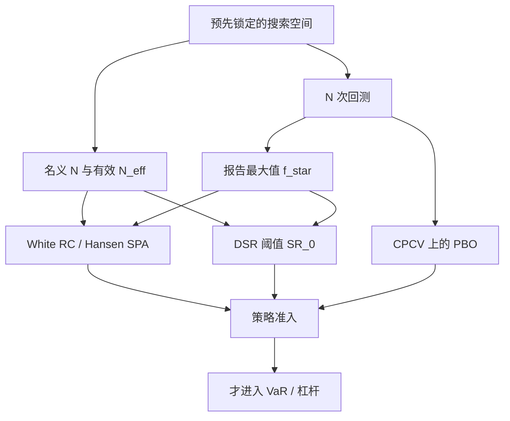

# 过拟合次数与试错

在同一段历史上对一簇规则取最优，检验统计量的原假设不再是「这一个规则没有技能」，而是「整簇规则里最好的那一个仍没有技能」；不把试错次数写进原假设，显著性就是搜出来的。

<footer>—— White, A Reality Check for Data Snooping, Econometrica, 2000；Bailey, Borwein, López de Prado and Zhu, Notices of the AMS, 2014</footer>

回测表上的夏普、胜率、最大回撤，几乎从未对应「事先指定、只跑一次」的实验。参数网格、品种池、起止日期、成本假设、进出场变体，都会把一次检验变成 $N$ 次试错后再报告最大值。White（2000）的 Reality Check 把这件事收成可自举的推断：基准之上的最优绩效，必须与「零技能簇的最大值」比较。Bailey、Borwein、López de Prado 与 Zhu（2014）则把同一机制写成更刺耳的命题——试错足够多时，任意事先指定的回测目标都可以被拟合，而这不表示策略有技能。本篇写**次数**：如何计数、如何进入极值、以及与 [过拟合作为风险](/quant/overfit-as-risk)、[Deflated Sharpe](/quant/deflated-sharpe)、[CPCV](/quant/cpcv) 的分工。它不替代 [VaR](/quant/var-methods) 的分位数，但决定你拿去配杠杆的那条权益曲线是否合法。

## 问题

设有 $N$ 个候选规则，第 $n$ 个在样本上的绩效统计量为 $f_n$（夏普、平均收益、相对基准的 $t$）。报告的是 $f^\star=\max_n f_n$。若每个 $f_n$ 在无技能下均值接近零、且近似独立，则 $f^\star$ 的期望随 $N$ 上升：正态情形大约是 $\sigma\sqrt{2\log N}$ 量级。把 $f^\star$ 送进「单次试验」的 $t$ 检验，拒绝概率远高于名义水平。这就是数据窥探（data snooping）：不是算错了夏普，而是用错了原假设。

White 针对的问题是：是否存在某个规则，其相对基准的期望绩效严格为正。朴素做法是看最优规则的 $t$；正确做法是看 $\max_n\sqrt{T}\,\bar d_n$ 在「整簇均值差为零」下的分布，其中 $\bar d_n$ 是规则 $n$ 相对基准的平均超额。Bailey 等人把同一最大值机制从「检验」推进到「设计」：若研究流程以样本内目标为停机条件，则停机时的回测几乎必然好看，样本外条件期望却在恶化。次数既是推断的参数，也是生产流程的状态变量。

### 名义网格不是有效试验次数

$N$ 不能直接等于参数点的个数。完全相关的两个网格点（只把止损从 1.9% 改到 2.0%）不应计两次；几乎独立的信号家族（动量与事件驱动）应分开累加。有效试验次数 $N_{\mathrm{eff}}$ 介于 $1$ 与名义格子数之间，取决于绩效序列的相关结构。漏计与过计方向相反：漏计让 Reality Check 与 DSR 假显著；把不相关市场、不相关年份的失败全部塞进 $N$，会过罚一个预注册策略。纪律是预先划定搜索空间，按空间的有效维度计 $N$，空间外的灵感要么新注册一次试验，要么承认 $N$ 增加。

Git 里被丢掉的分支、看过结果再改的成本假设、换一段「更有代表性」的样本，都是试验。论文脚注里的 $N$ 几乎总是下界。没有搜索日志，任何对次数的修正都只覆盖公开的那一部分。

## 方法

**White Reality Check。** 对每个规则计算相对基准的绩效差序列，取样本均值向量 $\bar{\mathbf{d}}$。统计量为 $V=\max_n\sqrt{T}\,\bar d_n$（或再学生化）。用平稳自举（block bootstrap）在「中心化后的」差序列上重抽样，得到无技能下 $V^\ast$ 的分布，再看 $V$ 的 $p$ 值。中心化是为了在原假设下把均值拨回零，避免基准本身有漂移时自举失真。Reality Check 的原假设是**所有规则都不优于基准**；拒绝只说明簇里至少有一个有技能，并不自动给冠军发护照——多重优于仍要逐步法（Romano–Wolf）或 Hansen 的 SPA。

**Hansen SPA。** Super Reality Check / Superior Predictive Ability 对学生化最大值更敏感，并对「很差的备择」降权，减轻 Reality Check 因一堆明显无用规则而功效下降的问题。工程上：先丢掉经济上不可交易的规则，再做 SPA，而不是把垃圾规则留在簇里指望检验自己会忽略它们。

**把 $N$ 写成回测元数据。** 每一次研究运行记录：候选集合描述、名义 $N$、$N_{\mathrm{eff}}$ 的估计（例如绩效相关矩阵的特征值截断）、是否看过样本外再回头。Bailey–López de Prado 的 DSR 用极值近似把 $N$ 与试验间夏普离散度折成阈值 $\mathrm{SR}_0$；Reality Check 用自举直接读最大值分布。两者应同时存在：解析近似写进每一张表的脚注，自举在策略准入时跑一遍。

### 试错停机与「看起来像样本外」

若流程是「直到夏普超过 2 才停止搜索」，停机时的样本内统计量是可选停时的值，分布比固定 $N$ 的最大值更偏。这时名义 $N$ 还要加上停机规则带来的额外选择。把样本切成研究段与「样本外」，若样本外被用来在模型和窗口之间选择，见 [滚动检验](/quant/walk-forward)，它仍是试验。真正的一次试验是：搜索空间、停机规则、验证段在看见任何结果之前锁定。

White 的 $p$ 值低，只拒绝「整簇都无技能」。把冠军的点估计原样拿去算 [Kelly](/quant/kelly-sizing) 或风险预算，等于把检验的存在性命题偷换成幅度命题。幅度仍受选择偏差膨胀，应使用紧缩夏普或样本外中位数，而不是 $f^\star$。

## 机制

试错抬高的是 $\mathbb{E}[\max_n f_n]$，不抬高任何一个规则的真实均值。机制是极值：独立同分布的中心化统计量，最大值的位置按 $\sqrt{\log N}$ 外移；弱相关时有效 $N$ 变小，外移变慢，但不会消失。过拟合作为风险的实现路径是：用被抬高的 $f^\star$ 估计 $\mu$，用样本内 $\sigma$ 配杠杆，实盘均值接近零时回撤被杠杆放大。它在账上像市场风险超限，根因是准入用了错误的原假设。

与 PBO 的差别在于问题陈述。PBO 问：样本内冠军在对称划分的样本外是否系统性地掉到中位以下。Reality Check 问：最优者相对基准的均值差是否能用零技能簇的最大值解释。DSR 问：已经选出的那一个夏普，在非正态与 $N$ 次试验下还有多少概率对应正技能。三次测量互补：RC/SPA 管推断，DSR 管单点夏普的脚注，PBO/CPCV 管冠军可迁移性。用其中任意一个替代另外两个，都会留下盲区——例如 SPA 拒绝后 PBO 仍可很高，若冠军只是在该样本的噪声上取胜。

### 次数如何污染风险数字

[VaR](/quant/var-methods) 与 [ES](/quant/expected-shortfall) 若在同一段历史上被用来选择窗口、衰减因子、置信水平或「哪一种方法好看」，分位数本身也过拟合。历史 VaR 的窗口长度、FHS 的 GARCH 阶数、Copula 的族，都是 $N$ 的一部分。风险模型的回测（Kupiec / Christoffersen）假定 $v_t$ 是预先指定的；若 $v_t$ 来自「在样本上挑通过率最高的设定」，通过率的名义水平失效。次数纪律必须从 alpha 研究延伸到风险参数：限额模型的超参数应预注册，或至少把选择次数记进模型卡。

## 边界与工程取舍

Reality Check 对基准敏感：基准选得极弱，很容易拒绝；基准选成已经过拟合的姐妹策略，又可能不拒绝。SPA 改善功效，但不消除隐藏试验。相关结构时变时，$N_{\mathrm{eff}}$ 本身是估计量，对它再做选择又是一层窥探。块自举的块长是带宽：太短破坏依赖，太长使有效重复不够。

不要用「我们做了样本外」替代报 $N$。不要把因子动物园的 $t>3$（Harvey–Liu–Zhu）直接当成交易系统的次数校准：策略配置的搜索空间往往更大，门槛应更高。也不要把失败试验从簇里删掉再跑 RC——那是在条件于「看起来不差」的子集上做检验。发表后衰减（McLean–Pontiff）提供第三种证据：统计量过关之后，仍要用从未参与选择的样本看绩效是否还在。

把过拟合次数当成操作风险事件（未记录搜索）还是模型风险（统计量未调整），会影响停机与资本。更干净的规则是：未申报 $N$ 的策略，风险预算为零，而不是给一个「打过折的 alpha」继续交易。

## 小结

- 报告最大值时，原假设必须是「整簇无技能」，而不是「这一个规则无技能」。
- White Reality Check 用自举读最优绩效差的最大值分布；Hansen SPA 对学生化最大值更有功效。
- 有效试验次数由绩效相关结构决定，名义网格、隐藏分支与停机规则都会改 $N$。
- RC/SPA、DSR、PBO 分别管推断、单点夏普与冠军可迁移性，不能互相替代。
- 风险模型的窗口与方法若也被选择过，VaR 回测的名义水平同样失效。
- 出处：White, *Econometrica*, 2000；Hansen, *Journal of Business & Economic Statistics*, 2005；Bailey, Borwein, López de Prado and Zhu, *Notices of the AMS*, 2014；Romano and Wolf 逐步多重检验；对照 Bailey and López de Prado, *Journal of Portfolio Management*, 2014。
