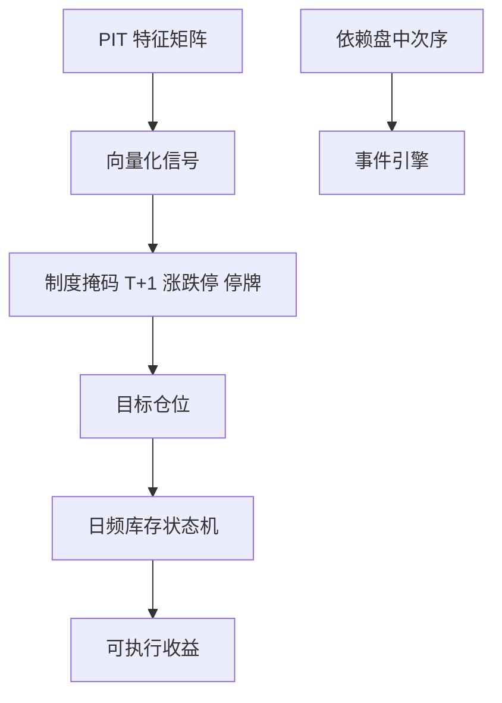

# 回测向量化

把日期 × 品种的矩阵一次算完，换来的是速度；付出去的是事件顺序。向量化合法，当且仅当决策不依赖盘中路径与路径依赖的库存。

<footer>—— 对照 López de Prado 对回测路径与信息泄漏的讨论；事件驱动回测与向量化回测的工程分界</footer>

[上一课](/quant/feature-store-research)给出可批量取出的点-in-time 特征。本课的缺口是**回测引擎的计算形状**：向量化（对整张面板做数组运算）对事件驱动（按成交与委托逐条推进）。两者不是品味：T+1、涨跌停、队列、保证金路径在事件引擎里自然，在矩阵里必须显式展开，否则会虚构成交。后课研究日志记录你用了哪一种引擎。

## 问题

日频截面因子：信号在 $t$ 收盘可知，$t+1$ 开盘或收盘成交，成本用价差加冲击函数，向量化足够——前提是没有「当日买了再卖」、没有涨跌停不可成交、没有融资强制平仓路径。A 股[T+1](/quant/cn-tplus1) 把可卖量变成状态，矩阵若只有一个持仓列，会放出非法日内反向。问题是列出决策所依赖的状态维度：若状态能写成「昨日持仓 + 今日信号」且成交规则是批量的，向量化；若依赖盘中簿、部分成交、保证金追缴，必须事件化或至少日频状态机。

向量化的隐蔽泄漏：用 `shift(-1)` 拿未来收益当标签却不小心拿来当特征；用全样本 `mean`；用未来才调整的成分。特征商店降低但不消灭这些，因为回测脚本仍能 join 错。引擎应只暴露 `data[t]` 与 `position[t-1]`，拒绝向前看的索引。

### 速度不能为路径依赖买单

组合优化、协方差、行业中性可以在每日截面向量化。执行若假设全部在收盘拍卖以收盘价成交，须与[收盘拍卖](/quant/closing-auction-design)或 A 股收盘集合竞价规则一致，否则向量化的「收盘价」不是可成交价。涨跌停锁定应把该日成交量置零或置为可成交方向的配给，而不是仍用收盘价变动当收益。

事件驱动不是自动更真：它可以漏掉公司行动、用错时钟。向量化不是自动更假：日频因子加严格 shift 与 PIT 特征，往往更可审计。选择由对象决定。

## 方法

分层：信号层向量化（NumPy / pandas / Polars 在日期–品种矩阵上）；成交层用显式状态机：可卖量、保证金、停牌、涨跌停标志。两层之间只传递目标权重与约束掩码。掩码必须来自 $t$ 日可知的制度状态。成本：向量化可用线性或平方根冲击 $g(q/V)$，但 $V$ 用当时 ADV，且参与率封顶，见[容量](/quant/capacity-participation)。

对拍：同一策略在向量化日频引擎与事件引擎（至少用日频 bar + 状态机）上跑，比较换手、违规单数、净收益。差来自非法成交或拍卖规则，应修向量化，而不是把事件引擎关掉。

### 并行与复现

按日期分块并行时，块与块之间不能共享带未来的标准化统计量。随机数与特征版本写入实验元数据。向量化容易「一不小心」用到整表，代码审查应搜 `shift(-`、全样本 `std`、以及 merge 时未限制 as-of。

## 机制

数组运算假设交换律与批量同时性。市场是全序事件。当策略的收益主要来自「同时在收盘对所有股票调仓」这一近似，向量化与真实规则的距离小；当收益来自盘中次序、排队、同一股票来回，距离大到结果改号。A 股涨跌停与 T+1 把许多美股日频论文的向量化模板变成非法动作生成器。

[撮合核](/quant/matching-engine-arch)的全序在研究里通常被压成日频；这是有意的降维。降维必须写出来，不能假装仍在谈微观结构 alpha。

## 边界

本课不提供用向量化掩盖未来函数以美化曲线的技巧。高频、最优执行、做市必须事件化。GPU 加速不改变泄漏代数，只改变犯错速度。

## 小结

- 向量化适合批量日频决策；路径依赖的库存与盘中次序需要状态机或事件引擎。
- 引擎只暴露当时可知输入；与事件引擎对拍以抓非法成交。
- A 股 T+1 与涨跌停使「单列持仓矩阵」经常非法。
- 出处：López de Prado 对回测泄漏的论述；与本栏制度课的成交规则。
