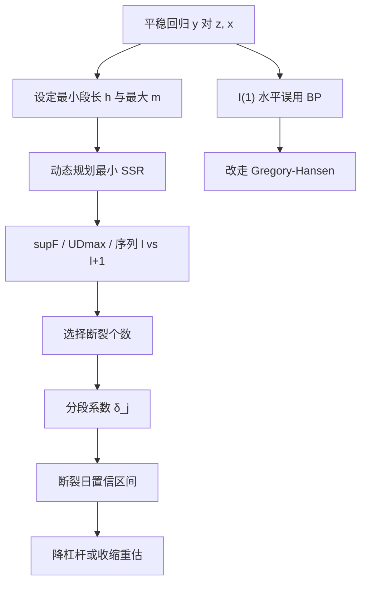

# Bai–Perron 结构断点

在部分系数允许于未知时点发生多次转换时，用动态规划全局最小化残差平方和，再以序列检验或信息准则选择断裂个数，得到的是分段线性关系，而不是一条全样本斜率。

<footer>—— Bai and Perron, Estimating and Testing Linear Models with Multiple Structural Changes, Econometrica, 1998</footer>

Chow 检验针对已知日期；[Gregory–Hansen](/quant/gregory-hansen) 针对协整残差的**单次**机制转换，零假设是无协整。[体制切换失效](/quant/regime-break-risk) 把断裂写成策略风险。Bai 与 Perron（1998, 2003）处理的是平稳或趋势平稳回归里、未知时点的**多次**结构变化：估 $\tau_1,\ldots,\tau_m$，检验 $m$ 对 $m+1$，并给出断裂日期的置信区间。本篇写纯结构变化与部分结构变化、$\sup F$ 与 UDmax、最小段长，以及为什么它不能直接当作协整破裂的替代检验——$I(1)$ 回归的渐近与他们的设定不同。

## 问题

线性模型

$$
y_t=z_t'\delta_j+x_t'\beta+u_t,\qquad t=T_{j-1}+1,\ldots,T_j,
$$

在 $m$ 个断裂下有 $m+1$ 段。$z_t$ 的系数 $\delta_j$ 随段变，$x_t$ 的 $\beta$ 可以限制为全样本不变（部分结构变化）。资产定价里 $y$ 可以是超额收益，$z$ 可以是因子或预测变量；配对里也可以对**已经差分或已经平稳**的价差、对冲误差做分段均值或分段 $\kappa$。问题是：在不知道 $m$ 与各 $T_j$ 时，既要估位置，又要控制因搜索而产生的过拒。

全样本 OLS 给出各段的加权混合物。混合物可能不显著（两段符号相反）或虚假稳定（截距变、斜率同向）。用混合物去做仓，等于在新段用错误暴露。[HMM](/quant/hmm-regime) 假定状态会按转移矩阵回来；Bai–Perron 的默认图像是换了就停在新参数上，直到下一次再换。用错装置会给出虚假回归概率，或把每一次危机切成新世界、样本碎到无法估。

### 已知时点与未知时点不是同一张表

法规生效日、涨跌停幅度调整、汇率安排宣布，应用 Chow 或虚拟变量，时点来自日历，不能来自「看残差图挑一个拐」。未知时点才需要 Bai–Perron 的全局 SSR 最小。若先看图再把那个日期送进 Chow，临界值作废。工程上应预先规定：制度日历用 Chow；数据驱动的多断裂用 BP；协整水平的单次未知转换用 GH。三套临界值不能混用。

回测里若允许「从样本里搜一个最优起点再估因子」，等于把 $T_1$ 推进了配置空间。Bai–Perron 至少把这种搜索的检验理论写出来了；在策略优化器里偷偷搜起点，连这层惩罚都没有。

## 方法

**全局估计。** 给定 $m$ 与最小段长 $h$，用动态规划在所有满足间隔约束的分割上最小化 SSR（Bai–Perron 2003 给出计算）。得到 $\hat T_1,\ldots,\hat T_m$ 与各段 $\hat\delta_j$。$h$ 太小，一次闪崩或几个异常收益会被认成断裂；$h$ 太大，短命但真实的制度（例如短暂做空禁令）会被抹掉。常用 $h$ 为样本的 5%–15%，与 GH 的修剪是同一类自由度保护。

**检验。** 无断裂对 $m$ 个断裂的 $\sup F$；未知 $m$ 上限时的 UDmax、WDmax；以及序列检验：$l$ 对 $l+1$，在已有 $l$ 个断裂的残差上再搜下一个。信息准则 BIC、LWZ 直接选 $m$，在异方差与肥尾下容易误选，收益信噪比低时尤其如此。应预先指定一条决策链，例如：先看 UDmax 是否拒绝无断裂，再用序列检验加 $h$ 约束定 $m$，BIC 只作报告。

**推断。** 断裂日期的置信区间来自 Bai（1997）一类渐近，宽度依赖于两段参数差距与段内波动。差距小则区间可以跨数月，此时 $\hat T_j$ 不能当事件研究的事件日。系数的标准误应分段、并允许异方差；把全样本 HAC 套在已切段的模型上，对象错了。

### 对价差与对因子：对象必须先平稳

Bai–Perron 的理论针对平稳回归误差（可允许滞后与异方差的稳健形式），不是针对 $I(1)$ 水平回归。对对数价格做「$\beta$ 的多断裂」，渐近不是 1998 年那张表。配对应：先差分或先在形成期做协整得到残差，再对残差均值、$\kappa$ 或方差做 BP；水平关系的未知单次转换交给 GH。因子溢价、预测回归（收益对估值比）更接近 BP 的原始对象，这也是 [体制切换失效](/quant/regime-break-risk) 一文引用它的原因。

部分结构变化有用：例如只允许截距断、斜率共用，或只允许某个因子的载荷断。纯结构变化让所有系数每段重估，短段上方差爆炸。金融里应优先部分变化，并把经济上不该断的系数（如期货合约乘数）钉死。

## 机制

动态规划保证在给定 $m,h$ 下 SSR 全局最小，避免贪心「先切一刀再切一刀」停在局部。序列检验的机制是：若还存在未建模的断裂，再加一刀会显著降低 SSR，超出因多两个日期而应付出的惩罚。UDmax 则对 $m$ 取上确界，避免先假定个数。这些机制控制的是检验水平，不是「真实世界断了几次」的后验概率。

经济上，断裂是折现率、风险价格、制度约束或指数编制的一次移动。统计上，全样本矩把两段混成没有人经历过的平均年。检测滞后意味着：当你在 $t$ 用到 $t$ 为止的数据刚拒绝「无断裂」时，账户已按旧 $\delta$ 交易了一段。因此 BP 是季度级模型重估工具，不是盘中触发器。更早的警报是 [CUSUM / MOSUM](/quant/cusum-mosum) 的递归残差，以及滚动系数相对其标准误的偏离。

信息准则选 $m$ 在高斯同方差下有道理；日收益近似值却是肥尾加异方差。LWZ 往往比 BIC 更吝啬，但不保证尺寸正确。把自动选出的 $m$ 直接写进产品「体制个数」，是把选择误差当成了经济结构。

### 与协整破裂、最优停时的分工

GH：问水平价格是否存在带一次转换的协整。BP：问平稳方程的系数断了几次。CUSUM：问是否已偏离历史关系，不一定估出所有 $T_j$。HMM：问是否在有限个状态间来回。对 [OU 残差](/quant/ou-spread)，若只是 $\mu$ 或 $\kappa$ 换了一次，BP 或 GH 合适；若平静/动荡反复切换，HMM 合适。给定一段参数稳定的 OU，进出障碍才是 [最优停时](/quant/ou-optimal-stopping) 的对象。先切段、再在段内解障碍；不要在全样本 OU 上优化阈值，再用 BP 事后解释「哪一段夏普高」——那是用 $\mathcal{F}_T$ 挑选路径。

## 边界与工程取舍

多重断裂的上限 $M$ 是设定。$M$ 太大，短段拟合噪声；$M$ 太小，漏掉的断裂进入残差，看起来像自相关或 ARCH。稳健做法：只对有制度解释的候选日期做 Chow，BP 当探索；新段参数用收缩或衰减窗口，避免在 $\hat T_m$ 之后用 20 个点估一整套协方差。

不要用全样本才知道的 $\{\hat T_j\}$ 去分段计算夏普再拼接。不要对 $I(1)$ 价格直接套 1998 临界值。不要把 BP 的 $\hat T_j$ 当天当成可交易事件：流动性在制度转换附近往往最差，冲击会吃掉「重估 alpha」。A 股还要排除停牌造成的伪段。

Bai–Perron（2003）的软件实现把 $h$、核、稳健标准误都变成选项。报告必须写 $h$、最大 $m$、用的是 $\sup F$ 还是 BIC，否则别人无法复现你的「两段 beta」。

## 小结

- Bai–Perron（1998, 2003）估计并检验线性模型中未知时点的多次结构变化，用动态规划最小化 SSR，用 $\sup F$、UDmax 或序列检验选 $m$。
- 部分结构变化只让部分系数随段变，更适合金融短段；最小段长 $h$ 防止把异常值当成断裂。
- 理论对象是平稳回归，不是 $I(1)$ 协整方程；水平关系的单次未知转换用 Gregory–Hansen。
- 断裂日期有确认滞后与宽置信带，适合模型重估，不适合当盘中信号。
- 反复马尔可夫体制与一次性（或少次）台阶是不同 DGP，应与 HMM、CUSUM 分工。
- 出处：Bai and Perron, *Econometrica*, 1998；Bai and Perron, *Journal of Applied Econometrics*, 2003；Bai, *Review of Economics and Statistics*, 1997。
