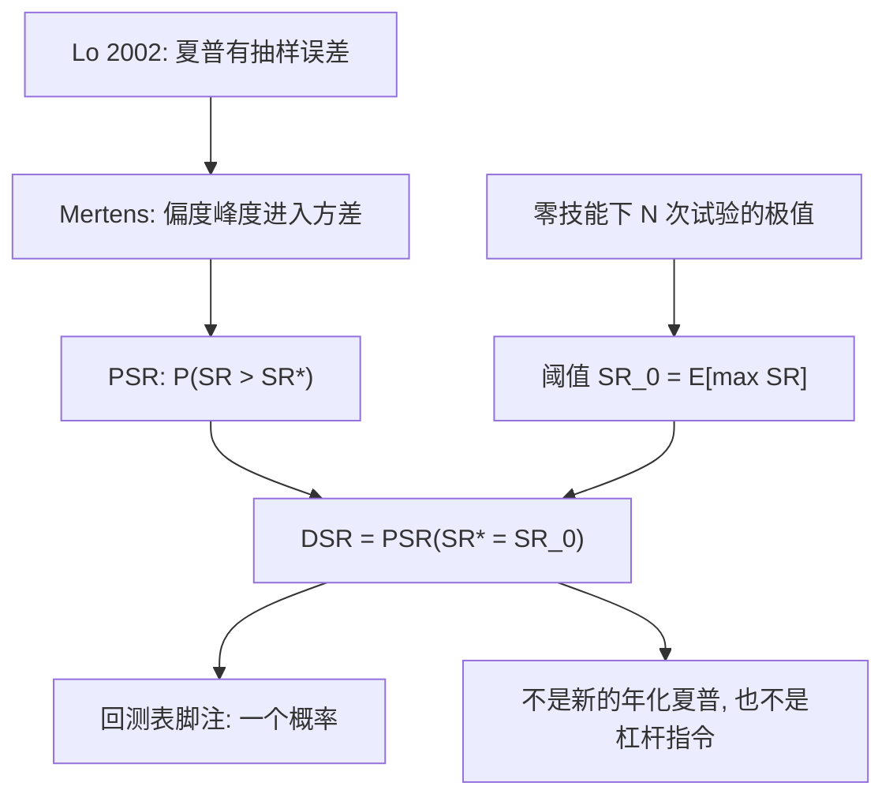

# Deflated Sharpe 原文

我们需要的不是又一个被挑选过的夏普点估计，而是：在非正态与多次试验之后，观测夏普仍对应正技能的概率。

<footer>—— Bailey and López de Prado, The Deflated Sharpe Ratio, Journal of Portfolio Management, 2014</footer>

[上一课](/quant/purge-embargo)按标签区间与测试时间的相交删除训练样本（purge），并在测试块之后加 embargo，处理 $y$ 的重叠与 $X$ 的短程相关。缺口是：清洗之后你报告的夏普，往往仍是看过 $N$ 次试验之后的最大者。[Deflated Sharpe](/quant/deflated-sharpe) 一文给出公式与有效 $N$；本课回到 2014 年原文：把原假设从「一次抽样的零技能」改成「$N$ 次试验最大值的零技能」。DSR 在原文里是一个概率，不是把夏普乘上折扣系数。不重写 purge 窗口如何由 $t_{i,1}$ 决定。

## 问题

Lo（2002）已经说明：收益独立正态时，$\widehat{\mathrm{SR}}$ 的标准误大约是 $\sqrt{(1+\tfrac12\mathrm{SR}^2)/T}$；有序列相关时朴素年化会夸大。Bailey–López de Prado 加上偏度 $\gamma_3$ 与超额峰度 $\gamma_4$，采用 Mertens 的渐近方差

$$
\mathrm{Var}(\widehat{\mathrm{SR}})\approx\frac{1-\gamma_3\mathrm{SR}+\tfrac14(\gamma_4-1)\mathrm{SR}^2}{T-1}.
$$

左偏与肥尾抬高方差，同样的点估计更不足以拒绝零技能。这是 PSR 的输入，见[概率夏普](/quant/probabilistic-sharpe)。原文要解决的下一问是：你报告的往往不是预先指定的那一次试验，而是看过 $N$ 次之后的最大者。零技能下 $\mathbb{E}[\max_n\widehat{\mathrm{SR}}_n]$ 随 $N$ 上升，用 PSR 去检验「是否大于 0」会系统性过度拒绝。需要把原假设的阈值从 0（或融资要求）抬到这场选美的预期冠军。

### 原文把 DSR 定义成 PSR 的一个特例

记 PSR 为 $\widehat{\mathrm{SR}}$ 超过阈值 $\mathrm{SR}^*$ 的（渐近）概率。DSR 取

$$
\mathrm{SR}^*=\mathrm{SR}_0:=\mathbb{E}\big[\max_{n=1,\ldots,N}\widehat{\mathrm{SR}}_n\big]\ \text{在真技能为零时}.
$$

于是 $\widehat{\mathrm{DSR}}=\widehat{\mathrm{PSR}}(\mathrm{SR}_0)$。原文给出的 $\mathrm{SR}_0$ 用极值理论的 Euler–Gumbel 近似，把试验间夏普的标准差 $V[\{\widehat{\mathrm{SR}}_n\}]^{1/2}$ 乘上与 $N$ 有关的极值因子。公式在综述文里已写，这里强调假设：试验近似独立、最大值的分布可用极值极限、夏普自身仍用正态 CDF 做尾部。策略高度相关时，名义 $N$ 应换成有效独立个数，否则 $\mathrm{SR}_0$ 过高、DSR 过罚——原文承认独立性，实务必须先聚类。

原文的数值例子表明：在常见的非正态与数十次试验下，$\mathrm{SR}_0$ 可以轻易达到 1 附近的年化量级。把回测表上的 1.5 当成「很强」，在他们的校准里往往只是刚超过选美预期。

## 方法

原文建议的最小输入是：最终报告的 $\widehat{\mathrm{SR}}$、样本长度 $T$、样本偏度与峰度、试验次数 $N$、以及这一簇试验夏普的标准差。没有簇、只有冠军时，$V$ 只能外生给定（例如非技能策略夏普的经验离散度），并做敏感性。输出是一个介于 0 与 1 的概率：DSR 接近 1 表示即便抬高了阈值、即便非正态，观测夏普仍不像零技能最大值；接近 0.5 或以下则无法拒绝。

与「haircut」的合法翻译是：给定 $N$ 与矩，可以反问「要把 DSR 维持在 0.95，冠军夏普至少需要多少」。这个最低夏普才是可与 1.5、2.0 比较的点估计。原文没有授权把 $\widehat{\mathrm{SR}}\times\mathrm{DSR}$ 或 $\widehat{\mathrm{SR}}-\mathrm{SR}_0$ 直接当作新的年化技能去配杠杆。杠杆仍受估计误差与[仓位规则](/quant/kelly-sizing)约束。

### 原文与 AMS「伪数学」通告的关系

同年 Bailey、Borwein、López de Prado 与 Zhu 在 *Notices of the AMS* 写回测过拟合：试验次数足够大时，任意业绩目标几乎必然被某条规则命中。DSR 论文是同一论点的可计算版本，对象收窄到夏普这一个统计量。PBO 论文（2017）则改用组合划分与相对排名，不依赖夏普的渐近正态。原文明确把自己定位为**解析近似**：便宜、可重复、适合作为每一张回测表的脚注；复杂相关与非线性选择过程应交给 Reality Check、SPA 或 CPCV。读原文时不要把它升级成「已经替代了多重检验文献」。

Harvey–Liu–Zhu 的 $t>3$ 针对因子动物园；DSR 针对策略回测的夏普。原文没有给出因子研究的 $t$ 门槛。一个 DSR 很高的日内规则，仍可能是异常表上的幸运者，两种调整要分开做。

## 机制

选择偏差抬高的是最大值的期望，不抬高任何单个策略的真实 SR。机制是极值：独立同分布的噪声夏普，最大值按 $\sqrt{2\log N}$ 一类速度漂移（正态情形）。非正态项则改变每个夏普的尺度：同样的最大值，在更肥的尾下更不可信。DSR 把这两层写进一个 CDF，原假设变成更难拒绝的那一个。这正是多重检验的精神，只是检验统计量被限制为夏普，并用解析极值代替对整簇收益的自举。

原文假设试验在夏普空间近似独立。高度相关的网格点（止损 1.9% 与 2.1%）不是两次试验。有效 $N$ 应用相关聚类或特征值计数来压缩。故意把失败试验排除会令 $N$ 偏小、DSR 虚高；把毫不相关市场的历史失败全部塞进去会过罚。纪律在原文之外、却被同一作者后来反复强调：预先定义搜索空间，按空间的有效维计数。

### 最小轨迹长度不是 DSR 的同一公式

Bailey–López de Prado 另文讨论：要区分 SR 为某目标值与 0，所需年数随目标平方反比增长。那是 PSR 框架下的样本量设计，不是 DSR 的 $\mathrm{SR}_0$。短样本上峰度估计本身很吵，原文的正态 CDF 尾部不可靠，应改用自举或更长样本，而不是把 DSR 精确到百分位后两位。

## 边界与工程取舍

原文不处理成本：零成本抬高的 $\widehat{\mathrm{SR}}$ 被放气之后仍可显著，只说明选择偏差解释不了零成本世界。也不处理泄漏：前视的夏普送进 DSR，输出的是对错误输入的精确概率。样本外若已被用来选模型，$N$ 不能退回 1。这些边界在综述文里展开；读原文时要记住它的输入被假定为「诚实的 $T,N,\widehat{\mathrm{SR}}$ 与矩」。

不要用 DSR 替代 [CPCV 路径分布](/quant/cpcv-lopez)。原文自己把解析极值当成相关结构简单时的快捷方式。试验结构复杂、标签重叠、参数网格高度相关时，路径方法更忠实。完整实验设计仍是：清洗后的组合路径看稳不稳，PBO 看搜索，DSR 给表上的那个夏普一个脚注。

把 DSR 当成优化目标去调 $N$ 的口径、调收益的去极值规则，会得到好看的概率和同样过拟合的系统。原文给出的是检验，不是目标函数。

## 小结

- 2014 年原文把 DSR 定义为以零技能最大夏普期望为阈值的 PSR，输出是概率，不是打折后的点估计。
- 两层修正分别来自非正态的夏普方差，以及多次试验的极值阈值；独立性与有效 $N$ 是一等假设。
- 它与 AMS 通告、后来的 PBO 是同一问题的不同计算工具：解析脚注 vs 路径排名。
- 成本、泄漏、相关试验结构超出原文范围，必须在输入侧诚实，并与 CPCV 互补。
- 出处：Bailey and López de Prado, *Journal of Portfolio Management*, 2014；Lo, *Financial Analysts Journal*, 2002；Bailey, Borwein, López de Prado and Zhu, *Notices of the AMS*, 2014。公式与工程计数见 [Deflated Sharpe](/quant/deflated-sharpe)。
