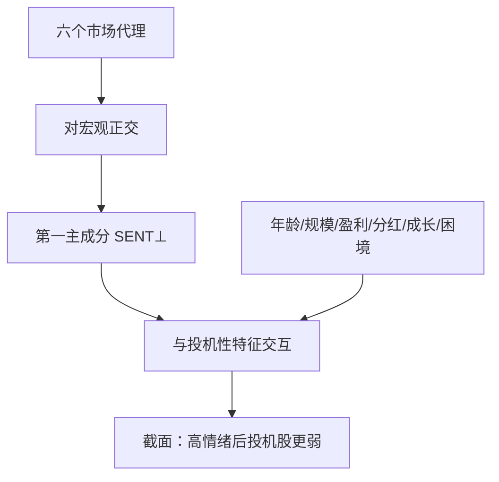

# Baker-Wurgler 情绪

投资者情绪是对资产的投机性需求；当情绪高涨，难以估值、难以套利的股票被抬得过贵，随后截面收益更差。

<footer>—— Baker &amp; Wurgler, Investor Sentiment and the Cross-Section of Stock Returns, Journal of Finance, 2006</footer>

情绪在日常语言里什么都能装。Baker 与 Wurgler（2006, 2007）给了一个可复制的**指数**和一条可检验的截面预测：情绪不是对所有股票同号的择时信号，它改变的是**投机性股票相对债券式股票**的相对价格。高情绪之后，年轻、小盘、不盈利、不分红、极端成长或困境的股票平均收益更低；低情绪之后相反。指数由六个市场代理的第一主成分构成，并正交化宏观状态，记作 $\mathrm{SENT}^{\perp}$。本篇写六个代理各自在量什么、主成分为什么必要，以及情绪与 [MAX](/quant/max-effect)、IVOL、IPO 热潮之间的接口。它不回答「今天该不该空仓」。

## 问题

行为金融需要一个不是事后从收益里倒出来的情绪度量。若用未来收益自己定义「当时情绪很高」，预测就变成同义反复。Baker–Wurgler 的策略是：找若干在理论上会随投机需求同步变动、又能在长期样本里观测的市场变量，抽共同成分，再问这个成分是否预测**截面**——尤其是套利成本高、估值主观的那一侧。宏观景气也会让 IPO 变多、换手变高，所以必须先把代理对宏观回归，否则情绪指数只是换了个名字的经济周期。

截面预测比时序择时更可证伪。时序上「高情绪之后市场下跌」不稳定，因为情绪与风险溢价、与宏观残差分不清。截面上比较「同类风险、不同投机性」的股票，宏观被差掉一块。BW 的主结果是截面：情绪与投机性特征的交互，而不是标普 500 的择时 $R^2$。

### 六个代理不是六个独立的情绪

六个变量是：封闭式基金折价（CEFD）、换手（NYSE 换手的去趋势）、IPO 数量（NIPO）、IPO 首日收益（RIPO）、新发行中的股权占比（S）、分红溢价（股利支付公司相对不支付公司的估值差）。折价高常被读成情绪低；IPO 热、首日暴涨、股权融资占比高、换手高、分红溢价低（成长相对便宜被追捧）常被读成情绪高。单个代理噪声极大：封闭式基金折价有自己的制度史，换手有长期趋势，IPO 有监管周期。第一主成分的意义是留下它们的**共变**，丢掉各代理的特质噪声。符号在提取时要对齐，使指数高对应投机需求高。

正交化宏观之后的 $\mathrm{SENT}^{\perp}$ 才是 BW 用于预测的对象。用未正交的第一主成分，会把衰退、通胀、工业生产写进「情绪」，随后的截面预测会混进宏观风险。下载指数时必须确认是哪一张表。

## 方法

对每个代理 $x_{k,t}$ 先对宏观变量（工业生产增长、衰退哑变量、利率等）回归，取残差 $\tilde x_{k,t}$。再对 $\tilde x$ 做主成分，第一主成分标准化后为 $\mathrm{SENT}^{\perp}_t$。预测回归的形式是：股票特征 $Z_i$（规模、年龄、盈利、分红、成长、困境）与情绪的交互，

$$
R_{i,t+1}=a+bZ_i+c\,\mathrm{SENT}^{\perp}_t+d\,Z_i\times\mathrm{SENT}^{\perp}_t+\varepsilon,
$$

关注 $d$：高情绪时，投机性 $Z$ 更高的股票随后收益更低。组合做法更直观：按 $Z$ 排序的多空在高情绪年份与低情绪年份分别报告。BW 强调单调性出现在难以套利的一侧，大盘、盈利稳定、分红的「债券式」股票对情绪不敏感。

指数是月度或年度的，取决于代理的最低频率。IPO 与分红溢价偏慢，换手与折价可以更快。不要把年度指数插成日度再去做高频择时——那是把六个慢变量的共同趋势当成了日度信号。更新滞后也必须尊重：当月 IPO 首日收益在月末才齐，用它预测当月收益会有前视。标准是用 $t$ 已实现的情绪预测 $t+1$ 的收益。

### 情绪预测的是相对价格，不是 β

高情绪时投机股的 β 也可能更高，因为它们更像增长期权。BW 在回归里控制规模、价值等，并展示结果在特征组合而非 β 组合上更干净：被错误定价的是**特征**（年轻、不盈利），不是统计上估出来的历史 β。这与三因子并不冲突——HML、SMB 本身就会随情绪波动——但情绪不是第七个风险因子的替代品；它是条件：同样的特征溢价在不同情绪状态下幅度不同。把 $\mathrm{SENT}^{\perp}$ 直接放进时间序列当第六个因子去吸收 α，通常 $R^2$ 很低，因为它不是每日可交易的多空收益，而是缓慢的状态变量。

后续文献把 BW 指数当作条件变量，去切 IVOL、MAX、盈利异象、IPO 长期弱势。典型模式是：高情绪之后，负腿（应当做空的投机股）更负。这与卖空约束一致：情绪高时正是约束最绑手、零售最活跃的时候。

## 机制

机制是两层市场。一层是噪音交易者对投机性故事的需求，随情绪涨落；一层是套利者的资本与约束。DeLong 等的噪声交易风险说明：套利者不能无限做空被高估的股票，因为情绪可能再升温。BW 把「哪些股票的需求弹性更情绪化」写清楚：估值主观（没有盈利、没有分红、历史短）时，故事的空间大；套利成本高（小盘、难以卖空）时，价格更跟需求走。情绪低时，同一批股票被过度抛弃，随后收益高——对称的需求不足。债券式股票两边都有锚定：盈利与分红使估值争议小，机构持仓使套利深。

六个代理各自对应需求的一个出口。IPO 与股权发行是公司供给对高情绪的反应：贵的时候发股票，这是 Baker–Wurgler 另一篇「股权融资比例预测市场」的时序故事。封闭式基金折价是同一类难套利证券的相对定价。换手是投机交易的强度。分红溢价衡量市场愿为「现在就给现金」付多少钱——情绪高时成长故事更贵，分红溢价下降。主成分把这些出口的同步运动当成同一个需求冲击的投影。

### 与个股彩票、基金流的关系

BW 情绪是**市场级**状态；MAX、IVOL 是**个股**彩票特征。高情绪期，高 MAX 股票被追得更凶，MAX 策略的随后负收益更强。两者不是替代：没有 BW 指数时，仍可按 MAX 排序；没有 MAX 时，BW 仍预测一类特征组合。完整的需求故事是状态×特征。基金流、ETF 流入是更快的情绪代理，但样本短、结构变（从共同基金到被动指数）。用基金流替换 BW 六个代理，问的是另一频率上的同一类问题，不能直接比较 t 值。

BW 指数在 2000 年代之后的更新依赖同一套代理的可得性。IPO 冷热、封闭式基金市场规模下降，会改变主成分载荷。用旧载荷对新数据加权，与每年重估载荷，指数路径会分叉。预测研究应固定提取窗口，避免用全样本主成分去预测样本内收益。

## 边界与工程取舍

情绪指数不能当日常仓位函数。频率慢、修订与滞后真实存在，六个代理在制度变化后含义会漂。2000 年代高频交易抬升换手，换手代理必须去趋势，否则「情绪」只是市场结构。中国市场没有同等的封闭式基金折价与 IPO 首日收益制度，硬套六个美股代理没有内容；应重建当地代理（两融余额、新开账户、基金发行热度等），并重新做宏观正交——那是另一篇论文，不是 BW 2006。

不要用新闻文本情绪、社交媒体分数去「验证」BW 而不做相关与领先滞后：文本情绪是另一对象，可以相关，不是同一指数。不要把高情绪理解成「所有风险溢价为负」：债券式股票可以不受影响，市场整体甚至仍有正的风险溢价。不要在回归左边用当月收益、右边用含当月 IPO 首日收益的指数。不要把 $\mathrm{SENT}^{\perp}$ 标准化之后的一个标准差当成可交易杠杆倍数。

作为研究设计，BW 最有用的是**切样本**：在高/低情绪期分别报告异象。许多负腿异象在高情绪期存在、在低情绪期消失，这支持错误定价加约束，削弱「恒定风险因子」叙事。作为交易信号，它太慢、太拥挤于宏观相关，需要与可交易的特征（质量、低 MAX）结合，而不是单独择时。

出处：Baker & Wurgler, *Journal of Finance*, 2006；综述式更新见 2007 年 *Journal of Economic Perspectives*。时序上股权融资比例见 Baker & Wurgler, 2000。个股彩票见 Bali et al. 的 MAX，不要把 BW 指数误称为 MAX 因子。

## 小结

- Baker–Wurgler 情绪是六个市场代理经宏观正交后的第一主成分，高值对应投机需求高。
- 预测对象是截面：高情绪之后难以套利、估值主观的股票收益更低，不是稳定的市场择时。
- 指数是缓慢状态变量，不宜当作日度第六因子；应用 $t$ 预测 $t+1$。
- 与 MAX/IVOL 是状态×特征关系；与 IPO、股权发行是同一需求的供给端反应。
- 代理有制度依赖，其他市场必须重建，不能下载美股指数去解释当地截面。
- 出处：Baker & Wurgler, *Journal of Finance*, 2006。
