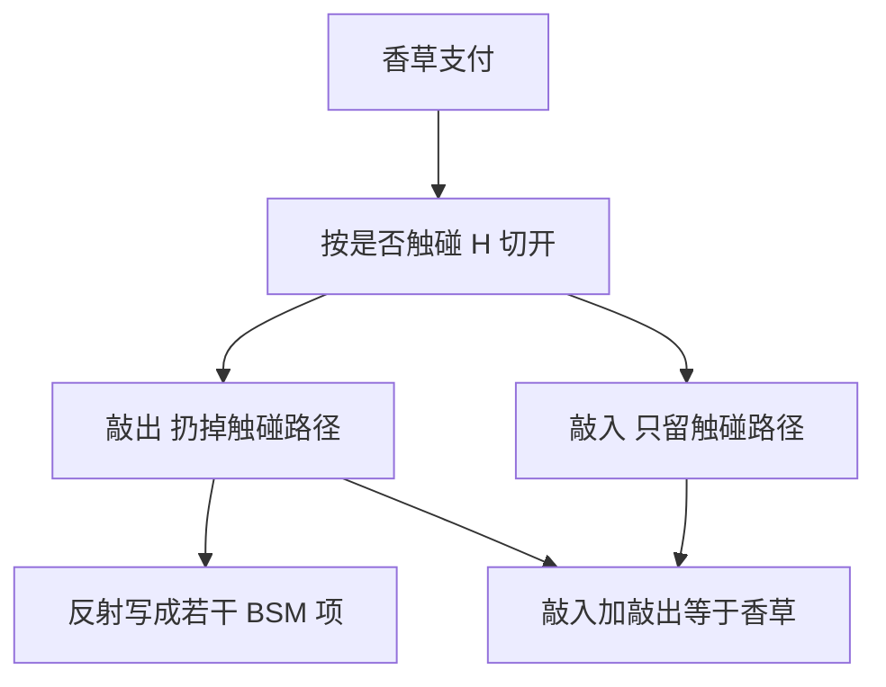

# 障碍期权解析解

敲出是香草减去在壁上被吸收的那些路径的贡献；反射原理把吸收问题写成若干漂移相反的 BSM 项。

<footer>—— Merton, Theory of Rational Option Pricing, Bell Journal of Economics and Management Science, 1973；Reiner and Rubinstein, Breaking Down the Barriers, Risk, 1991</footer>

[上一课](/quant/digital-options)把到期示性写清。障碍把示性沿路径展开：是否曾触及 $H$ 决定合约是活着、作废，还是变成另一份支付。主干里 [障碍监控频率](/quant/barrier-monitoring) 已经写了离散对连续的连续性修正。本课的缺口是：**连续监控、GBM 下那一组闭式本身怎么来、怎么用，以及它不能覆盖什么。** 后课篮子不再是一维反射。

## 问题

向下敲出看涨：若 $\inf S_t\le H$ 则支付 0，否则 $(S_T-K)^+$。Merton（1973）对 $K=H$ 的下跌敲出给出闭式；Reiner–Rubinstein 把八类敲入/敲出、看涨/看跌、向上/向下写成统一的 BSM 项组合。问题不是再推一遍反射公式的每一项，而是分清三件事先修没钉死的事：(1) 连续公式假定 GBM 且连续观察；(2) 敲入 + 敲出 = 香草只在同类、同一 $H$、连续（或同一离散网格）下成立；(3) 返现（rebate）是触碰时的数字，不是障碍期权的边角料。

把连续公式直接套到日频观察的权证上，就是监控课已经反对过的做法。本课提供的是「若连续成立，价格从哪几项来」，供树、PDE、模拟当基准，而不是当生产估值。

### 反射给出的是镜像资产，不是另一张曲面

GBM 下，$\ln S$ 是带漂移布朗。在壁垒 $h=\ln H$ 上吸收，转移密度由原过程减去（或加上）从镜像出发的过程构成，漂移因测度要改。结果是若干 $S_0$、$H^2/S_0$ 为现价的 BSM 看涨看跌。实现时项数多、符号易错，应以敲入敲出平价与 $H\to0$ 或 $H\to\infty$ 的极限做单元测试，而不是凭记忆抄系数。

$H$ 与 $K$ 的相对位置改变哪些项存活。反向障碍（敲出壁在价内）的 Delta 可以在壁附近变号。解析解能算，不代表能用香草簿去对冲到壁上。

## 方法

连续 GBM：用 Reiner–Rubinstein（或 Haug 汇编）的标准项，输入 $S,K,H,r,q,\sigma,T$ 与返现。离散监控：回到 [障碍监控频率](/quant/barrier-monitoring) 的 $H'$ 修正，或只在观察层检查的树/[PDE](/quant/option-pde)。有微笑：连续 GBM 闭式不能重现香草曲面，应改局部波动或随机波动上的 PDE/MC；闭式最多当控制变量。

返现若在触碰时立刻付，是一触即付数字；若到期才付，是带吸收的到期数字。两者的贴现时钟不同，不能都当「障碍费」。双障碍、时间依赖 $H_t$、巴黎期权（在壁外停留够久才触发）都没有同一组八公式。

## 机制

障碍把路径空间切成「从未碰到 $H$」与「曾经碰到」。敲出扔掉后一类；敲入只留后一类。反射把「碰到过」的概率质量用镜像路径表达，从而回到欧式积分。这就是为什么公式看起来像几份香草的线性组合——线性的是 GBM 的转移密度，不是市场里的香草价格。有微笑时，真实测度下的「碰到过」不能用同一套镜像系数从 ATM 香草读出来。

对冲在 $H$ 附近失败的原因与数字类似：触发是不连续事件。卖方通常用附近香草加反向数字去近似，并在距离 $H$ 的缓冲带里提前把 Gamma 卸掉，而不是等到触发那一 tick。

## 边界

闭式假设连续路径、常数 $\sigma$、连续监控、无离散分红。股权离散分红、外汇的离散观察、商品的期货滚动，每一条都够让闭式变成近似。局部波动能校准香草，障碍价格对壁附近的局部 vol 极敏感，校准误差会放大——这是后课模型风险，本课只点名。不要发明「障碍隐波」去反推一个 $\sigma$ 再代回 Merton 公式当生产价格；那是把模型误差塞进一个数字。

雪球、autocallable 是离散观察的复合障碍，解析八公式不够，见后课与前沿里的 [雪球](/quant/snowball-pricing)。

## 小结

- 连续 GBM 障碍价格是反射给出的若干 BSM 项；敲入敲出平价是检查项。
- 生产合约几乎都是离散观察或带微笑，闭式是基准不是报价。
- 返现是触碰数字，时钟要写清；双障碍与巴黎不是同一组公式。
- 出处：Merton, *Bell Journal*, 1973；Reiner and Rubinstein, *Risk*, 1991。
