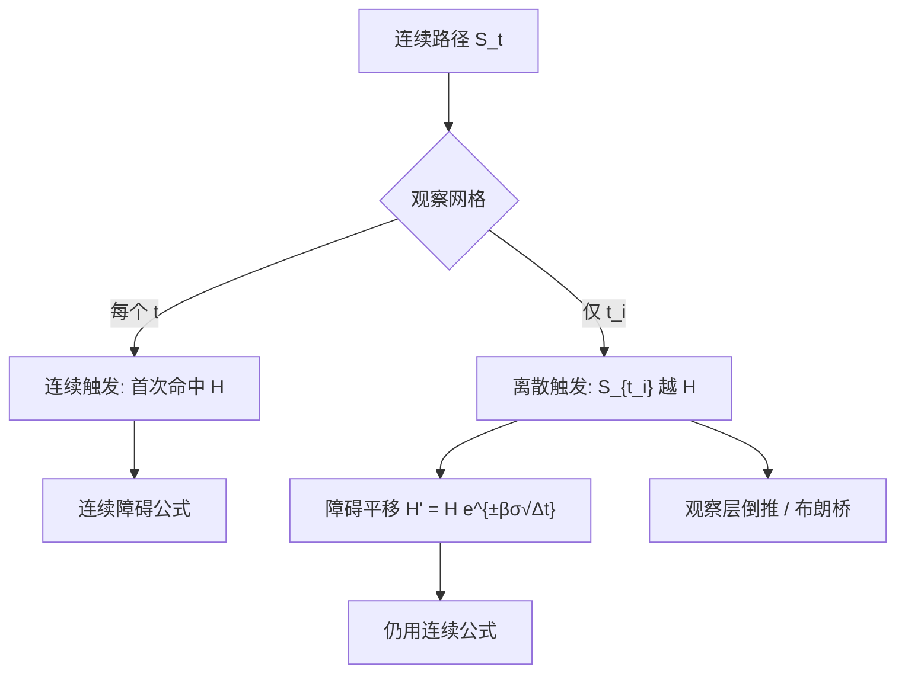

# 障碍期权监控频率

把连续监控的障碍沿监控间隔做一次指数平移，离散观察下的价格就可以借用连续公式；平移量由布朗运动的极值分布决定，而不是由交易员对「会不会碰到」的直觉决定。

<footer>—— Broadie, Glasserman and Kou, A Continuity Correction for Discrete Barrier Options, Mathematical Finance, 1997</footer>

障碍期权的支付取决于标的有没有在存续期内触及某个水平 $H$。这句话里的「触及」必须先规定观察时钟：连续监控假设路径的每一瞬间都算，离散监控只在收盘、整点或合约列出的时刻取样。同一敲出（knock-out）条款，观察越稀，越难被敲掉，期权越贵；敲入则相反。连续情形在 Black-Scholes 下有 Reiner–Rubinstein 一类闭式；真实合约几乎都是离散的，直接套连续公式会把敲出卖得太便宜。Broadie、Glasserman 与 Kou（1997）给出把障碍平移 $H' = H e^{\pm\beta\sigma\sqrt{\Delta t}}$ 的连续性修正，使离散问题仍能走连续公式。本篇写监控频率如何进入价格与希腊值，以及微观结构里障碍附近的流动性——那是观察网格与簿几何的相互作用，不是一份「如何把价格扫过障碍」的操作手册。欧式香草见 [Black-Scholes-Merton](/quant/bsm)，路径模拟见 [蒙特卡洛定价](/quant/mc-pricing)。

## 问题

连续监控下，一维扩散只要穿过 $H$ 就算触发，首次命中时间有已知分布，敲出看涨可以写成香草减去一个反射项。离散监控把路径先抽样再判断，两次观察之间可以穿过 $H$ 再回来而不触发，敲出概率下降。问题是这个「漏检」有多大，以及它怎样随观察间隔 $\Delta t$、波动率与障碍距离变化。对短期限、障碍靠近现货的反向敲出，漏检不是高阶修正，而是一等价格来源。

第二句话是合约与系统不一致。条款写「每个交易日收盘」，估值却用连续公式；或者条款写连续，但内部风控用五分钟网格。两种时钟给出不同的触发事件集，希腊值在障碍附近的尖峰位置也不一样。需要的是：在给定观察网格上定义触发，再决定用修正闭式、树、还是带指示函数的模拟。

### 连续监控的闭式与离散监控的价格差

以向下敲出看涨为例，连续触发集是 $\{t\le T: S_t \le H\}$，离散触发集是 $\{t_i: S_{t_i}\le H\}$。离散触发是连续触发的子集，故离散敲出期权的持有人更常拿到香草支付，价格更高；离散敲入更难生效，价格更低。价差随 $\sqrt{\Delta t}$ 而不是随 $\Delta t$ 消失——因为布朗桥在一步里的极值偏差是 $\sqrt{\Delta t}$ 量级。于是「一天观察一次」相对连续，误差可以达到几个波动点，不能靠把步数从 365 改到 366 来忽略。

敲出与敲入在连续监控下常有平价：敲入 + 敲出 = 香草（同类看涨或看跌、同一 $H$）。离散监控下平价仍近似成立，因为每一次观察上触发的定义互补；路径在观察之间的漏检对敲入、敲出同时发生，平价比单一边的绝对价格更稳。

## 方法

连续 Black-Scholes 障碍公式把吸收壁或反射原理用到几何布朗上，得到若干 $d$ 项的组合，数值实现要注意障碍在价内或价外、以及 $H$ 与 $K$ 的相对位置。离散监控的精确解涉及多元正态在角型区域上的积分，观察次数一多就不可用。Broadie–Glasserman–Kou 的修正是：把连续公式里的障碍换成

$$
H' = H\exp\bigl(\pm\beta\sigma\sqrt{\Delta t}\bigr),\qquad \beta=-\frac{\zeta(1/2)}{\sqrt{2\pi}}\approx 0.5826,
$$

符号按敲出方向选择，使连续过程更容易（或更难）被判定为触碰，以补偿离散漏检。$\zeta$ 是黎曼 zeta。这一修正对日频、障碍不太贴近的情况通常够用；观察极少或障碍极近时，应改用 treed 的观察层、或对布朗桥在步内极值做校正抽样。

树与 PDE：只在观察层检查 $S$ 是否越过 $H$，非观察层按普通倒推。观察层必须落在时间网格上，否则又引入一层插值误差。蒙特卡洛若只比较区间端点，估的是离散合约；若要逼近连续，需在每步用布朗桥极值的解析分布决定是否触碰，而不是把 $\Delta t$ 盲目加密却仍只看端点。

### Broadie–Glasserman–Kou 连续性修正

修正的来源是：离散观察下，「未触发」等价于一串高斯点都在障碍一侧，其与连续首次命中的差异，可由随机游走极值与连续极值的渐近位移刻画。$\beta\sigma\sqrt{\Delta t}$ 就是这个位移在对数价格上的表达。它不是在障碍上加几个 tick 的经验法则：$\sigma$ 与 $\Delta t$ 变了，平移必须跟着变。把修正一次性写进日历再对所有期限共用，会在短期限上平移过大、在长期限上过小。

离散观察还可以是非均匀的：只在交易日、跳过周末，或只在到期前一周加密。此时没有单一 $\Delta t$，修正公式应分段，或放弃闭式改网格。美式障碍（可提前行权且带敲出）更没有简单平移：执行停时与敲出停时互相截断，应对齐观察日做倒推，并在每个观察节点上先判断敲出再判断行权。

## 机制

监控频率进入价格，是因为它改变了触发这一停时的定义，而不是因为改变了标的的真实路径。同一条连续样本，日频观察可能判未敲出，逐笔观察可能判敲出。估值必须与结算条款用同一套观察信息，否则对冲的是另一个合约。希腊值在障碍附近出现尖峰：连续敲出的 delta 在 $H$ 处接近不连续；离散监控把尖峰展到相邻两个观察日之间，对冲可以在观察前把 delta 收到香草、观察后若未触发再重新套回去。观察日当天的伽马是离散障碍的风险集中点。

微观结构上，障碍常落在整数价位，止损与敲出单在附近聚集，可见深度会变薄或变厚。这会改变短时实现波动与滑点，从而改变「会不会在观察时刻印在 $H$ 一侧」。它解释的是离散观察对成交价网格的敏感性，不是提供一套把印记推过 $H$ 的交易步骤。研究侧可以统计障碍邻近的订单流毒性与深度消耗，与 [VPIN](/quant/vpin)、[订单流毒性](/quant/ofi-toxicity) 对照；交易侧则应把障碍当成结算定义，把流动性当成执行成本，而不是当成可操纵的开关。

### 监控时刻、舍入与簿上的障碍

合约写的是交易所以何种价格观察：官方收盘、结算价、还是连续成交价。用中间价判断触发、用成交价结算，会在价差内部制造争议区间。最小报价单位使 $H$ 若不是 tick 的整数倍，实际触发发生在最近可成交价。离散监控加离散价格，等于障碍被推到网格点上；连续公式里的 $H$ 应先映射到这个网格再谈修正。开收盘集合竞价、涨跌停使观察价被制度截断，连续布朗的首次命中分布在这些日子失效。

「连续监控」在电子盘上其实是逐笔或逐毫秒的离散，只是 $\Delta t$ 小到与连续公式不可分。真正的建模选择是合约观察网格，不是交易所引擎的物理时钟。

## 边界

闭式与 BGK 修正依赖几何布朗、常数波动、单一障碍。局部波动、随机波动会改变步内极值，平移系数 $\beta$ 不再恰好是 $0.5826$。双边障碍、巴黎障碍（需在障碍外停留一段时间）、窗口障碍，观察定义更复杂，修正不能直接套。红利离散跳跃见 [离散股息对美式期权](/quant/discrete-dividend-am)：除权可能直接把现货打过 $H$，应在除权日单独判断，而不是靠监控频率去「平均掉」。

不要把障碍附近出现的止损单流写成操作建议。本篇把聚集当作价格冲击与触发相关的经验事实：它让离散观察价对深度更敏感，并让做市商在观察前扩宽价差。检测这类流动性空洞属于市场质量研究，与 [Kyle 模型](/quant/kyle-model) 的冲击、[PIN](/quant/pin) 的信息不对称是同一族问题的不同时钟。

回测离散障碍若用日线高低点代替官方观察价，会高估敲出频率：高低点是连续极值的粗糙代理，恰恰是离散合约故意不采用的量。估值与回测必须用条款指定的印记。

## 小结

- 障碍条款的「触及」由观察时钟定义；离散敲出贵于连续敲出，价差随 $\sqrt{\Delta t}$ 消失。
- Broadie–Glasserman–Kou 用 $H' = H e^{\pm\beta\sigma\sqrt{\Delta t}}$（$\beta\approx 0.5826$）把离散问题接回连续公式。
- 树与模拟只在观察层判断触发；逼近连续需步内极值，而不是只加密端点。
- 观察日是伽马风险的集中点；合约印记、tick 与集合竞价决定真实触发集。
- 障碍附近的深度变化属于流动性与冲击研究，不提供穿越障碍的交易配方。
- 随机波动、离散股息、巴黎/窗口障碍会打破单一平移。
- 出处：Broadie, Glasserman and Kou, *Mathematical Finance*, 1997；连续障碍闭式见 Reiner and Rubinstein 以及标准 BS 障碍公式。
