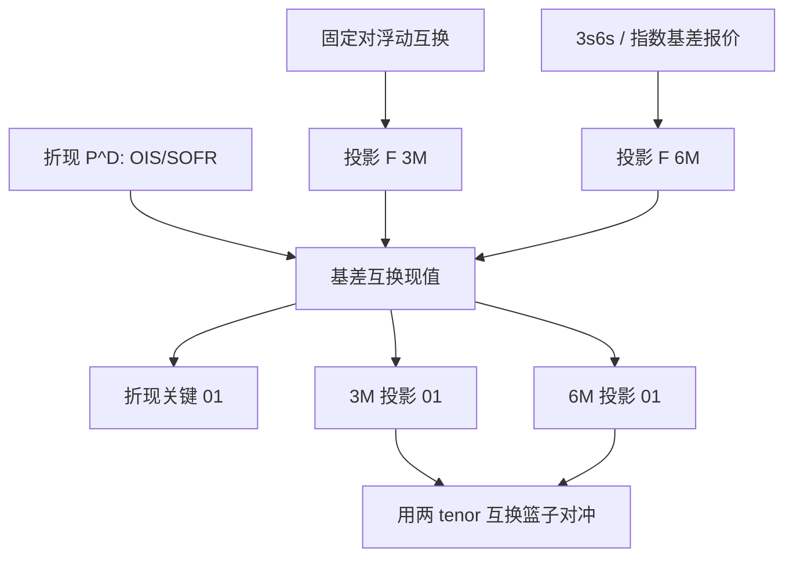

# 基差互换

    
同一货币下，不同期限的浮动指数不再能由一条曲线生成；3M 对 6M 的价差本身可交易，必须再自助一条投影曲线。

    <footer>—— Mercurio, Interest Rates and The Credit Crunch: New Formulas and Market Models, 2009；Bianchetti, Two Curves, One Price, Risk, 2010</footer>

基差互换（basis swap）交换两串浮动利息：同一货币、不同指数或不同期限，价差加在其中一条腿上使合约初始公允价值为零。危机前，1M、3M、6M LIBOR 被当成同一无风险短端的不同复利，期限基差只有几个基点；危机中 3s6s、LIBOR–OIS 撑开到必须单独建模。Mercurio（2009）写出多曲线下 cap、FRA 与基差的公式；Bianchetti（2010）把「两条曲线、一个价格」写成市场惯例；Fujii、Shimada 与 Takahashi（2010）讨论有抵押时多条互换曲线如何同时自助。本篇写单币种期限基差与指数基差，不写已单独成篇的[交叉货币基差](/quant/xccy-basis)。它是[OIS 与多曲线](/quant/multi-curve-ois)的可交易腿，也是 [LMM](/quant/lmm) 在停用 LIBOR 之后仍要保留多条 tenor 结构的原因。

## 问题

单曲线恒等式说：3M 远期应由贴现因子之比给出，六个 3M 复利应对齐一个 6M。一旦 3M 与 6M 指数含不同的银行信用、流动性与定盘微观结构，恒等式变成带价差的市场。基差互换把这个价差变成报价：例如付 3M、收 6M 减去 $b$ 个基点。$b$ 的期限结构是新的状态变量。问题是估值：折现用哪条曲线、两条投影如何自助、期权的标的是哪一个远期，以及风险报告如何把「3M 的 5Y」与「6M 的 5Y」分成不同的[关键期限 DV01](/quant/key-tenor-dv01)。

第二层是指数改革。LIBOR–OIS 曾是信用与无担保融资的晴雨表；转到 SOFR 之后，同类对象变成期限 SOFR 对隔夜复利、SOFR 对有效联邦基金、或 SOFR 对担保隔夜融资的不同口径。名字都叫 basis，微观不同。把 2011 年的 3s6s 回归系数套到 2025 年的 SOFR 基差上，是在估计一段已经关闭的市场。

### 浮动对浮动，不是「再做一个互换」

普通利率互换是固定对浮动，风险主要是固定端久期对浮动指数。基差互换两腿都是浮动，平行移动下净久期接近零，剩余的是两条投影曲线的相对移动。用单一互换 DV01 去对冲基差簿，会在水平冲击上过度对冲、在基差冲击上完全不对冲。这与[互换价差](/quant/swap-spread)（互换对国债）不同：那里一条腿是政府曲线；这里两条腿都是银行或 RFR 指数，国债便利不直接出现。

报价惯例必须写清：价差加在短期限腿还是长期限腿、年分数、支付频率是否错配、是否交换名义。3s6s 在美元与欧元上的符号习惯不必相同。内部把基差存成「6M 投影减 3M 投影的平价差」，再映射到经纪商惯例。

## 方法

**曲线。** 先自助抵押折现 $P^D$（OIS 或 SOFR OIS）。再对主指数（如 3M）用固定对浮动互换自助投影 $F^{3M}$。基差互换给出 6M 相对 3M 的信息，用来自助 $F^{6M}$，而不是再用 6M 固定对浮动单独当唯一输入——二者应交叉检验。FRA 与期货是短端投影的直接观察，但期货有凸性，不能当远期本身，见[曲线自助](/quant/curve-bootstrap)。

多曲线下，一笔 3s6s 基差互换的现值是两条浮动腿按 $P^D$ 折现的差。每条腿的期望用各自投影远期。不要用 $P^{6M}$ 去折现 6M 现金流：$P^{6M}$ 只是生成远期的辅助对象。Bianchetti 的「一个价格」指所有现金流最终都走折现曲线。

**风险。** 对 $P^D$ 做关键冲击，得到折现 DV01（两腿年分数若不同，折现风险不为零）。对 $F^{3M}$、$F^{6M}$ 分别做关键冲击，得到两列投影 01，符号相反、期限结构不必镜像。对冲：用 3M 互换（或 SOFR 3M 产品）与 6M 互换的篮子解线性方程，使两列关键 01 落入限额；剩余的折现 01 用 OIS 对冲。单因子 [Hull-White](/quant/hull-white) 只有一个 $r$，做不到两列投影，基差只能外生冻结。

### 市场模型里的 tenor 结构

LMM 的状态是某一 tenor 的简单远期。多曲线之后，3M LMM 与 6M LMM 是两套状态，其间的瞬时相关与基差扩散要另设。Mercurio 给出用折现曲线加各 tenor 远期的定价公式，caplet 的标的是该 tenor 的投影远期，贴现用 $P^D$。把 1997 年单曲线 LMM 的漂移原样用于 6M，再拿 3M 波动去标 3s6s 期权，相关结构是错的。工程上常见的简化是：香草用各 tenor 自己的波动曲面，基差用较慢的因子或冻结，不为 3s6s 单独建满秩 LMM——流动性不够支撑那么多参数。

[HJM](/quant/hjm) 可以对两条瞬时远期曲线写耦合波动，漂移条件要对每条可交易折现（或对每条投影的适当计价物）分别成立。实践成本通常高于「折现一条 Hull–White，投影基差当确定性调整」。只有当账簿含大量基差期权或 CMS 对错误 tenor 的暴露时，才值得让基差随机。

## 机制

期限基差的经济来源是指数本身的信用与流动性，而不是折现。6M LIBOR 含更长的无担保银行风险，危机中高于两个 3M 的复利；OIS 几乎不含这笔信用，LIBOR–OIS 变宽。担保之后，SOFR 隔夜复利与「期限 SOFR」仍可因凸性、在险期限、期货微观与合成而不同，但量级和危机中的银行信用基差不是同一量级。Johannes–Sundaresan 讨论的抵押，影响的是折现与互换利率水平，会同时抬或压两腿，对纯期限基差是二阶，除非两腿的抵押惯例不同。

错配支付频率会留下微小的固定端式暴露：3M 腿一年付四次、6M 腿付两次，年分数与折现时点不同，平行曲线移动仍有残差。这不是曲率交易，是日计数。做大名义之前应用关键点把残差扫出来，必要时用一笔小的固定对浮动补齐，以免基差簿看起来像[曲线蝶式](/quant/curve-butterfly)。

LIBOR–OIS 曾被当成银行体系压力的近实时指标。SOFR–OIS（或 SOFR–FF）更多反映担保与准备金结构。同一张「基差监控图」换指数而不换解释，会在 2023 年之后制造虚假警报。

### 与互换价差、交叉货币的边界

互换价差连的是互换与国债；单币种基差连的是两个浮动指数；交叉货币基差连的是两种货币的浮动加本金交换。三者可以相关——美元短缺时 xccy、LIBOR–OIS、国债特殊性一起动——但对冲工具不能借用。用收 LIBOR–OIS 去对冲 EURUSD basis，留下外汇和监管日历。风控科目应是「曲线 × 指数 × 货币」，而不是一个叫 basis 的桶。

## 边界与工程取舍

不要在投影曲线上用全局插值，使 3M 的 10Y 扰动改变 6M 的 30Y 远期，Ho 意义上的三角形在基差维度上崩掉。不要把期货凸性塞进基差节点当「真实远期」。不要为稀疏的 1s3s 报价建一条每天重校准的随机基差因子，参数会吸收噪声。期权smile 在各 tenor 上可以不同，3s6s 的 cap 更薄，模型风险大于香草。

LIBOR 停用后，残余合同的后备把 IBOR 换成 RFR 加固定利差，期限基差的一部分被冻结进利差调整，另一部分变成 RFR 期限结构。账簿要按协议日切换曲线，而不是把旧 3s6s 历史继续当风险因子。见[SOFR 过渡与后备](/quant/sofr-transition)。

实现测试：把 OIS 曲线平行上移、两条投影相对不动，基差互换的 PnL 应只有年分数错配量级；把 6M 投影相对 3M 上移 1bp，PnL 应接近基差 DV01。过不了这两项，折现与投影接反了。

## 小结

- 单币种基差互换交换两个浮动指数，把期限或指数价差变成可交易曲线，而不是单曲线恒等式的残差。
- Mercurio（2009）、Bianchetti（2010）、Fujii–Shimada–Takahashi（2010）给出危机后多曲线公式与有抵押自助。
- 风险是折现 01 加两列投影关键 01；一因子短端模型无法内生期限基差。
- 与互换价差、交叉货币基差科目分离；LIBOR 时代的 3s6s 故事不能原样贴到 SOFR。
- LMM/HJM 可以耦合多条 tenor，但流动性通常只支撑把基差当慢因子或冻结。
- 出处：Mercurio, 2009；Bianchetti, *Risk*, 2010；Fujii, Shimada & Takahashi, 2010；Johannes & Sundaresan, *Journal of Finance*, 2007。
