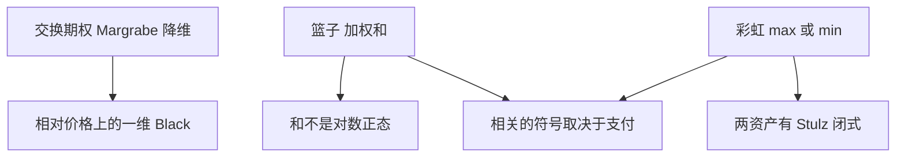

# 篮子与彩虹

交换期权的执行价是另一资产的未来价格；彩虹把支付写在最好或最差的那一个上。一维反射用不上，相关结构成为一等公民。

<footer>—— Margrabe, The Value of an Option to Exchange One Asset for Another, Journal of Finance, 1978；Stulz, Options on the Minimum or the Maximum of Two Risky Assets, Journal of Financial Economics, 1982</footer>

[上一课](/quant/barrier-analytics)还在单资产路径与壁。本课把标的换成**向量**：篮子是加权和上的期权，彩虹是 $\max$ 或 $\min$ 上的期权，交换是 Margrabe 的 $S^{(1)}$ 换 $S^{(2)}$。缺口是相关——不是再写一遍 [BSM](/quant/bsm)，而是：**多维对数正态下哪些有闭式，其余如何把相关从香草微笑里拆出来。** 后课 quanto 再把外汇乘进来。

## 问题

篮子看涨 $\bigl(\sum w_i S_T^{(i)}-K\bigr)^+$ 没有闭式：和不是对数正态。彩虹 $\bigl(\max_i S_T^{(i)}-K\bigr)^+$ 在两资产、GBM、常数相关下有 Stulz 公式；三资产以上迅速变成高维正态积分。问题是报价台常用「篮子隐波」一个数去套 Black，这个数同时吸收了成分波动、权重、相关与微笑，**不能**拿去当相关互换的输入。

相关上升时，正权重篮子的方差 $\mathbf{w}^\top\Sigma\mathbf{w}$ 上升，篮子期权变贵；「最好那个」的彩虹在相关下降时更贵，因为更能挑到跑赢的一个。符号可以相反。把篮子和彩虹都叫「多资产期权」然后共用一张相关矩阵去调，会把对冲方向做反。

### Margrabe 是相对价格上的一维问题

交换期权支付 $(S_T^{(1)}-S_T^{(2)})^+$。以 $S^{(2)}$ 为计价，相对价格 $S^{(1)}/S^{(2)}$ 在 GBM 下仍是 GBM，波动是 $\sqrt{\sigma_1^2+\sigma_2^2-2\rho\sigma_1\sigma_2}$，执行价为 1。闭式存在是因为降维，不是因为「两资产比较简单」。一旦有微笑、有三个以上资产、或支付是篮子加权，降维消失。

指数期权在定义上是篮子期权，但指数有自己的期权市场。用成分香草加相关去复制指数期权，剩下的是相关风险溢价与分红差异，对象与 [指数套利](/quant/index-arb) 相邻，本课不重写指数复制。

## 方法

两资产交换、两资产彩虹：闭式或低维积分，相关用历史或从指数/成分隐含相关反推。篮子：矩匹配（把 $\sum w_i S_i$ 配成一个对数正态）、Monte Carlo、或对加权和做近似分布（Milevsky–Posner 等）。有微笑时，每个成分用自己的边际（[Dupire](/quant/dupire) 或混合对数正态），相关用高斯/t copula 或因子结构；边际与相关必须分开校准，见主干 [Copula](/quant/copula)。

隐含相关：从指数期权与成分期权反推一个 $\rho_{\mathrm{imp}}$。它是定价核下的相关，不是已实现相关。后课 [相关互换](/quant/correlation-swap) 交易这个差；[分散交易](/quant/dispersion-trade) 是期权实现。

## 机制

正权重篮子：$\rho$ 升则组合方差升，期权更贵。这与分散交易的符号一致——做空指数波动、做多成分波动，近似做空隐含相关。Max-彩虹：$\rho$ 降则「挑选权」更值钱；worst-of 则在 $\rho$ 降时更易碰到最差腿，看涨变便宜、看跌变贵。同一张 $\rho$ 的比较静态，在篮子与彩虹上可以反号，必须按支付写，不能按「多资产」三个字写。

## 边界

矩匹配在权重集中、短期限时够用；成分有跳、相关不稳定、worst-of 有许多腿时会系统性偏。局部波动重现各边际，不重现共跳；危机里相关冲向 1，篮子与指数期权的价差会瞬间消失，复制失败。权重若随价格漂移（价格加权指数），状态还要包括相对权重，不是常数 $w$。

不要用一个篮子隐波去对冲成分 Vega：那个数字不是可交易的相关。

## 小结

- 交换期权可降维；篮子一般无闭式；两资产彩虹有 Stulz 公式。
- 相关对篮子与对 max/min 彩虹的比较静态可以反号。
- 篮子隐波把波动、权重、相关捆在一起，不能当相关互换输入。
- 出处：Margrabe, *Journal of Finance*, 1978；Stulz, *JFE*, 1982；Milevsky and Posner, *Journal of Derivatives*, 1998。
