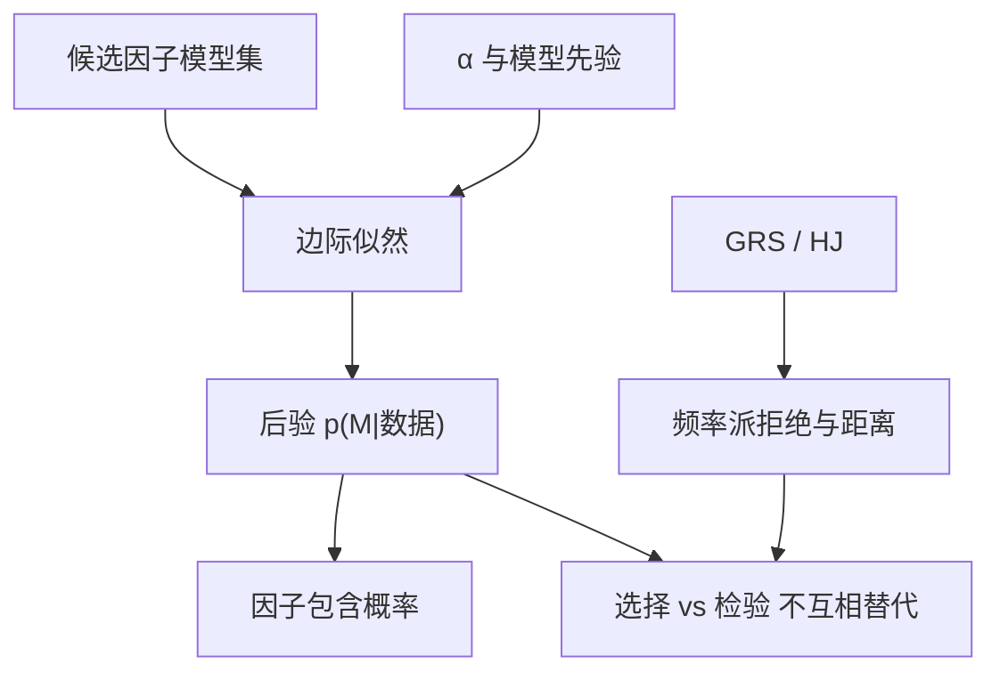

# 因子模型的贝叶斯比较

比较的不是谁在一张表上把 $J$ 的 p 值抬过 5%，而是：在给定先验下，数据更愿意把概率质量分给哪一套因子。

<footer>—— Barillas and Shanken, Comparing Asset Pricing Models, Journal of Finance, 2018</footer>

[HJ 距离](/quant/hj-distance-test) 给出误设的样本范数，仍是经典点上的一次比较：不自动惩罚「多一个因子总能降 $\delta$」。Barillas 与 Shanken 把因子模型比较写成贝叶斯：对嵌套与非嵌套的线性因子模型，用边际似然（或等价的 Sharpe 改进）算后验概率。本课缺口：在 GMM/HJ/GRS 都报过之后，**用边缘似然处理多重模型与过拟合**。下一课收缩把同一思想用到单个系数，而不是整套模型的胜负。

## 问题

候选模型 $\mathcal{M}_k$：可交易因子 $f^{(k)}$，检验资产 $R$。经典做法逐个 GRS 或两两 $J$。模型数随因子动物园指数涨，5% 拒绝失去家庭wise 含义；嵌套时大模型总有更小的样本 $\alpha$。问题是计算 $p(\mathcal{M}_k\mid R)$，先验 $p(\mathcal{M}_k)$ 与参数先验必须写明。

Barillas–Shanken 的关键简化：比较可交易因子模型，不必先指定检验资产——在一定先验下，模型比较约化成**因子之间谁解释谁的夏普**。这与「检验资产选得越好看越通过」的经典病相对。仍须声明：先验对 $\alpha$ 的尺度（Barillas–Shanken 用相对因子夏普的先验）会推动后验。

### 不是把 p 值换成「贝叶斯」标签

BIC 近似边缘似然，惩罚参数个数，但是对先验与样本量的粗近似。资产定价 $T$ 不算大、$N$ 与 $K$ 的相对大小敏感，应尽量用他们给出的精确或准精确边际似然，而不是随手 BIC。Harvey、Liu 与 Zhu 对因子动物园的多重检验是频率派 FDR；本课是模型空间上的后验。两者都在管「太多候选」，对象一个是单因子 t，一个是整模型。

后验概率 0.7 不表示「有 70% 把握在真实世界赚钱」。它是：在模型集封闭、先验与似然都接受的前提下，概率质量的分配。模型集没把真实包含进去，后验仍会在错误集里归一化。

## 方法

**似然。** 通常假设因子与资产联合正态，或对超额收益的时间序列回归正态。边缘化 $\beta,\Sigma,\lambda$。共轭先验给出解析或易算的边际似然。Barillas–Shanken 比较「谁该出现在定价因子里」，把非定价的检验资产与因子一并处理。

**先验。** 对 $\alpha$ 的先验尺度是关键超参：太紧则任何 $\alpha$ 都被视为噪声，小模型胜；太松则数据无法反对大模型。应报告超参敏感性。均匀模型先验把概率平分给所有子集，因子多时大模型空间占优，可用稀释先验。

**输出。** 每个模型的后验、因子的包含概率、以及相对基准（市场）的证据比。不要只报「最佳模型」点名。

### 与 GRS 对照

GRS 拒绝「这些 $\alpha$ 联合为零」。贝叶斯问「加入这些因子后边际似然是否上升」。可以 GRS 拒绝（经典显著 $\alpha$）但贝叶斯仍支持小模型（$\alpha$ 幅度相对先验与 $\Sigma$ 不够）。这不是矛盾：一个控 I 类错误，一个做模型选择。报告应并列，而不是用后验抹掉拒绝。

## 机制

边缘似然 $\int p(R\mid\theta,\mathcal{M})p(\theta\mid\mathcal{M})d\theta$ 自动把只会拟合噪声的参数积掉——Ockham 因子。夏普改进大、且稳定，才会胜过额外维度的惩罚。机制与 Hjort–Claeskens 模型平均、与经验贝叶斯收缩同源：都把「额外自由」写成先验下的积分，而不是只看样本内平方误差。

可交易因子比较能约化，是因为线性定价下，模型的优劣由因子张成的前沿决定。宏观因子不可交易时，约化失败，必须回到检验资产与 SDF，经典 HJ/GMM 更直。

正态似然对危机日敏感。用 t 似然或混合会改后验。若结论只在正态下成立，应写明。这与稳健回归课将处理的离群是同一尾巴，只是这里作用在模型概率上。

### 计算

子集 $2^K$ 在 $K\gt 20$ 时不可枚举，用 MCMC、鸟击、或只比较预登记的嵌套链（市场 / FF3 / FF5 / Q）。探索性的全子集搜索要把多重比较写进发现研究，不能当验证。

## 边界与工程取舍

样本分裂：用一半算后验、一半验证，先验仍会泄漏若你用全历史选因子名单。因子是被同一文献矿出来的，后验过乐观——这是 Harvey–Liu–Zhu 的频率派警告在贝叶斯里的对应：先验应对「已发表」打折，很少有人真这么做，故后验应当上界。

工程：预登记模型集与 $\alpha$ 先验尺度；报包含概率与敏感性；并列 GRS/HJ。不要用后验概率当组合权重除非明确模型平均并扣成本。不要把宏观 SDF 塞进 Barillas–Shanken 的可交易约化。下一课把收缩从「整模型」降到「单个 $\beta$ 与均值」。

## 小结

- 贝叶斯模型比较用边缘似然分配后验，惩罚只拟合样本 $\alpha$ 的额外因子。
- Barillas–Shanken 在可交易因子、合适先验下把比较约化到因子夏普，减轻检验资产挑选。
- 先验尺度与模型集封闭性决定后验；应做敏感性，并与 GRS/HJ 并列。
- 不可交易宏观因子不能套同一约化；因子动物园的选择偏差会让后验偏乐观。
- 出处：Barillas and Shanken, *Journal of Finance*, 2018；相关贝叶斯资产定价见 Avramov 等；多重检验的频率派对照见 Harvey, Liu and Zhu。
