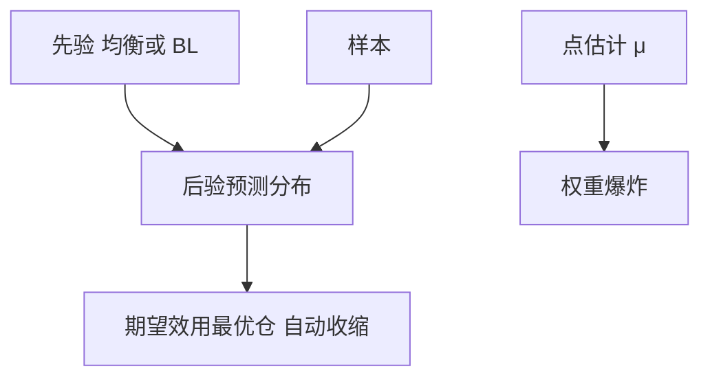

# 贝叶斯组合与参数不确定

未知的 $\mu$ 应积分掉，而不是用点估计塞进 Merton 公式；后验越散，有效风险厌恶越高，仓位越收缩。

<footer>—— 对照 Jorion 对 Bayes–Stein 估计的组合应用；Black–Litterman 的均衡先验</footer>

[上一课](/quant/garleanu-pedersen)在二次冲击下给出向平滑瞄准点的部分调整，瞄准点含未来信号预期，$\Lambda$ 必须来自执行模型。缺口是目标本身：GP 把 $\pi^\ast$ 当已知再谈怎么交易，样本均值当 $\mu$ 会在历史运气最好的资产上杠杆。本课钉贝叶斯组合：对 $\mu$（及 $\Sigma$）求后验，决策最大化后验期望效用，权重向先验收缩。不重讲部分调整增益。主干装置见 [Black–Litterman](/quant/black-litterman) 与 [收缩](/quant/cov-shrinkage)；后课稳健优化默认已经分清后验平均与最坏情形。

## 问题

GP 的瞄准点把 $\mu$ 当已知；样本均值当 $\mu$，Markowitz/Merton 会在历史运气最好的资产上杠杆。贝叶斯：给定先验与样本，对 $\mu$（及 $\Sigma$）求后验，决策是最大化后验期望效用，或等价地对后验预测分布做 Markowitz。结果通常是：权重向先验（常取均衡市值或 BL 均衡）收缩，有效 $\gamma$ 变大。问题是把「我们很不确定 $\mu$」写成先验方差，而不是写成口头谨慎然后仍用点估计下单。

预测分布的方差 $=$ 残差方差 $+$ 参数不确定。短样本、高维时第二项主导，最优仓接近无风险或接近均衡，这是特征。

### 与 BL 的分工

BL 用均衡 $\pi$ 当先验均值，观点当似然。本课强调：即使没有观点，仅参数不确定也要求收缩。有观点时，观点的置信就是先验精度。不要既用 BL 又用另一套「再保守 50%」的随意分数，除非那 50% 来自后验计算。

对数效用对参数不确定特别脆：Kelly 课已说满 Kelly 在 $\mu$ 高估时破产风险升。贝叶斯 Kelly 自然分数化。

## 方法

先验：$\mu$ 向均衡或零超额（风险平价精神）；$\Sigma$ Inverse-Wishart 或因子。后验预测代入二次效用得 $\pi$。高维用经验贝叶斯估计先验方差，避免拍 $\tau$。对照：点估计 Markowitz vs 后验政策的样本外，对象是扣费 IR 与换手，不是样本内前沿。

动态：参数后验随数据更新，政策应慢，避免把噪声当新观点——与校准隔日罚同构。

## 机制

积分 $\mu$ 等于在效用里加一项对估计误差的厌恶。仓位下降、分散上升（不太敢集中押注历史赢家）。这与下一课稳健优化的最坏 $\mu$ 集合是两条路：贝叶斯对后验加权平均，稳健对集合取 min。前者需要先验，后者需要不确定集。

## 边界

先验错了（均衡本身是错的模型）会把所有人拉向错误基准。稳健课处理先验也不信的情况。计算：全贝叶斯 MCMC 对日频再平衡太重，实务用共轭或 BL 闭式。不要把贝叶斯当成「可以用更短窗口」的许可证——短窗口让后验更散，仓位应更小。

## 小结

- 对参数积分后，仓位收缩、有效风险厌恶上升；这是政策，不只是估计技巧。
- BL 是带均衡先验的实现；不要叠加无来源的再打折。
- 与稳健优化不同：平均后验 vs 最坏集合。
- 出处：Jorion, *Journal of Financial and Quantitative Analysis*, 1986（Bayes–Stein）；Black and Litterman, 1992。
