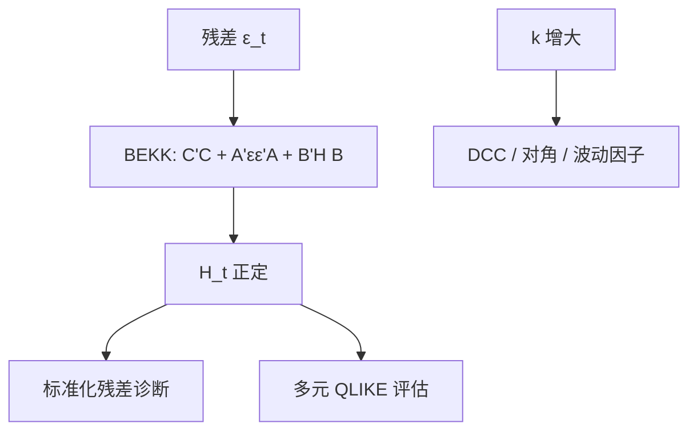

# BEKK 多元 GARCH

让协方差矩阵自己做自回归，还要每天保持正定；把 ARCH 与 GARCH 项写成二次型，正定可以靠参数构造来保证，而不必每天把矩阵投影回去。

<footer>—— Engle and Kroner, Multivariate Simultaneous Generalized ARCH, Econometric Theory, 1995；BEKK 名称来自 Baba, Engle, Kraft and Kroner 的工作论文传统</footer>

[QLIKE](/quant/qlike-vol-forecast-eval) 已经规定怎么评一元 $\hat h_t$。组合风险需要 $H_t=\mathrm{Var}(r_t\mid\mathcal{F}_{t-1})$ 整矩阵。[GARCH](/quant/garch) 的直接推广是 vec 形式，参数过多且正定难保。Engle 与 Kroner 的 BEKK 令

$$
H_t=C^\top C+A^\top\varepsilon_{t-1}\varepsilon_{t-1}^\top A+B^\top H_{t-1}B,
$$

$C$ 三角，$A,B$ 为 $k\times k$，构造上 $H_t$ 正定（在温和条件下）。本课缺口：一元方差动态之后的**系统方差**。DCC、CCC 是相关与方差分离的另一条路；BEKK 是联合的。下一课波动因子把 $k$ 再降维，因为满 BEKK 在 $k\gt 5$ 时已经吃力。

## 问题

$k$ 个收益，无约束多元 GARCH 的参数 $O(k^4)$。BEKK 满矩阵仍 $O(k^2)$，对角 BEKK $O(k)$。问题是在正定、可估计、与溢出发散（spillover）之间选设定。对角 BEKK 不许波动从资产 $i$ 传到 $j$ 的方差方程（除了通过相关），满 BEKK 允许但易过拟合。

Bollerslev 的 CCC 令相关常数、各方差一元 GARCH；Engle 的 DCC 让相关慢变。BEKK 不把相关拆出来，冲击对 $H_t$ 的路径由 $A,B$ 的二次型决定。对象是**条件协方差过程**，不是已实现协方差（高频单元）。

### 估计与准似然

条件高斯 QMLE，即使创新非高斯，在正则下仍一致。标准误用三明治。约束 $H_t$ 正定已由 BEKK 形式部分保证；$C$ 满秩、适当平稳条件（$A,B$ 的 Kronecker 谱半径）仍要查。数值上 $k=4$ 已需好初值；常从对角 BEKK 或 CCC 起步。

BEKK 的单个 $A_{ij}$ 不是「$j$ 对 $i$ 的溢出弹性」那么好读，因为二次型混了符号与尺度。读溢出应用 IRF 式的波动脉冲（Hafner–Herwartz 一类），或比较对角与非对角的似然，而不是盯着某一个 $A_{ij}$ 的 $t$。

## 方法

**设定选择。** 指数与两三个期货：$k$ 小，满或标量 BEKK。一篮子股票：不要满 BEKK，用 DCC、因子 GARCH 或下一课波动因子。标量 BEKK（$A,B$ 为标量乘单位）最省，溢出同质。

**诊断。** 标准化残差 $H_t^{-1/2}\varepsilon_t$ 的交叉 ACF、平方交叉 ACF 应抽干。若常相关被拒绝，CCC 不够；若仍有平方相关，升阶或加非对称（GJR 式 BEKK）。

**预测评估。** 用已实现协方差当代理，多元 QLIKE 或 Frobenius。代理的异步偏差见后课 [已实现协方差](/quant/realized-covariance)；日频 BEKK 评测不要用未同步的分钟矩阵。

### 与因子模型

若收益有因子结构，残差 GARCH + 因子方差更省。BEKK 对残差 $k$ 仍大。Engle、Ng、Rothschild 的因子 ARCH 是下一课的先声：共同波动由少数因子承担，特异再一元 GARCH。BEKK 适合「没有明显因子、又要溢」的小系统。

## 机制

$A^\top\varepsilon\varepsilon^\top A$ 把昨天的外积写进今天的 $H$，方向由 $A$ 旋转。$B^\top HB$ 让旧协方差持续。二次型保证半正定相加。持续性由 $A,B$ 的谱决定，接近 IGARCH 时长期预测漂，与一元相同，且更容易被断点污染（Lamoureux–Lastrapes 的多元版）。

杠杆：对称 BEKK 对正负冲击一视同仁。非对称 BEKK 或先估一元 GJR 再 DCC，往往更符合股票。本课对称为默认，杠杆是诊断拒绝后的扩展。

标准化残差仍肥尾时，QMLE 点可以，VaR 不能靠高斯分位。应 t 创新或经验分位，与一元 GARCH 课相同。

### 识别与等价

BEKK 参数有符号翻转等等价，$A,B$ 的个别系数解释弱。应报预测与特征根，不报「显著的 $A_{12}$」。这与结构 VAR 的识别不同：BEKK 是缩减式方差，没有冲击正交化故事，除非再加均值 VAR 识别。

## 边界与工程取舍

$k$ 大时伪拟合、似然平坦。缺测、不同上市日历要先对齐。高频不该用 BEKK 替代已实现协方差——信息集错误。组合优化对 $H_t$ 的最小特征值敏感，BEKK 过拟合会制造虚假低风险方向，应收缩或因子。

工程：小 $k$ 对角/标量 BEKK；中 $k$ DCC；大 $k$ 因子。评估用 Patton 纪律的多元损失。下一课把维数用波动因子压下去。不要对 50 只股票估满 BEKK。不要用 BEKK 相关当高频交易的瞬时相关。

## 小结

- BEKK 用二次型保证条件协方差正定，是小系统多元 GARCH 的构造性默认。
- 满 BEKK 参数仍随 $k^2$ 涨，对角/标量/DCC/因子是维数的退路。
- 单个 $A_{ij}$ 解释弱；看特征根、波动脉冲与样本外矩阵损失。
- 断点抬高持续性；杠杆、肥尾须扩展，不能靠高斯 QMLE 做尾部。
- 出处：Engle and Kroner, *Econometric Theory*, 1995；CCC 见 Bollerslev, 1990；DCC 见 Engle, *Journal of Business & Economic Statistics*, 2002。
