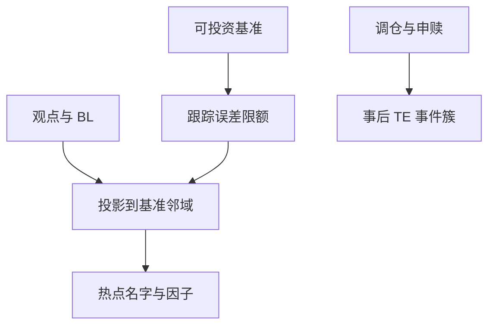

# 基准与跟踪误差

跟踪误差约束把组合钉在基准附近：优化的对象变成相对方差，而不是绝对方差；约束绑得越紧，越难把观点写成有意义的主动权重。

<footer>—— Roll, A Mean/Variance Analysis of Tracking Error, Journal of Portfolio Management, 1992；风险预算语言对照 Litterman, Hot Spots and Hedges</footer>

[上一课](/quant/fund-flows-chasing)说明资金在产品之间流动。要评价主动，必须先指定**基准与允许偏离**。跟踪误差（TE）是主动收益 $R_p-R_b$ 的波动，见 [IR/Sharpe](/quant/ir-sharpe) 的分母。Roll（1992）与 Jorion 指出：在 TE 约束下做均值方差，最优解一般不是无约束有效前沿上的点。Litterman 的热点与对冲把主动风险拆到名字与因子上，供预算而不是供又一次 [CAPM](/quant/capm) 检验。130/30 与指数增强的产品契约就是这条约束。

## 问题

基准不可投资（含未上市、含税差异、含当日不可借的成分）时，TE 是会计数字，不是可对冲风险。基准选错（用大盘评小盘基金）会把风格暴露叫做 IR。问题是合同：基准必须可投资、与费用与分红处理一致，TE 限额要同时管因子与残差。指数调仓周的被动流会暂时抬高 TE；那是规则，不是经理「失去控制」，见 [指数纳入](/quant/index-inclusion-passive-flow)。

最小化 TE 而不管超额，会复制基准加噪声，主动份额接近零（下课）。最小化 TE 同时强加观点，观点会挤在少数无约束的方向上——Litterman 热点出现的地方。

### 相对最优不是绝对最优

Roll 的几何：TE 约束是以基准为球心的椭球，切点组合一般不是市场组合或 Markowitz 切点。用绝对夏普评价 TE 产品是改契约。用 TE 评价绝对收益对冲基金同样改契约。

Black–Litterman 把观点与均衡收益混合，输出的是绝对权重；再加 TE 约束，等于把 BL 观点投影到基准的邻域。投影会削掉观点的一大部分，IR 预期必须跟着降。

## 方法

定义：$x_t=R_{p,t}-R_{b,t}$，$\mathrm{TE}=\sigma(x)\sqrt{q}$。分解：因子 TE vs 特异 TE，用 [基本面风险模型](/quant/fundamental-risk-model)。优化：$\max w^\top\alpha-\lambda(w-w_b)^\top\Sigma(w-w_b)$ 加约束。报告：事前预测 TE vs 事后实现，含调仓周。热点：贡献主动方差最多的名字，对照限额。

## 机制

投资人用基准做委托与比较。TE 是代理成本的可观测上限。绑得越紧，技能越难表达，费用越像浪费——除非契约本来就是增强指数。被动流迫使大家在同一天交易，实现 TE 有事件簇，不能当 IID 去年化。

## 边界

本课不写如何用基准切换操纵业绩。自定义基准若不可投资，IR 不可信。下一课：TE 高不等于持股与指数不同。

## 小结

- TE 产品应用相对风险评价，不要用绝对夏普改契约。
- 基准必须可投资；约束把观点投影到热点上。
- 调仓周的 TE 是被动流，不是经理失控。
- 出处：Roll, *JPM*, 1992；Jorion 对 TE 约束优化；Litterman, Hot Spots and Hedges。
