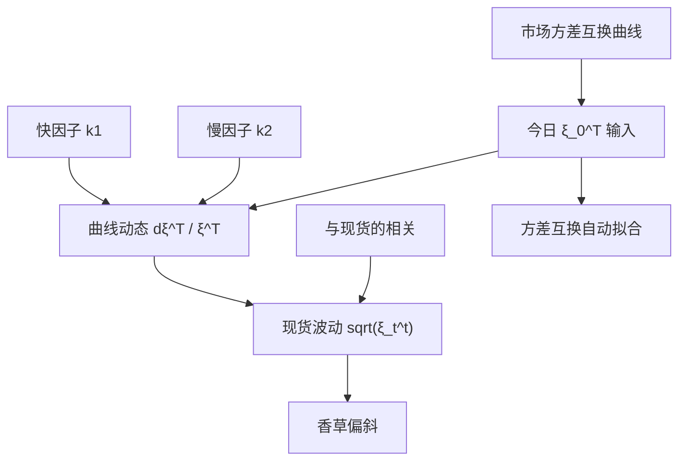

# Bergomi 方差曲线

    
把整条远期方差曲线当作状态，让它在风险中性下对每个到期保持鞅，今日的方差互换期限结构被自动拟合；波动的波动与相关再写在曲线的因子动态上，而不是写在单一 CIR 方差里。

    <footer>—— Bergomi, Stochastic Volatility Modeling, Wiley, 2016；曲线动态见其 2005–2008 年风险杂志论文</footer>

[Heston](/quant/heston) 用一个均值回复的 $v_t$ 生成整条方差期限结构：形状被 $\kappa,\theta,v_0$ 锁成指数型，市场的方差互换曲线只要不是这种形状，香草与方差产品就不能同时准。[Dupire](/quant/dupire) 拟合边际却没有独立的 vol-of-vol。Lorenzo Bergomi 把对象从「瞬时方差」换成「远期方差曲线」$\xi_t^T=\mathbb{E}[v_T\mid\mathcal{F}_t]$：今天观察到的曲线 $\xi_0^T$ 直接作为输入，动态只描述曲线以后如何随机翻动。两因子规格用一个快因子打短端偏斜、一个慢因子打持久凸性，是方差产品与指数期权簿上的常用语言。本篇写曲线对象与因子动态，粗糙波动的后续见 rough Bergomi 一类扩展，这里停在经典 Bergomi。

## 问题

方差互换的公平执行价（在连续复制、无跳的理想情形下）是 $\frac1T\int_0^T \xi_0^u\,\mathrm{d}u$ 的函数，市场每天给一条这样的期限结构。Markov 扩散若只有一个 $v_t$，蕴含的 $\xi_0^T$ 是 $v_0,\kappa,\theta$ 的特定函数，拟合方差曲线与拟合香草微笑会打架。要把方差曲线当作外生输入，模型必须对每个 $T$ 让 $\xi_t^T$ 是鞅（在适当测度下），今日 $\xi_0^T$ 等于市场，剩下的自由度是曲线的波动率结构——哪些到期一起动、动多少、与现货如何相关。问题是用低维因子驱动无穷维曲线，使：方差互换自动对、香草偏斜由因子与相关生成、计算仍可行。

Bergomi 的回答是对数正态型因子乘在远期方差上，核函数 $e^{-k(T-t)}$ 给出指数相关的期限结构。一因子往往无法同时给短端陡偏斜与长端稳定的 vol-of-vol；两因子是实务默认。

### 远期方差而不是瞬时方差

瞬时 $v_t$ 满足 $\xi_t^t=v_t$。Heston 里 $\xi_t^T$ 对 $T$ 是仿射的显式函数，形状被 $\kappa$ 钉死。Bergomi 直接写

$$
\frac{\mathrm{d}\xi_t^T}{\xi_t^T}=\alpha_\theta\,\bigl(\mathrm{e}^{-k_1(T-t)}\mathrm{d}W_t^{(1)}+\theta\mathrm{e}^{-k_2(T-t)}\mathrm{d}W_t^{(2)}\bigr)
$$

一类（系数按实现正规化，使瞬时 vol-of-vol 的水平可调），$\xi_t^T$ 对每个固定 $T$ 是局部鞅，自动 $\mathbb{E}[\xi_T^T]=\xi_0^T$。今日把市场方差曲线插成 $\xi_0^T$ 填进去，就不再用 $\theta$ 去「猜」长端方差。现货

$$
\frac{\mathrm{d}S_t}{S_t}=r_t\mathrm{d}t+\sqrt{\xi_t^t}\,\mathrm{d}W_t^S,
$$

与因子布朗相关，相关结构决定偏斜。这与 SABR 按到期标记微笑不同：Bergomi 是跨期一致的动态模型，方差产品与香草共用一条曲线状态。

$\xi_t^T$ 是远期瞬时方差，不是到期 $T$ 的 Black 隐含波动。把 VIX 或方差互换执行价直接当成某个 $\xi$ 而不做 $\frac1T\int\xi$ 的积分变换，期限会对错。短端 $\xi_0^t$ 尤其噪，需要把曲线在 $T\to 0$ 处正则化。

## 方法

输入：市场方差互换（或香草条带复制，见 [方差互换与 VIX](/quant/variance-swap-vix)）插值成 $\xi_0^T$；现货与各因子的相关 $\rho_1,\rho_2$；均值回复 $k_1\gt k_2$；vol-of-vol 水平与两因子权重 $\theta$。欧式没有 Heston 那种标准仿射特征函数（对数正态曲线破坏仿射），定价用 PDE 投影、蒙特卡洛或近似公式（Bergomi–Guyon 展开一类）。校准通常分两层：曲线 $\xi_0^T$ 完全来自方差产品或复制，不靠香草反解；再用香草偏斜校准相关与 vol-of-vol。不要把 $\xi_0^T$ 再当自由参数去贴微笑水平——水平已被方差曲线用掉，否则破坏互换的自动拟合。

模拟：每个时间步更新有限个基准到期的 $\xi$，中间用指数核对 $T$ 插值，现货用当前 $\xi_t^t$。因子是 Gauss 的，可用 [Sobol'](/quant/sobol-qmc) 与布朗桥。离散化误差出现在曲线的插值与 $\sqrt{\xi_t^t}$ 的积分，而不是 CIR 的负方差；但 $\xi$ 必须保持正，对数正态规格自动保证。

### 偏斜粘性与对冲比

Bergomi 强调偏斜粘性比（skew stickiness ratio）：现货移动时 ATM 隐含波动移动多少，相对于粘执行价或粘 Delta 规则。一因子对数正态方差往往给出过强或错误期限的粘性；两因子让短端因子与现货高相关、长因子较钝，可以对不同期限的 sticky 行为分开调。这是相对 Heston 的实务动机：交易员用的语言是「短方差」和「长方差」怎么跟指数一起动，而不是 $\kappa$ 的一个指数。对冲上，方差曲线的桶 Delta（对 $\xi_0^T$ 的敏感）比单一 Vega 更接近账面：你在对整条曲线做风险，而不是对一个 $v_0$。

近似公式把微笑对 vol-of-vol 展开到一阶或二阶，便于日内重算；精确障碍仍应 MC/PDE。近似误差在陡偏斜、长到期上累积，校准若只用近似，再拿到 MC 上给奇异产品，会出现「香草对、障碍不对」的假 LSV 问题——根源是定价引擎不一致。

## 机制

无穷维曲线被两个 Ornstein–Uhlenbeck 型因子驱动，相关核 $e^{-k_i(T-t)}$ 使邻近到期同向动、远到期几乎只跟慢因子走。这是 HJM 在方差曲线上的类比：不能任意写 $\mathrm{d}\xi^T$，否则可以有方差套利；鞅条件是无套利的最低要求。对数正态保证正性，也产生对香草微笑的凸性（vol-of-vol 抬翼）。现货相关把杠杆效应写在曲线上：指数下跌时短端 $\xi$ 上升得比长端多，形成负偏斜的期限结构。

相对 Heston：自动拟合任意合理的方差期限结构，不强迫指数衰减形状；失去仿射特征函数，香草校准更重。相对 Dupire：有真正的 vol-of-vol 与随机未来微笑；不自动拟合所有执行价的欧式——要用 [LSV](/quant/local-stoch-vol) 再乘杠杆 $L$，或接受微笑残差。相对 SABR：SABR 管单到期报价，Bergomi 管动态与方差产品；二者可以在同一张桌上，但参数不互译。

### 一因子不够的地方

一因子核 $e^{-k(T-t)}$ 只有一个衰减速度。短端偏斜要求大的瞬时 vol-of-vol，同一因子会把长端方差曲线搅得过凶，与长方差互换的相对平静冲突。两因子把能量按期限分开，是最小的可用规格。再加因子或改成粗糙核（Hurst $\lt 1/2$）能改善短端，但校准与对冲桶增加。经典 Bergomi 停在两因子对数正态曲线，是计算与识别的折中，不是定理上的完备。

曲线在 $T$ 很近时的 $\xi_0^T$ 对隔夜跳跃和周末敏感，插值假设（平坦远期方差 vs 线性总方差）会改变短端偏斜校准。应声明插值，并与交易台的方差互换惯例一致。

## 边界

无跳时曲线对象干净；有跳时方差互换复制有缺口，$\xi$ 的市场输入已经混进跳补偿，因子动态若仍写成连续对数正态，短端会误把跳当成 vol-of-vol。仿射跳扩散（Bates）在特征函数上更顺，但方差曲线形状不自由。Bergomi 不是 Lévy，也不是局部波动。

欧式没有 1993 年那种标准闭式，把 Bergomi 当「更快的 Heston」会失望。它的优势在方差账、VIX 相关产品与动态，不在香草校准速度。2016 年的书把多年风险杂志文章收成系统；引用具体动态时应指向因子个数与核，而不是只写书名。Rough Bergomi 改核为分数，短端更贴，不在本篇展开。

风险中性曲线动态里的 vol-of-vol 含方差风险溢价。用历史方差曲线的 PCA 去「验证」$k_1,k_2$ 可以做，但水平应对不上定价 $\alpha_\theta$，那是两个测度。

## 小结

- Bergomi 以远期方差曲线 $\xi_t^T$ 为状态，今日曲线来自市场，动态使每个 $\xi^T$ 为鞅，方差互换期限结构自动拟合。
- 两因子指数核分开短、长方差的 vol-of-vol；现货相关生成偏斜与粘性。
- 相对 Heston，曲线形状自由、失去仿射特征函数；相对 Dupire，有随机未来微笑、不自动贴所有执行价。
- 校准应分层：曲线给方差产品，相关与 vol-of-vol 给偏斜；香草引擎与奇异引擎必须同一动态。
- 一因子无法同时服务短端陡偏斜与长端平静；跳会污染短端 $\xi$。
- 出处：Bergomi, *Stochastic Volatility Modeling*, 2016；曲线动态见 Bergomi, *Risk*, 2005–2008；方差复制见 Carr and Madan。
