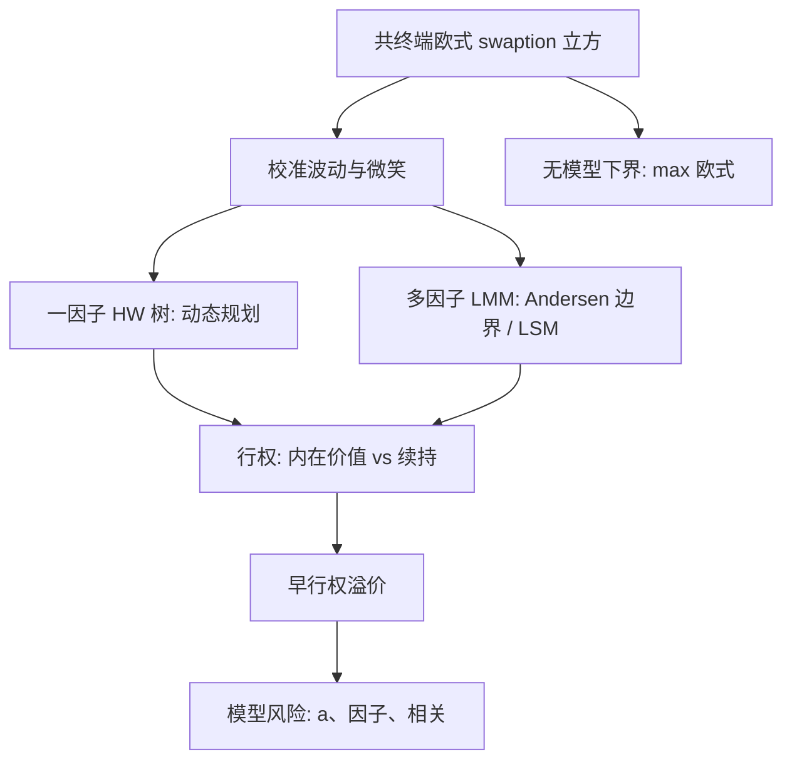

# 百慕大互换期权

    
多因子市场模型里，百慕大 swaption 没有树那么便宜的动态规划；在模拟路径的截面上估计续持，才能把共终端香草与早行权放进同一套曲线动态。

    <footer>—— Andersen, A Simple Approach to the Pricing of Bermudan Swaptions in the Multifactor LIBOR Market Model, Journal of Computational Finance, 2000</footer>

百慕大互换期权给予持有人在一组离散日进入（或取消）一笔指定互换的权利。可赎回公司债、可取消互换、以及许多结构化票据的发行人选择权，最终都落到这一对象上。欧式 swaption 在一因子短端里可用 Jamshidian（1989）分解；百慕大没有欧式那样的封闭式，因为它在每个行权日比较内在价值与续持。Hull 与 White（1990, 1994）的三叉树把一因子均值回复变成可计算的早行权；Andersen（2000）针对多因子 [LMM](/quant/lmm) 给出简单的行权策略与模拟；Longstaff 与 Schwartz（2001）的最小二乘蒙特卡洛成为高维标准。本篇写共终端校准、行权边界与模型风险，补充[Hull-White](/quant/hull-white) 的树、[HJM](/quant/hjm) 的高维状态，以及[Longstaff-Schwartz](/quant/longstaff-schwartz) 在利率上的用法。它与 [CMS 凸性](/quant/cms-convexity) 同属曲线期权，但校准仪器是共终端香草而不是整条微笑积分。

## 问题

以 10NC2 年度行权的付款人百慕大为例：锁定期两年后，每年有权进入一笔当时剩余期限的支付固定互换，直到最终到期。与之对应的欧式共终端族是：2 年入 8 年、3 年入 7 年、…、9 年入 1 年。百慕大价格必须至少等于每一个共终端欧式（可在该日行权并放弃其余），通常严格更大，因为可以等待更好的日期。问题是把市场共终端 swaption 立方校准进模型后，早行权溢价还依赖：均值回复（或因子衰减）、因子个数（相关）、以及波动的期限结构。只校准欧式并不锁定百慕大——这是交易台模型风险的核心。

第二个问题是指数与折现。多曲线下，行权比较的是投影曲线上的互换内在价值，贴现沿 OIS/SOFR。一因子 $r$ 不能同时当两者。LIBOR 停用后，共终端仪器换成 SOFR swaption，旧的 LIBOR 百慕大要按后备切换，见[SOFR 过渡](/quant/sofr-transition)。

### 取消权与进入权

持有人百慕大 swaption 是进入权。发行人可取消的互换（callable / cancellable swap）是取消权，等价于普通互换加一笔对手方向的百慕大。可赎回债是债券加发行人百慕大。法律与估值上要分清谁有权、通知期、现金流是否包含当期票息。通知期把行权日与生效日错开，内在价值要用远期互换而不是即期平价，并进入凸性。把通知期当成零，会系统性高估早行权频率。

「百慕大 ≥ max(欧式)」是无模型不等式，可当实现测试。若树或 LSM 给出的百慕大低于共终端欧式，先查行权日对齐、年金与投影曲线，再加节点。

## 方法

**一因子树。** Hull–White 三叉树上，状态是短端 $r$，每个行权日比较互换标记与续持。欧式边界用 Jamshidian 或树自身的欧式价格校准 $a,\sigma$（常分段）。优点是动态规划干净、可赎回结构好嵌套；缺点是曲线只能沿一种模态变形，2s10s 的行权决策被扭曲。校准若用 cap 而不是共终端 swaption，百慕大会卖不出市场价格，见 Hull–White 篇的经典失败。

**LMM 模拟。** 状态是一串远期，树不可用。Andersen（2000）用参数化行权边界（例如对某个状态变量的阈值）在模拟中优化，得到下界；也可以用 Longstaff–Schwartz：在行权日把后续贴现现金流回归到互换利率、年金、若干远期的基函数上，实值路径才回归。高估来自样本内过拟合，应用独立路径估值。因子个数与瞬时相关决定不同共终端欧式之间的相关，从而决定等待的价值：相关越高，越接近一因子，早行权溢价越小。

**校准顺序。** 先用共终端 ATM（及必要的微笑）校准波动；再检查中间欧式与倾斜；最后才看百慕大相对市场经纪商报价的残差。残差应视为模型风险限额，而不是再加一个专用于该百慕大的参数——否则无法对冲。Markov-functional（Hunt–Kennedy–Pelsser）用低维马尔可夫状态贴住香草微笑，常作为树与全 LMM 之间的折中。

### 行权决策与对冲

内在价值是标的互换的现值（对付款人而言，固定利率高于平价时为正）。续持是「今天不行权、保留未来选择」的价值。利率已大幅朝有利方向走时，继续等待的期权价值可能小于立即锁定，于是行权。一因子里决策几乎是短端的阈值；多因子里同样的 10Y 平价，斜率不同可以改变等待价值。因此百慕大的[关键期限 DV01](/quant/key-tenor-dv01) 在行权日附近极不稳定：一个关键点的 1bp 可能改变停时，差分要小步并检查数字噪声。

对冲：欧式 vega 用共终端香草；早行权溢价对均值回复 $a$、对第二因子波动、对相关敏感，这些参数往往不可交易。实务用香草立方把能对冲的对冲掉，把溢价的残差进模型风险，而不是假装存在「百慕大波动」这一个可交易数。

## 机制

早行权溢价来自 vis-à-vis 欧式的择时。若未来波动会降、或曲线只能平行移动，等待的价值低，百慕大贴近最贵的那个欧式。若存在独立的斜率冲击，今天 10Y 还没到行权水平，2Y 却可能在下一次行权日把剩余互换推实值，等待有价值。这正是一因子树系统性卖便宜（或买贵，视你站在哪边）的机制：它关掉了斜率期权。Andersen 与 Andreasen 关于因子依赖的讨论，要回答的就是：增加因子后百慕大价格动多少，以及这是事实还是校准没对齐欧式。

可取消互换还与信用纠缠：发行人行权往往发生在利率下降时，同时发行人信用可能改善或恶化。把取消权当纯利率百慕大、把信用当附加利差，会忽略错误方向。更完整的处理见对手方与可赎回债的混合；本篇只强调：利率引擎给出的百慕大，默认对手方不违约、不通知失败。

锁定期间没有行权，不等于没有 vega。锁定期内曲线仍扩散，到期共终端欧式的波动在锁定期内就要对冲。把锁定期当「无期权」会漏掉最流动的那几年香草。

### 与 CMS、飞的关系

CMS 结构化票据常带发行人取消，于是同时需要 CMS 凸性与百慕大。两者对微笑和因子的需求不同，不能只校准共终端 ATM。曲线[蝶式](/quant/curve-butterfly)会出现在行权附近的关键 01 里：有效暴露从「整段剩余互换」跳成「更短的共终端」，曲率瞬变。风险报告应在行权日加密情景，而不是只用昨日的线性 DV01。

## 边界与工程取舍

不要用一棵只拟合 cap 的 Hull–White 树给共终端百慕大做市。不要在 LSM 里用过少路径、过多基函数，然后把样本内价格当中价。不要忽略通知期、营业日与提前定盘。不要把经纪商百慕大报价当成无模型真值：那是对方的模型和保证金，你的对冲仍在香草立方上。

计算预算：交易台用树或马尔可夫泛函做经常性标记，用 LMM LSM 做模型风险对照。两者对同一共终端欧式应对齐，否则对照无意义。多曲线、负利率位移、微笑（SABR 或位移 LMM）都改变行权边界，升级模型要重做历史 PnL 解释。

Jamshidian 分解给的是欧式，不是百慕大。在文档里写「Jamshidian 定价百慕大」一定是错的，除非你先把它退化成只能在一天行权。

## 小结

- 百慕大 swaption 是离散日进入或取消互换的权利，价格不低于共终端欧式族的最大值。
- 一因子 Hull–White 树给出干净的早行权，但关掉斜率；多因子 LMM 用 Andersen 策略或 Longstaff–Schwartz 回归。
- 必须校准共终端 swaption，而不是 cap；早行权溢价对不可交易的均值回复与相关敏感。
- 通知期、多曲线与指数转换改变内在价值定义；线性关键 01 在行权附近不稳定。
- 出处：Andersen, *Journal of Computational Finance*, 2000；Longstaff & Schwartz, *Review of Financial Studies*, 2001；Hull & White, *RFS* 1990 与 *Journal of Derivatives* 1994；Jamshidian, *Journal of Finance*, 1989（欧式分解）。
