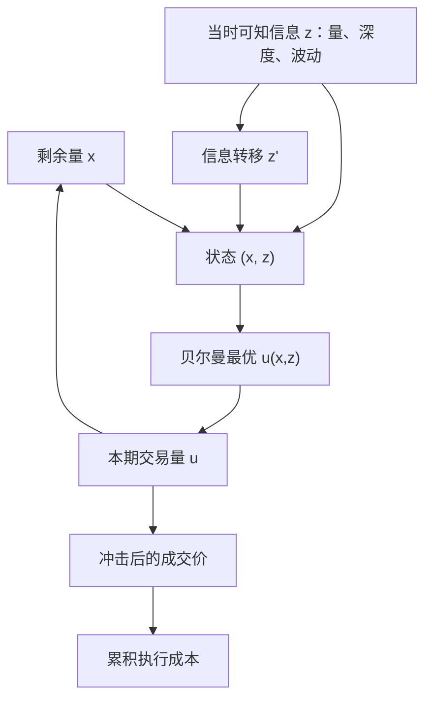

# Bertsimas-Lo 动态执行

    
大额交易的最优拆法是动态规划：每一期根据当时价格、成交量与剩余量决定下一口，而不是在开始时就把整条轨迹钉死。

    <footer>—— Bertsimas and Lo, Optimal Control of Execution Costs, Journal of Financial Markets, 1998</footer>

Perold 把纸面决策价与实现成交的差叫做实施缺口。把缺口当成「这一笔母单如何切开」的控制问题，Bertsimas 与 Lo（1998）给出一个离散时间答案：最小化期望执行成本的动态规划（DP）。状态是剩余库存与可观测信息（价格、交易量等），动作是这一期交易多少，转移含价格冲击与信息更新。最优策略因此是**反馈**：价格已走、量已放大，或信息显示流动性变差时，速率应当改。Almgren–Chriss 稍后在连续时间用临时/永久冲击与均值—方差给出闭式轨迹，往往被当成执行理论的默认引用；BL 更早，且强调信息与适应性——静态时间表只是信息集退化时的特例。本篇写 DP 的对象、与 AC 的差别，以及为什么「自适应」不是把母单交给未约束的短期预测。它与 [Cartea–Jaimungal](/quant/cartea-jaimungal) 的限价控制、[RL 执行](/quant/rl-execution) 是同一问题在不同工具下的版本。

## 问题

在 $N$ 个时段内买入（或卖出）总量 $X$。第 $i$ 期交易 $u_i$，剩余 $x_i$，约束 $\sum u_i=X$。成交价 $P_i$ 依赖当时信息 $z_i$ 与你的 $u_i$（冲击）。目标是

$$
\min_{\pi}\mathbb{E}\Bigl[\sum_{i=1}^N P_i(z_i,u_i)\,u_i\Bigr],
$$

策略 $\pi$ 把 $(x_i,z_i)$ 映射到 $u_i$。若 $z$ 无信息含量且冲击对时间齐次，最优可以是确定性时间表。若 $z$ 包含预测未来价格或未来深度的变量，最优 $u_i$ 应对 $z_i$ 反应：预期下一期更贵或更薄，则本期多做。问题是写出可计算的 DP，而不是口头上的「根据市场情况调整」。

与 AC 的问题陈述对比：AC 显式把成本方差加进目标，得到风险厌恶的有效前沿；BL 的基准目标是期望成本，风险通过状态里的价格动态进入，或通过额外的惩罚项进入。BL 的长处是信息；$z$ 可以是量、价、甚至离散的市场状态。短处是维数：状态一连续且多维，DP 需要离散化或函数近似，闭式很少。

### 静态轨迹是退化情形

预先规定 $u_i=X/N$（TWAP）或 $u_i$ 正比于预期成交量（VWAP 型）的策略，属于开环：不看 $z_i$ 的实现，只看时钟。BL 的最优是闭环。开环可以是闭环在「$z$ 不可用或无预测力」时的解，也可以是约束（必须贴近 VWAP 基准）下的次优。交易台同时用两种：上层用 AC/BL 决定这一小时的 $u$，下层再拆成子单。把 VWAP 当成最优执行定理，是把基准合同当成了成本最小化。

动态规划需要正确指定 $z$ 的转移。用未来成交量当本期 $z$，或用全天 VWAP 当状态，是前视。信息必须是该期开始时可知的过滤，与 [点-in-time](/quant/point-in-time) 同一要求。

## 方法

**冲击与信息。** 一个典型规定：$P_i=\mu_i+\gamma u_i+\varepsilon_i$，$\mu_i$ 是公允价，随信息与永久冲击走，$\gamma u_i$ 是临时冲击。若 $\mu_{i+1}$ 含 $\alpha^\top z_i$ 或自回归，则 DP 的贝尔曼方程把「现在多交易以避开可预测的不利移动」写进一阶条件。Bertsimas–Lo 讨论线性冲击与线性信息结构下的可解情形：最优 $u$ 对剩余量线性、对信息线性，类似 LQG 控制。非线性冲击或离散状态则要求数值 DP。

**风险。** 仅最小化期望成本会在 $\alpha$ 为正时过度推迟买入（等待更好价格），余量暴露变大。补救是加 $\lambda\mathrm{Var}$ 或库存二次罚，精神与 AC、与 Cartea–Jaimungal 的 $\ell(q)$ 相同。$\lambda$ 应来自组合风险预算，不要在执行 DP 里另搜一个让回测 VWAP 最好的 $\lambda$。

**与 AC 的连续极限。** 时段变短、信息只剩布朗过滤、冲击分成临时与永久，BL 的线性二次结构会靠近 AC 的欧拉–拉格朗日。因此二者不是对立学派：AC 是低维闭式工作马，BL 是「还要把量与短期预测放进状态」时的框架。生产上常见的自适应 POV——参与率随短期波动与深度调节——是 BL 反馈的工程近似，见后续的参与率规则，而不是又一个闭式定理。

### 估计与校准

$\gamma$ 与信息系数必须用自己的成交与当时可得的 $z$ 估计，滚动、点-in-time。把全样本回归的 $\alpha$ 塞进 DP，等于让执行算法偷看这段历史的可预测性，样本内缺口会假好。评估应对母单走 [实施缺口](/quant/implementation-shortfall) 与到达价滑点，并与 TWAP/VWAP/AC 开环对照；只报「相对 VWAP 改善」会激励跟踪基准而不是最小化缺口。容量上，自适应策略在大家都用同一 $z$（例如同一盘口不平衡）时拥挤，反馈项失效甚至反号。

线性冲击便于 DP，但大单更接近平方根。把平方根硬塞进离散 DP 仍可数值解，不能再用 LQG 闭式。Huberman–Stanzl 对冲击的无套利约束，在允许来回交易时要检查；单向母单约束更松。

## 机制

闭环的价值来自对冲可预测成分：把 $u$ 当作对 $\mathbb{E}[P_{i+1}-P_i\mid z_i]$ 的反应。若 $z$ 是真流动性（深度突然增加），多做会降低冲击；若 $z$ 是毒性（知情买入抬价），买入母单跟着加码会买在更差的价格上——同一反馈符号，经济含义相反。BL 框架本身不区分，必须靠 $z$ 的定义：执行状态应偏流动性与剩余风险，把方向性 alpha 留给组合层，或像 CJ 那样显式建模逆向选择。把因子信号塞进执行 DP，会把执行层变成第二套策略搜索。

开环与闭环的成本差，在信息比高时显著，在噪声 $z$ 时为负：反应把噪声当成信号，换手与冲击上升。这是执行层过拟合。应用嵌套样本评估反馈系数，而不是在全历史上拟合一个「最优反应斜率」。

### 从 DP 到强化学习

状态连续、动作含限价时，经典 DP 表格不够，函数近似或 RL 出现。Nevmyvaka 等把执行交给强化学习，奖励是成本。BL 提供的是：奖励应是缺口而不是 VWAP 偏离，状态必须可因果观测，冲击必须对自己的 $u$ 有弹性。RL 没有这些约束时，会学到模拟器的免费午餐。BL 是可审计的低维基准；RL 是高维残差。不要跳过基准直接部署深度策略。

## 边界与工程取舍

离散期与「一期一个 $u$」忽略了期内的订单类型、队列与取消。要把 BL 接到限价，需要像 CJ 那样扩展动作。涨跌停、拍卖、最小报价单位使线性转移失效，应分时段 DP 或把这些写成约束。多资产交叉冲击使状态含向量 $x$ 与协方差，维数爆炸，实践中用净风险因子降维。

不要声称 Bertsimas–Lo 授权「看见价格涨就停买」。那是把价格本身当正 alpha，往往是动量与冲击的混合物，单向推迟会在趋势里放大缺口。反馈应针对深度、波动、剩余时间，价格水平最多以相对到达价的偏离进入风险项。也不要把 1998 年的线性冲击当 2020 年代的校准；微观结构与费率都已变，见 maker-taker 与平方根冲击。

Bertsimas–Lo 是最优控制论文，不是交易软件架构。母单切片、子单路由、风控停机仍要独立实现。DP 给出的 $u_i$ 是这一期的预算，不是可提交的订单。

## 小结

- Bertsimas 与 Lo（1998）把大额执行写成离散时间动态规划：最优拆单是对剩余量与当时信息的反馈，而不是开环时间表。
- 静态 TWAP/VWAP 是信息集退化或基准约束下的特例；闭环的价值取决于 $z$ 是否真是流动性信息。
- 与 Almgren–Chriss 连续均值—方差互补：AC 给闭式轨迹，BL 给信息与适应性的框架。
- 冲击与预测系数必须点-in-time 校准；把方向性 alpha 塞进执行 DP 会变成第二层策略搜索。
- 高维限价动作上，BL 是基准，强化学习是残差，奖励应对齐实施缺口。
- 出处：Bertsimas and Lo, *Journal of Financial Markets*, 1998；Almgren and Chriss, *Journal of Risk*, 2000/2001；Perold, *Journal of Portfolio Management*, 1988。
