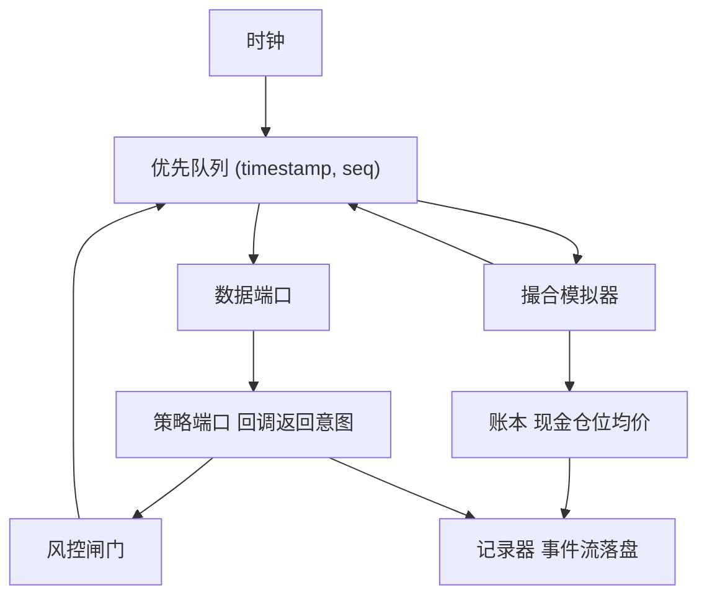

# 事件驱动框架的解剖

框架与库的分界是控制反转：库等你来调用，框架拥有主循环，在它认为正确的时刻来调用你。

<footer>—— 据 Johnson and Foote, Designing Reusable Classes, Journal of Object-Oriented Programming, 1988 对框架与控制反转的论述；对照 Pardo, The Evaluation and Optimization of Trading Strategies, 2007 的仿真流程整理</footer>

[上一课](/quant/de-map)把数据工程收成一台平台：不变量、双时间轴与契约让研究里的每个数字都答得出哪份字节、哪条规则、哪个知识集——引擎设计从此建立在可信数据之上。本课程把事件驱动回测做成能长期维护的软件：部件放在哪、接口是什么、不变量由谁守护。本课给出解剖图——时钟、数据端口、策略端口、撮合模拟器、账本、风控闸门、记录器七个器官——后课的取舍、深化、规模与测试都在这张图上展开。后课默认已经读完本课。

## 问题

[事件驱动回测引擎](/quant/event-driven-backtest)讲清了循环的语义，没有讲工程边界。把策略、撮合器与账本写进一个进程，第一天没事，第三个月出现三种溃烂：策略为了「看一眼现金」直接伸手进账本，回测与实盘的对账从此各说各话；有人在策略回调里读了系统时钟，历史重放的确定性被静默破坏；成交模型与引擎焊死，换一个市场就要动核心。缺的不是更聪明的循环，而是一组器官边界：每类状态只有一个所有者，每条信息只走声明的通道。

### 七个器官与各自的契约

**时钟与队列**是全序的唯一来源：引擎按 $(\text{timestamp}, \text{seq})$ 弹出事件，任何不经队列的状态修改都违规。**数据端口**把历史行情、修订与停复牌事件按到达序交给引擎，策略不得自行开文件。**策略端口**是回调契约——on_bar、on_order、on_timer——策略收到事实、返回意图，不做 IO、不读墙钟。**撮合模拟器**消费请求与行情、产出回报，档位可插拔。**账本**是现金、仓位、均价的唯一真相，只由成交事件更新。**风控闸门**在订单入队前检查在途与持仓限额，拒绝本身是事件。**记录器**把每个事件与每个决策追加落盘，是后课诊断与测试的地基。

## 方法

落成代码后按依赖方向审一遍：策略依赖端口类型与事件定义，不依赖引擎；撮合器依赖[订单状态机](/quant/order-state-machine)与行情，不依赖策略；账本只认回报。**端口适配器**把「同一策略对象跑在模拟撮合器与真实网关上」变成配置而不是分支：实盘与回测共享状态机语义、只换网关，这正是[研究、模拟、实盘隔离](/quant/research-sim-prod)要求的形态，也是对账的前提。

策略端口的宽窄是关键设计决定。太窄（只给收盘价数组），事件框架退化成向量化的空壳；太宽（把整本账本与撮合器内部递给策略），边界失效。可用的判据：把回调入参抄成文档，凡是「策略在实盘拿不到的」都不能出现在入参里——上帝视角的簿、未来的 bar、别人的订单号，一票否决。

审计一个框架的第一分钟：在策略回调里搜 `time.now` 与 `read_csv`。出现任何一个，重放同一份数据就得不到同一条净值——确定性在策略侧已经丢了。

## 机制

控制反转买来两样东西。第一是**可重放**：全序事件流加上种子化随机数，同一输入必得同一输出，监管审计、灾备演练与回归测试才有裁判。第二是**可替换**：撮合器、数据源、网关都是接口后面的实现，替换它们不触碰策略；保真度的提升因此变成换档位，而不是重写系统。记录器让「图从哪来」有了答案：诊断与报表读事件流重放，而不是重新计算状态，图与账本才不会变成两套真相。性能优化必须在不破坏全序的前提下做：按品种分区、批量行情编码都合法；「先算完所有信号再一次撮合」不合法，它重新引入了[事件驱动回测引擎](/quant/event-driven-backtest)警告的前视。

## 边界

解剖不是劝你一切从框架开始：日频、宽松成交假设的研究，向量化脚本仍是对的工具，框架的价值要等路径依赖出现才兑现（下一课写这条边界）。也不要为调试方便开后门——引擎不知道策略的存在，策略不知道引擎的内部，后门最终都会在生产对账时收费。

## 小结

- 框架即控制反转：引擎拥有时钟与全序事件流，策略是被调用的回调，只返回意图。
- 七器官各守一类状态：时钟、数据端口、策略端口、撮合器、账本、风控闸门、记录器。
- 同一策略对象经适配器跑模拟与实盘、只换网关，是对账与环境隔离的前提。
- 可重放（全序加种子）与可替换（插拔撮合器）是框架买到的两样能力。
- 策略回调里不许出现墙钟与文件 IO；诊断必须从记录的事件流重放。
- 出处：Johnson and Foote, *JOOP*, 1988；Pardo, *The Evaluation and Optimization of Trading Strategies*, 2007；站内[事件驱动回测引擎](/quant/event-driven-backtest)、[订单状态机](/quant/order-state-machine)各课。
