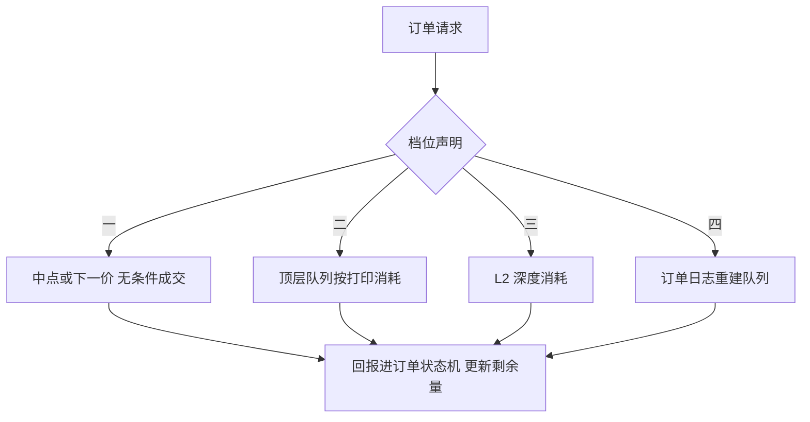
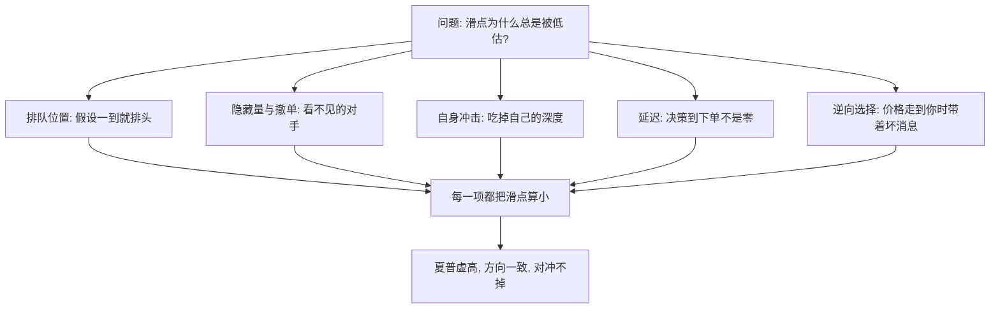

# 成交模拟的深化

成交模拟器站在回测保真度的顶上：它住在哪一档，滑点与容量的结论就只能住在哪一档。

<footer>—— 据 Harris, Trading and Exchanges, 2003 对优先规则与成交机制的论述；对照 Hasbrouck, Empirical Market Microstructure, 2007 整理</footer>

[上一课](/quant/bf-vectorized-vs-event)把粗筛与定案分了层，定案的可信度全部落在撮合模拟器上。[事件驱动回测引擎](/quant/event-driven-backtest)给过三档粗分——中点加价差、价位队列、订单日志回放——本课把档位拆开写：每档能回答什么、不能回答什么、怎么校准、怎么防止它高估你。

## 问题

成交模拟器决定「你的单子以什么价、多少量、在哪个事件上成交」。乐观偏差在这里进入系统，且几乎总是乐观：假设限价单一到就排队头，忽略自己的单子对簿的消耗，忽略跨越更优价的成交必须先吃掉那些价（trade-through），把决策到下单的延迟设为零。每一种都把滑点算小、把夏普算大，而且方向一致——[模拟器偏差](/quant/simulator-impact-bias)课指出，训练或评估环境的乐观误差不会被对冲掉。部分成交同样：剩余量挂在簿上是风险也是信息，[订单状态机](/quant/order-state-machine)要求它成为一等状态，模拟器必须更新它而不是假装一次成交完成。

### 档位阶梯

第一档：下一笔成交价或中点加价差，无条件成交。只回答方向经济学，适用于日频定案前的粗估。第二档：顶层队列消耗——你的单子挂在某价位，按历史成交打印逐笔消耗队首数量；你的到队位置是未知量，通常保守假设排在同价现有单之后，用[排队与成交概率](/quant/fill-probability)模型补充。第三档：L2 深度消耗——沿价位图吃深度，但[Level-2 / Level-3 数据](/quant/l2-l3-data)已经说明聚合档位丢失了档内次序，此档回答不了队列名次。第四档：订单日志回放，带订单号重建真实队列，保真度最高，见[订单簿重建](/quant/orderbook-reconstruction)，代价是数据与算力。

术语翻译：L1 是「成交了什么」（价格与量），L2 是「想成交可以挂哪」（聚合后的各价位深度），L3 是「谁先谁后」（每笔挂单的完整队列）。档位越高越接近交易所真实看到的簿，但数据量也从每兆涨到每吉——保真度是拿存储和算力买来的。

## 方法

档位必须随结果一起声明，因为[容量](/quant/capacity-participation)与滑点敏感性都依赖它。三件事跨档位通用。其一，延迟显式化：订单请求在 $k$ 个事件之后才对撮合器可见，$k$ 声明为情景而不是常数零。其二，费用结构：maker-taker 返佣与印花税按场所分支，见[Maker-taker 费用](/quant/maker-taker)；同一策略换场所，最优挂撤行为反转。其三，种子化：队列消耗里凡有随机模型（如到队位置的先验），必须可种子化，同一 seeds 重放必得同一回报，否则上一课的对拍协议无从执行。

校准的对照物不是回测自己，而是实盘交易分析：到达价、有效价差、完成率——[滑点归因](/quant/slippage-attribution)的分解逐项对上模拟器的对应参数。对不上时修参数，不修信号。

限价成交是条件事件：价格走到你，往往因为有人带着你不知道的消息来。队列模型若只算成交概率、不联带逆向选择，会把最容易成交的时刻恰恰当作利润来源——这是成交模拟最深的结构性乐观。

数字实例：0.03% 的费率差就足以反转挂撤选择。taker 单在价差 0.05% 的市场吃单，成本约 $0.05\%+0.03\%=0.08\%$；maker 挂队首等成交，若返佣 0.02%，期望成本约 $0.025\%-0.02\%\approx 0.005\%$——但要承担不成交与逆向选择。费用表改一栏，策略的挂撤逻辑就得重新校准。

## 机制

档位阶梯的本质是信息集的阶梯：第一档只用价格序列，第二档加成交打印，第三档加价位深度，第四档加订单全序。保真度不随档位平滑上升：第二档在薄队列上会系统性地高估成交，因为真实队列里有你看不见的隐藏量与提前撤单；第三档的聚合深度反而可能比诚实的第二档更误导。因此档位选择是「问题需要什么」决定，不是「数据有什么」决定——回答排队位置的问题，第三档是假装，要么上第四档，要么把统计模型写成显式情景。

乐观偏差从哪几个口进入结论：

集合竞价、涨跌停与停牌各有自己的撮合语义，不能塞进连续档位，见[停牌与涨跌停对回测](/quant/halt-limit-backtest)；真实交易所的优先规则参考[撮合引擎架构](/quant/matching-engine-arch)。

## 边界

模拟器不能比数据更真：只有 L2 就声明队列模型是猜测，写成情景做敏感性，而不是当成交易所真相。不要把模拟器调到与某段实盘完全吻合——那是对单一路径过拟合，[模拟器偏差](/quant/simulator-impact-bias)的警告适用于一切评估环境。保守默认值（到队排尾、延迟非零、成交概率打折）是 Pardo 的老建议：默认值不自动保守，必须有人在验收时签字。

常见误区：初学者容易以为「模拟器对上某段实盘滑点=校准完成」。对单一路径的精确吻合往往是对那一天的过拟合——市场只走了一种走法。合格的校准是分项对上：到达价、有效价差、完成率各自接近，且换一段行情不崩，而不是让总滑点凑等。

## 小结

- 成交模拟器四档：中点、顶层队列、L2 深度、订单日志回放；档位决定滑点与容量结论的上限，必须声明。
- 延迟、费用、种子跨档位通用：延迟是情景，费用按场所，随机必须可重放。
- 乐观偏差是结构性的：排队位置、隐藏量、自身冲击、逆向选择，默认全都在高估你。
- 校准对照实盘 TCA，逐项归因；对单段实盘的精确吻合是过拟合不是校准。
- 出处：Harris, *Trading and Exchanges*, 2003；Hasbrouck, *Empirical Market Microstructure*, 2007；Pardo, *The Evaluation and Optimization of Trading Strategies*, 2007；站内[订单状态机](/quant/order-state-machine)、[Level-2 / Level-3 数据](/quant/l2-l3-data)各课。
