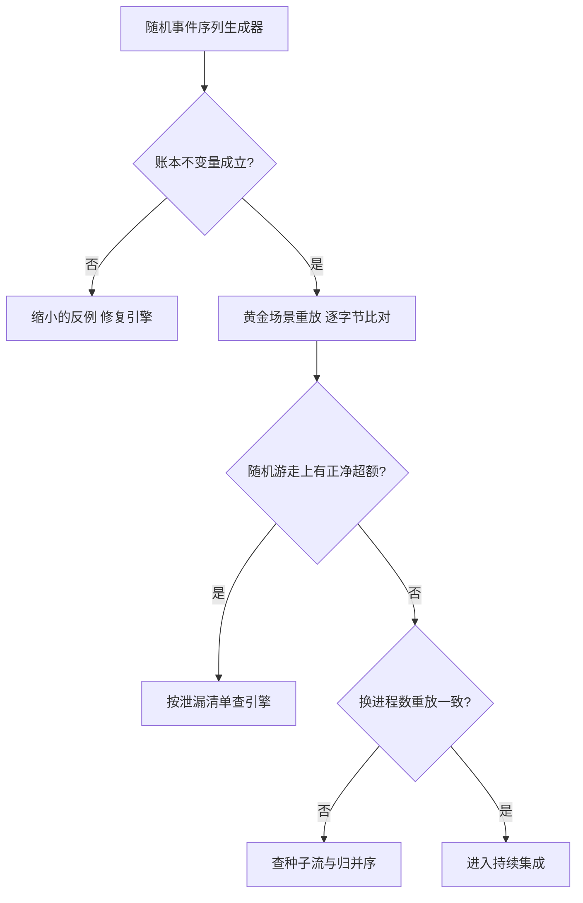
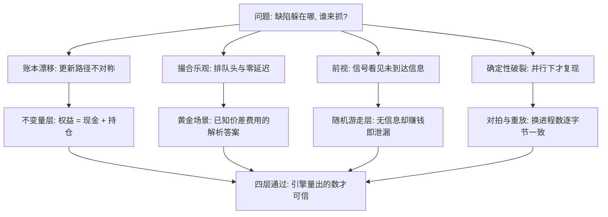

# 框架的测试

对随机数据都赚钱的回测，先按框架缺陷立案，再谈策略。

<footer>—— 据 Claessen and Hughes, QuickCheck: A Lightweight Tool for Random Testing of Haskell Programs, ICFP 2000 对性质测试的论述；对照 López de Prado, AFML, 2018 对泄漏的论述整理</footer>

[上一课](/quant/bf-visual-diagnostics)把诊断做成面板；面板再全，也只能看见被算出来的东西。框架自身的正确性——账本守恒、重放确定、无前视、对拍一致——必须由站在策略之外的测试来守护：一次前视泄漏让夏普翻倍，一笔账本漂移把每笔成交差一分钱，攒起来就是一条假曲线。本课写回测框架的测试体系；它测的是引擎，不是策略。

## 问题

框架缺陷的麻烦在于它不抛异常，而是输出一条更好看的净值。四类惯犯。前视：信号在撮合前看见未到达的信息，`shift(1)` 不是充分防线，[防止未来函数](/quant/no-future-function)列过完整清单。账本漂移：现金与仓位的更新在任何一条事件路径上不对称，差额小到日常看不出来。确定性破裂：只在并行、只在某顺序的回报下复现，单机重放永远正常。撮合乐观：默认值悄悄假设排队头、零延迟。四类都戴着 alpha 的面具，而统计调整（$N$、DSR）建立在「引擎量的是真相」的假设上——引擎坏了，全部试验的记账作废。

术语翻译：性质测试（property-based testing）就是「不写具体的输入输出样例，而是写一条永远该成立的性质，让机器随机生成成百上千组输入去攻击它」。例如「无论事件顺序多乱，成交量永远不超过剩余量」——框架自己找反例，找到后还会把触发条件自动缩到最小。

### 测试的四个层次

**不变量层**：账本守恒写成性质测试——权益等于现金加持仓市值；成交量永不超剩余量；无成交区间权益只随标记变动。性质测试对随机生成的事件序列断言这些关系，而不枚举样例。**黄金重放层**：构造答案解析已知的小场景——一笔已知价差与费用的往返、一个停牌日、一次竞价——输出存为黄金文件，重放必须逐字节一致。**泄漏检测层**：在随机游走合成数据上跑有费用的策略，期望净超额应 $\le 0$；显著为正即引擎在漏信息。**对拍层**：同一数据同一假设下向量化与事件引擎的协议化对比（[向量化与事件驱动的取舍](/quant/bf-vectorized-vs-event)），差异超阈值即失败。

## 方法

性质测试的生成器要懂金融：生成的事件序列应包含人类容易忘记的顺序——确认未到先撤单、`pending_cancel` 状态下来成交、同一毫秒内乱序回报——这些正是[订单状态机](/quant/order-state-machine)里最锋利的转移。QuickCheck 的方法在这里最值钱：失败时自动缩小成最小反例，一张「成交大于剩余量」的四步序列胜过一百条手写样例。网关替身按脚本注入延迟、拒单、部分成交、重复成交编号，验证坏消息下的行为与实盘状态机一致。持续集成的纪律：引擎改动必须重跑黄金场景加泄漏检测；套件小到每次提交都跑得完，大场景留给夜间。

数字实例：账本漂移可以小到荒谬又致命：某条事件路径上每笔成交因舍入多扣 0.01 元，一年 2500 笔也只差 25 元，对 100 万的净值是 0.0025%。但它破坏的是「权益=现金+持仓」这条恒等式——漂移的危害不在金额大小，而在恒等式不再成立后，所有对账失去裁判资格。

随机游走检测的阈值要诚实：有费用的策略在鞅上的净期望 $\le 0$，但有限样本里夏普的抽样噪声大，把「显著为正」的门槛定在抽样分布的高分位（Lo, 2002 的提醒），否则测试会被噪声触发到人人麻木。

## 机制

这套体系之所以分层，是因为四类缺陷各躲在不同的地方：不变量抓住状态层的任何不对称，黄金重放抓住语义回归；随机游走抓住信息层泄漏，因为它给引擎喂了「没有任何可赚的东西」；对拍抓住假设层的不一致。四层合起来覆盖的是[事件驱动框架的解剖](/quant/bf-event-driven-anatomy)承诺的两样能力：可重放（黄金与确定性测试守护）与可替换（对拍与网关替身守护）。测试通过不等于模型正确——它只保证引擎量出来的东西值得被统计检验。

四类缺陷各躲在哪、由哪层测试来抓：

## 边界

测试不能证明成交模型真实：模拟器与实盘的差距要靠[滑点归因](/quant/slippage-attribution)对照实盘数据，测试只能守住「模拟器按声明的模型运行」。合成场景覆盖不了场所规则变更——规则是数据，随场所版本走，规则变更本身要有回归用例。性质测试的生成器自身是代码，也会有盲区，偶尔手工构造「奇怪的交易日」补足。最后，别把测试套件当成免检通道：过了测试的策略仍要走[分级上线](/quant/paper-to-live-staging)的关卡，引擎正确只是入场券。

常见误区：初学者容易以为「测试全绿=回测可信」。四层测试只保证引擎按声明的模型运行——量尺没有坏；但量尺准不等于画的是真图：成交模型像不像真实市场要靠滑点归因对照实盘，统计显著性要另算。引擎正确只是入场券，不是通行证。

## 小结

- 引擎缺陷戴着 alpha 的面具；统计调整的前提是引擎量的是真相，测试守护这个前提。
- 四层：账本不变量的性质测试、黄金场景重放、随机游走泄漏检测、两层对拍。
- 生成器要覆盖罕见事件顺序；缩小反例是性质测试最值钱的产出。
- 确定性验收与并行一致：换进程数重放必须一致，先对事件流再谈容差。
- 测试保证引擎值得信任，不保证策略有效；晋级仍走模拟与分级上线关卡。
- 出处：Claessen and Hughes, *ICFP*, 2000；Lo, *Financial Analysts Journal*, 2002；López de Prado, *AFML*, 2018；站内[防止未来函数](/quant/no-future-function)、[订单状态机](/quant/order-state-machine)各课。
