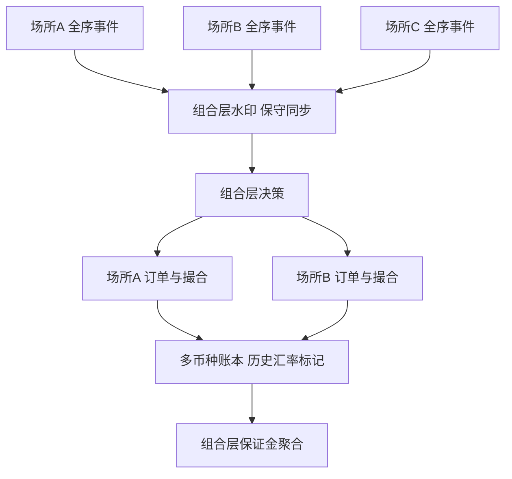
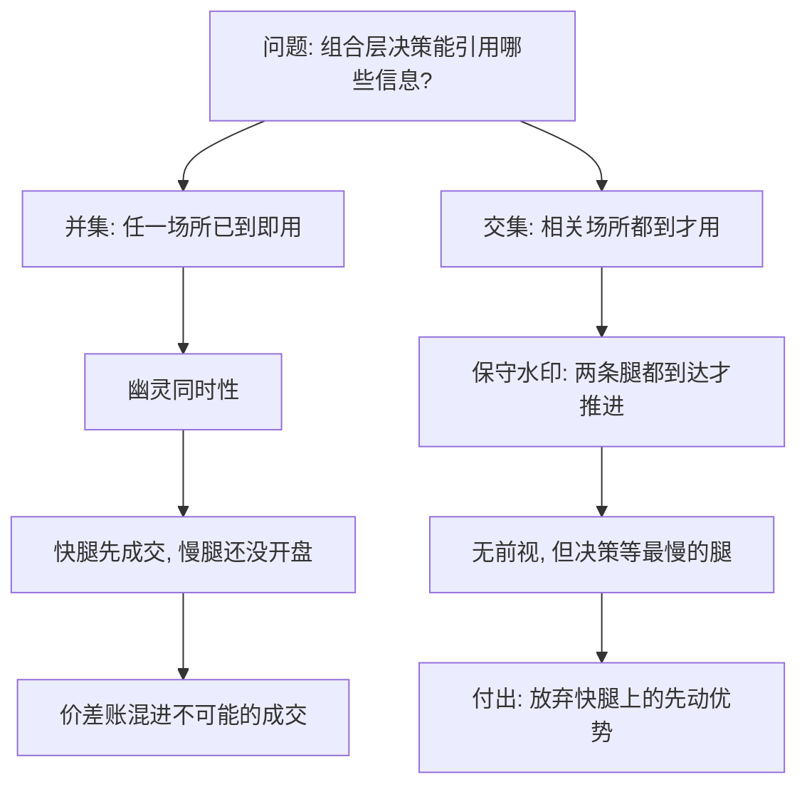

# 多资产回测

多资产回测里没有全局时钟：「组合在同一个瞬间行动」是工程约定；约定错了，价差与对冲的账先错。

<footer>—— 据 Harris, Trading and Exchanges, 2003 对多市场结构与交易时段的论述；对照各交易所日历与时钟的公开规则整理</footer>

[上一课](/quant/bf-fill-simulation-deep)把成交模拟拆成档位，图景还停在单一标的。组合一跨资产，时区、日历、币种、保证金、公司行动各来一套，引擎的全序与账本的记账单位都要重新设计。本课写多资产回测的框架机制：事件排序、币种换算、保证金聚合与跨市场约束；策略内容不是对象。

## 问题

单标的回测默认三件事，跨资产后全部失效。其一，「同一时刻」存在：A股午休时芝加哥正开盘，日历、夏令时、午休各按各的表走；用一个统一时间戳列打天下，会在时段错位处制造幽灵的同时性——价差策略的一条腿在另一条腿的市场还没开盘时已经「成交」。其二，「同一记账单位」存在：美元期货盈利折回人民币用哪一刻的汇率，是账本定义的一部分；偷懒用当日收盘统一折算，跨币种的对冲账里会混进汇率择时的假损益。其三，「同一套规则」存在：T+1、涨跌停、借券可得性、保证金模型逐场所不同，写成全局假设，就在某一个市场上必然违法成交。

数字实例：A股下午 14:00（北京时间）时，芝加哥是凌晨 1:00（夏令时差 13 小时），CME 大部分时段还没开盘。若引擎用「日历日」对齐两市收盘价，一条「A股收盘买入、芝加哥收盘卖出」的所谓同时对冲，两端实际相差了整整一个全球交易日。

### 排序、账本与规则各归各

**事件排序**：每个场所维护自己的全序 $(\text{venue}, \text{timestamp}, \text{seq})$；跨场所声明同步策略——对价差与对冲类策略用保守水印：两条腿都到达才推进组合层决策，见[时钟、迟到数据与对账](/quant/late-data-recon)。**多币种账本**：仓位按币种分列，汇率从 as-of 存储取历史标记，基准货币损益的换算时点显式声明（常用上一收盘，而不是即期逐笔）。**保证金**：逐场所的保证金模型可组合为组合层占用，跨市场抵扣按场所族规则，见[保证金与盯市](/quant/futures-margin)。**规则层**：T+1、停牌、借券作为场所规则数据进入引擎，不写成策略 if-else，延续[订单状态机](/quant/order-state-machine)的原则。

## 方法

宇宙先于事件。多资产回测的第一个数据问题是「当时有哪些可交易名字」：指数成份用 as-of 历史，见[指数成分历史](/quant/index-constituents-history)；退市名字必须留在宇宙里，否则[幸存者偏差](/quant/survivorship-bias)直接写进横截面。公司行动按场所接入事件流（分红、拆分、期货展期各有日历，见[公司行动引擎](/quant/corporate-action-engine)与[期货交割与展期日历](/quant/futures-roll-calendar)），除权日同时改仓位、订单与账本映射。流动性约束最后加：参与率上限逐场所参数化，作为撮合器拒绝订单的理由，而不是优化里的软惩罚。

水印同步的代价要诚实记账：保守策略会让组合层决策等到最慢的一条腿，等于假设你放弃快腿上的先动优势。它买到的是无前视，卖出的是实施速度——这笔交换应作为情景披露，而不是藏在引擎里。

## 机制

多资产框架的核心机制是把「组合」从「一堆仓位」升级为「受约束的账本聚合」：约束在订单层（每场所规则拒绝非法单）、在组合层（保证金、敞口上限按基准货币计）、在报告层（多币种损益按声明时点折算）。三层分离后，跨市场套利的回测答案才有定义：价差收敛的每一段损益都能指认发生在哪个场所、哪种币种、哪条规则之下。同步水印则把跨场所的因果钉住：任何组合层决策引用的信息集，是所有相关场所该时刻已到达信息的交集，而不是并集——用并集就是让先开盘的市场替后开盘的市场做决定。

直觉类比：水印同步像「小组讨论必须等两人都看完材料才开始」——保守，但没人会引用别人没看过的信息。用并集像「谁先看完谁先拍板」：拍板引用了另一份还没到手的『事实』，在回测里这叫前视，在实盘里这叫做梦。

信息集取交集还是并集，决定价差账的合法性：

## 边界

本课不假装多场所微观结构可以等保真度回放：跨场所延迟、各自的数据档位差异，都应写成情景。跨场所套利对延迟假设最敏感，没有把托管与网络建模进去就谈延迟套利，是[市场分割与 NBBO](/quant/market-fragmentation) 与[低延迟工程：内核旁路与 FPGA](/quant/low-latency-engineering) 层面的自欺。加密日历与证券日历不共享假期，报告层要显式处理「某场所无此日」。最后，多资产放大的是账本复杂度而不是 alpha：框架保证账算得对，不保证配得好。

常见误区：初学者容易以为「多币种回测只要乘个汇率就行」。乘哪一个时点的汇率本身就是建模决定：用当日收盘统一折算，等于假设自己能在收盘瞬间以中间价换汇；用 as-of 历史汇率按声明时点折算才经得起对账。汇率择时的假损益，就是从「乘哪个价」这个细节里漏进来的。

## 小结

- 跨资产三件失效的默认：同时性、记账单位、统一规则；每件都要在框架里显式重建。
- 排序按场所全序加组合层保守水印；决策信息集取交集，不取并集。
- 多币种账本用历史汇率在声明时点折算；保证金按场所族聚合为组合层占用。
- 宇宙、公司行动、场所规则全部 as-of 化、数据化；幸存者偏差从宇宙层挡住。
- 出处：Harris, *Trading and Exchanges*, 2003；站内[时钟、迟到数据与对账](/quant/late-data-recon)、[保证金与盯市](/quant/futures-margin)、[指数成分历史](/quant/index-constituents-history)、[幸存者偏差](/quant/survivorship-bias)各课。
