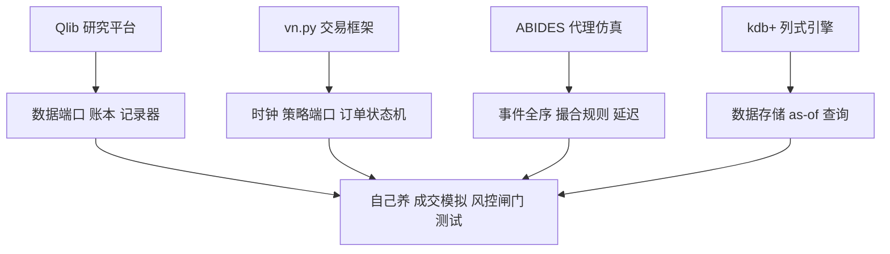

# 开源框架对照与收束

选框架不是数功能清单，是决定七个器官里哪几个外包、哪几个自己养：成交模拟与风控闸门，几乎总该自己养。

<footer>—— 据 Microsoft Qlib、vn.py、ABIDES 与 kdb+ 的公开文档对照整理</footer>

[上一课](/quant/bf-framework-testing)给了验收框架的测试体系。本课按第一课的解剖图对照四个谱系——研究向量化平台、事件驱动交易框架、代理仿真器、列式行情引擎——读出各自的强器官与空缺，回答「自建还是采用」。本课程到此收束。

## 问题

采用一个框架，等于默认接受它的全部隐含值：成交假设、时钟语义、试验计数与作者所在市场的规则。A 股的 T+1、涨跌停与竞价语义在上游框架里常常缺席，缺口常被使用者在策略层打补丁——补丁绕过引擎，测试也罩不住它。反过来一切都自建，就把事件循环与状态机这些久经实盘检验的商品代码重写一遍，省下的依赖换成自己维护的缺陷。缺口是决策标准：哪几个器官是商品，哪几个器官编码了你独有的场所规则与资金约束。

### 四个谱系按解剖图对号

**研究向量化平台**以 Microsoft Qlib 为代表：点时数据层、模型插槽与实验记录齐备，回测偏日频向量化，成交假设轻；强在数据与研究侧器官，事件侧留白，执行须另接事件引擎（见[Microsoft Qlib](/quant/qlib-quant)）。**事件驱动交易框架**以 vn.py 为代表：事件引擎加网关适配把国内柜台差异收成统一对象，回测与实盘共享状态机、撮合器可插拔；强在交易控制面，微观结构保真度不在默认回调里（见[vn.py 交易框架](/quant/vnpy-framework)）。**代理仿真器**以 ABIDES 为代表：离散事件内核让延迟、撮合规则与反事实代理成为一等对象，回答的是市场设计与多代理问题，不是单策略协议回测（见[ABIDES 事件驱动仿真](/quant/abides-simulation)）。**列式行情引擎**以 kdb+/q 为代表：tick 带宽与 as-of 连接把计算搬到数据旁边，是引擎的存储侧底座而非回测器本身（见[kdb+ 与 q](/quant/kdb-plus)）。

## 方法

采用与自建按器官分账。可以外包的：事件循环、行情适配、订单状态机、数据存储——这些是商品代码，社区替你踩过坑，测试体系照常适用。应当自己养的：成交模拟器（它编码你所在场所的优先规则与自己的冲击，是乐观偏差的入口，见[成交模拟的深化](/quant/bf-fill-simulation-deep)）；风控闸门（资金与限额是公司事实）；扫描的结果库与试验计数（[参数扫描的架构](/quant/bf-param-sweep-arch)的多重检验纪律没法外包）。验收照上一课的尺子：黄金重放、泄漏检测、并行一致三条达标；功能清单再长也不算框架，只算演示集。

框架默认值是最常缺席的声明：用框架回测五年的人，未必说得出它的默认延迟、队列位置与费用。验收时把默认值抄成一页纸——说不清默认值的回测，审计时等于没有成本模型。

## 机制

对照的机制收获是把「框架差异」翻译成「器官差异」：框架间的性能之争，多是各自强器官不同——Qlib 的快在研究层数据管道，vn.py 的价值在控制面统一，ABIDES 的贡献在延迟与反事实建模，kdb+ 的带宽在存储侧。混合使用因此有清晰接缝：kdb+ 或列存平台做存储与 as-of（[时序数据库的选型](/quant/de-tsdb-selection)照用），Qlib 类平台做信号研究，自养的事件引擎做定案，vn.py 类框架做实盘控制面——每条接缝只传数据与信号，不共享可变状态。

## 边界

对照会过期：许可、版本与生态三年一变，本课留的是对照方法而不是排名。代理仿真回答的是市场设计问题，别拿它替代协议回测；商用列式引擎的许可与人才成本要计入决策；上游缺席的中国场所规则，贡献回去或带声明的补丁分叉，别静默改。至此九课走完：解剖给出器官与不变量，取舍给出两层分工，成交与多资产给出保真度和规模，扫描与并行给出吞吐和纪律，诊断与测试给出证据和守护，对照给出采用与自建的分账——回测框架设计的全部内容，就是把回测语义做成可维护、可审计、可重放的软件。本课程到此收束。

## 小结

- 四谱系按解剖图对号：研究平台、交易框架、代理仿真、列式引擎，各有强器官与留白。
- 可外包：事件循环、状态机、存储、适配；应自养：成交模拟、风控闸门、结果库与试验计数。
- 验收看三条：黄金重放、泄漏检测、并行一致性；功能清单不替代它们。
- 框架默认值（延迟、队列、费用）必须抄录声明；说不清默认值等于没有成本模型。
- 课程收束：九课一条线——把回测语义做成可维护、可审计、可重放的软件。
- 出处：Microsoft Qlib、vn.py、ABIDES、kdb+ 公开文档；站内[事件驱动框架的解剖](/quant/bf-event-driven-anatomy)、[框架的测试](/quant/bf-framework-testing)各课。
