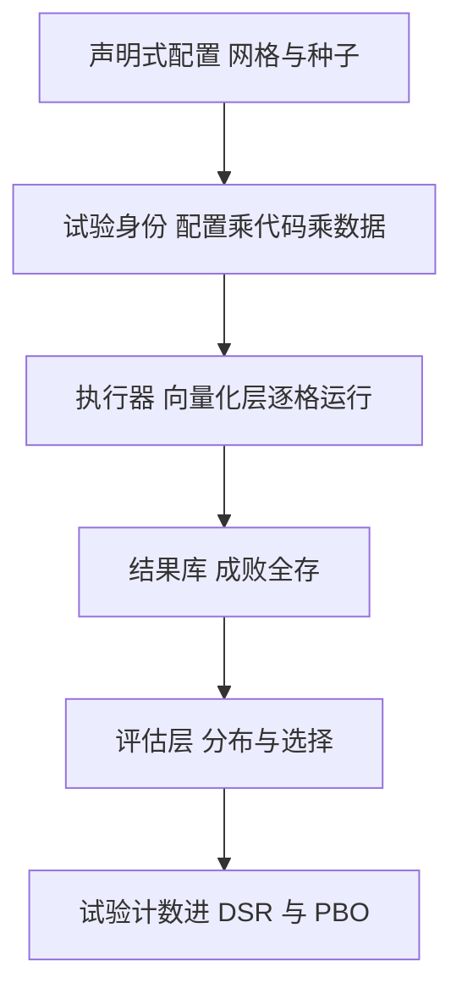
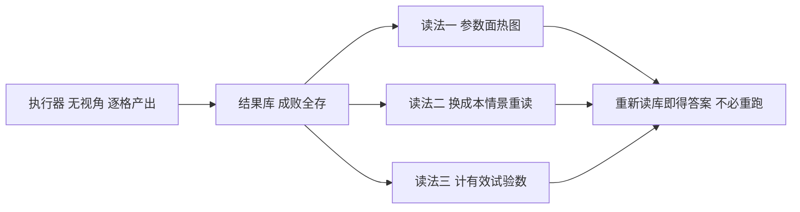

# 参数扫描的架构

每个被看过的参数格子都是一次试验；扫描架构的职责是让这个 $N$ 数得出来、存得下来、赖不掉。

<footer>—— 据 Bailey, Borwein, López de Prado and Zhu, The Probability of Backtest Overfitting 及 Notices of the AMS, 2014 对多重检验的论述；对照 White, Econometrica, 2000 整理</footer>

[上一课](/quant/bf-multiasset)把引擎撑到多资产，剩下的工程问题是规模：一个策略族乘参数网格乘多市场，运行与评估都得有架构。本课把扫描写成框架的一等公民：配置对象、试验身份、结果存储与试验计数。筛选层用向量化的算力（见[向量化与事件驱动的取舍](/quant/bf-vectorized-vs-event)），本课写的是那一层之上的组织学。

## 问题

笔记本里的扫描死于四件事。结果只活在 notebook 里，三天后连作者也不知道胜者参数是哪次运行、哪份数据；只记录胜者，参数面上的邻域稳定性与鲁棒性再也问不出来；报错与中断的运行被顺手丢弃，配置层面重演一遍幸存者偏差；最要命的是 $N$ 失忆——看过两百个格子，报告里写「我们试了三个想法」，[过拟合次数与试错](/quant/backtest-overfitting)的调整从此无从谈起。缺的不是更快 sweeping，而是一套让每一次「看过结果」都留痕的架构。

### 配置、身份与结果库

扫描的三件套。**配置对象**是声明式的：策略版本、宇宙、参数网格、数据版本、成本情景、种子，一个字典说尽。**试验身份**是配置、代码哈希与数据版本的联合哈希——数据版本来自平台（[时序数据库的选型](/quant/de-tsdb-selection)的版本化），没有它，供应商一次刷新就让历史结论不可复现。**结果库**按身份存每一次运行的完整产物：权益路径、成交日志、指标、报错。失败也是结果；只存胜者的结果库，在配置层面先行一遍[幸存者偏差](/quant/survivorship-bias)。

## 方法

评估层读的是全网格，不是冠军。报告的最小集合：参数面热图与邻域稳定性（冠军参数的邻居是否同样好，还是孤峰）；样本内外散点与[组合过拟合 CPCV](/quant/cpcv) 的路径分布；以有效试验数填入 [Deflated Sharpe](/quant/deflated-sharpe)。有效数是关键修正：网格里的格子高度相关，$5\times5$ 的格子簇可能只等于三五个独立假设；名义格子数填进多重检验调整会高估显著性，应按参数邻域聚类计数，与[多重检验纪律的现场用法](/quant/multitest-discipline-cap)一致。搜索策略上，网格与随机采样适合铺面，贝叶斯优化省算力但每一步查询都自适应于已看结果——查询次数同样计入 $N$，不能因为「智能」就免票。

把报错的运行也写进结果库并标出原因：某格因数据缺口失败，与某格因策略失效亏损，是两种信息。静默丢掉前者，参数面上会出现一片看似「未评估」实为「不可评估」的空洞，后续的人会把它当成空地重新踩一遍。

给个数字：$5\times5$ 的参数网格名义上是 $25$ 次试验，但相邻格子高度相关——若按邻域聚类只折出 $4$ 个独立假设，填进 Deflated Sharpe 的有效 $N$ 就取 $4$ 而不是 $25$。取 $25$ 会把显著性门槛放得过宽，让平庸的夏普也显得能过关。

## 机制

扫描架构真正的机制是把「选择」从「运行」中剥离。执行器是无视角的：给它身份与配置，它产出结果，不知道谁是冠军；选择只发生在评估层，而评估层看到的永远是分布。这样分离之后，任何后续问题——鲁棒性面、参数敏感性、换一个成本情景重读——都不需要重跑，只需要重新读库。试验计数也因此有了账本：结果库里的每一行都是一次看过，$N$ 不再依赖作者的记忆。预注册的假设与扫描的关系同样清晰：扫描生成假设，预注册（[假设与预注册](/quant/hypothesis-preregistration)）冻结下一个样本外的检验，两者的分界就是结果库的某一次读取。

「选择与运行剥离」可以想象成体检中心与医生：体检中心（执行器）只管按单子抽血出报告，不知道也不关心你哪里不舒服；诊断（评估层）是医生拿着全部指标做的，想换个角度分析就重读报告，不必重新抽血——回测里「重新抽血」就是重跑扫描，又慢又多花一次 $N$。

## 边界

扫描不替代时序协议：CPCV 与[样本外与滚动检验](/quant/walk-forward)回答的是路径与漂移，参数面回答的是邻域，三层互补。也不要在看过事件层结果之后回头重扫向量层——那是用新一次试验去解释旧试验，$N$ 翻倍而报告不变，是最常见的隐性膨胀。算力不是约束，纪律才是：结果库会诱惑「反正便宜再扫一轮」，每一轮都在花同一个 $N$ 的额度。

常见误区：把结果库当「备份」，存不存都行。其实它是账本——$N$ 的每一个计数都以库中的一行为凭；没有账本，「我们只试了三个想法」就无从审计，多重检验调整也就退化成自我申报的荣誉制度。

## 小结

- 扫描三件套：声明式配置、试验身份（配置乘代码乘数据版本）、成败全存的结果库。
- 评估层读分布不读冠军：参数面、邻域稳定性、CPCV 路径、按有效数填 DSR。
- 网格格子相关，名义试验数高估独立性；按邻域聚类计数，贝叶斯查询同样计票。
- 选择与运行剥离；预注册与扫描的分界是结果库的某一次读取。
- 出处：Bailey, Borwein, López de Prado and Zhu, *Journal of Computational Finance*, 2017 与 *Notices of the AMS*, 2014；White, *Econometrica*, 2000；站内[组合过拟合 CPCV](/quant/cpcv)、[过拟合次数与试错](/quant/backtest-overfitting)各课。
