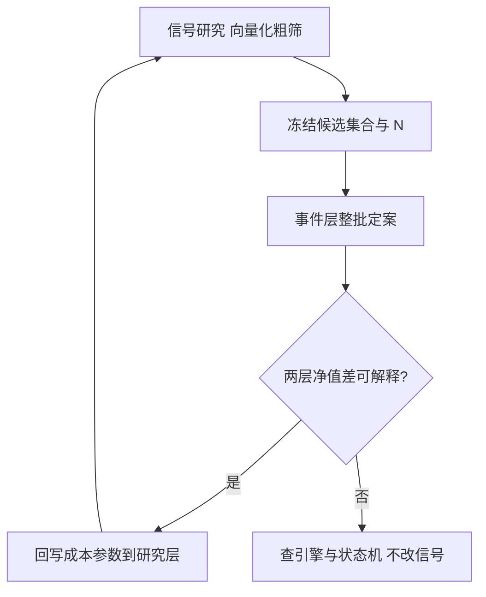
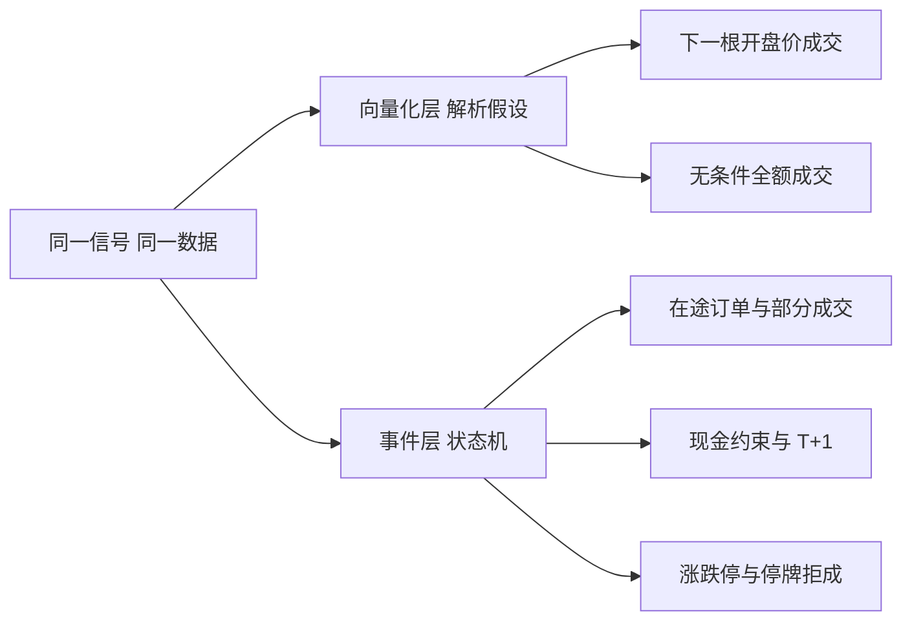

# 向量化与事件驱动的取舍

向量化回答「信号有没有」，事件驱动回答「这笔交易做不做得成」；把两问混进同一条净值曲线，两边的答案都失真。

<footer>—— 据 López de Prado, Advances in Financial Machine Learning, 2018 对回测结构与路径依赖的论述；对照 Pardo 的仿真分层实践整理</footer>

[上一课](/quant/bf-event-driven-anatomy)把框架拆成七个器官，其中撮合器与账本只在事件侧存在。缺口随之而来：研究要扫几千个候选，事件引擎每个候选慢几个数量级，全塞进事件侧算不起，全留在向量化侧又丢掉成交的路径依赖。本课写这条边界的画法：什么问题必须事件侧回答，什么问题允许向量化近似，两层如何对拍、差异归给谁。

## 问题

向量化的本质是把「当时能否成交」压缩成一组解析假设：下一根开盘价或中点加价差、无条件成交、现金无限。日频、满仓、低换手的因子研究里这组假设误差小、速度快一个数量级以上；但[回测向量化](/quant/backtest-vectorization)已经指出，A 股 T+1 与涨跌停能让单列持仓矩阵直接非法，[停牌与涨跌停对回测](/quant/halt-limit-backtest)里「在不可交易的 bar 上成交」是向量化最常造假的位置。取舍错的症状有两种：在向量化的漂亮夏普上晋级，实盘完成率远低于一；反过来，把还在筛选期的信号全灌进事件引擎，算力花在两周后就会被丢弃的候选上。

### 判据与分工

判据一条：损益是否路径依赖。持仓转移成本、部分成交、拒单、限额、日内时序影响净值，就必须事件侧；信号统计本身（IC、分层收益、候选排序）允许向量化。分工因此是两层：研究层向量化粗筛并解析扣费，候选集合冻结后整批进事件层定案；冻结之前事件层不算任何信号，否则算力诱惑会重新打开「看一眼结果再改」的循环。

## 方法

对拍是两层之间的协议：同一份数据、同一版本信号，向量化在自报的成交假设下与事件引擎各跑一遍，净值差应能被假设逐项解释——价差多大、错过多少涨跌停、拒单多少笔。解释不了的残差才是引擎缺陷，修的是引擎或状态机，不是把信号朝事件层的结果方向调：那是把事件层当第三重交叉验证用，[研究、模拟、实盘隔离](/quant/research-sim-prod)的警告原样适用。

成本参数的流向是单向的：事件层的实测（完成率、滑点分布）回写研究层的解析成本，让下一轮粗筛更接近真相；研究层不许因为向量化曲线好看而去「修」事件层。试验次数记在两层之和上，候选集合冻结后进事件层的那一批才算有效样本外。

算一笔数量级账：十年日频的向量化回测在笔记本上是毫秒级，事件引擎同一任务常以秒到分计，差距千倍上下。粗筛与定案分层不是风格偏好，是算力预算下的必然分工。

对拍的账要逐项算：两层净值差 $0.8\%$，其中价差假设差贡献 $0.5\%$、错过两个涨跌停贡献 $0.25\%$、拒单贡献 $0.03\%$，剩下的残差才轮到「查引擎」。跳过归因直接调参数，等于把缺陷当成了校准目标。

## 机制

两层能共存的前提是成交假设被显式化。向量化的成本函数与事件层的撮合器档位必须写成同一套参数（价差、冲击系数、拒单率），一层升级另一层随之校准；参数没有共享口径，差异既不能解释也不能收敛。事件层不是「更准的向量化」：它保留的是向量化没有的状态——在途订单、现金约束、会话边界——这些状态在低换手日频下多数时间不激活，这正是向量化的近似在那一域成立的原因。

术语翻译：「在途订单」就是已经发给柜台、但还没收到成交或拒绝回报的委托。向量化里不存在这个状态——它默认下单即成交；事件层必须记着它，否则同一份现金可能被下两单。两层差距在高换手策略上放大的根源就在这里。

## 边界

本课不宣布向量化低人一等：中低频、无杠杆约束、成交假设不敏感的策略，向量化终身够用，事件层只在晋级关卡请出来。也不要把对拍做成常态校准——每轮都对到分毫不差，说明事件层被调得迁就假设，保真度反而在退化。混合策略（日频信号、日内执行）要求两层共享信号定义与时间戳语义，聚合口径必须版本化，见[时钟、迟到数据与对账](/quant/late-data-recon)。

初学者容易把「两层对拍到分毫不差」当成工程质量高。方向恰恰反了：事件层若被调得迁就向量化假设，保真度正在退化——它存在的意义就是说出「这笔交易做不成」，偶尔对不上才是它在正常工作。

## 小结

- 判据一条：损益路径依赖必须事件侧；信号统计允许向量化粗筛。
- 分层流程：向量化粗筛、冻结候选与 $N$、事件层整批定案；事件层不做筛选期工作。
- 对拍差异逐项归因给成交假设；解释不了的残差是引擎缺陷，不是调信号的依据。
- 成本参数单向回写：事件层实测校准研究层假设，方向不可逆。
- 出处：López de Prado, *Advances in Financial Machine Learning*, Wiley, 2018；Pardo, *The Evaluation and Optimization of Trading Strategies*, 2007；站内[回测向量化](/quant/backtest-vectorization)、[停牌与涨跌停对回测](/quant/halt-limit-backtest)各课。
