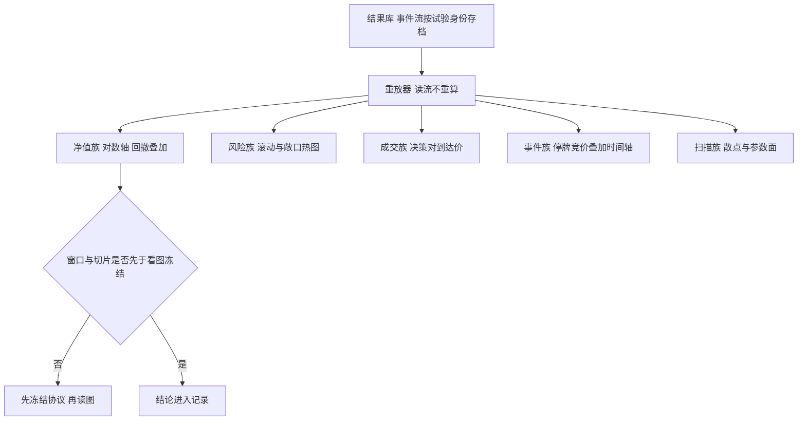
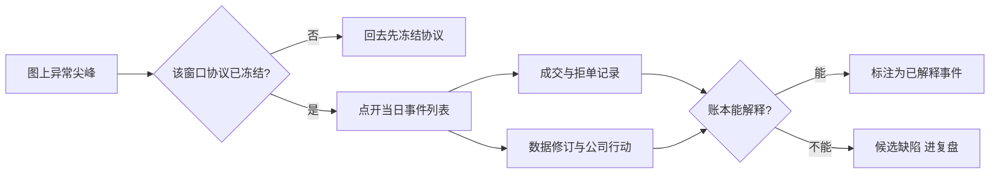

# 可视化的诊断

图的诚信在于它从哪里来：从重算状态画的图是二手证词，从落盘事件流画的图才是账本的投影。

<footer>—— 据 Tufte, The Visual Display of Quantitative Information, 1983 对图形诚信的论述；对照生产监控的看板实践整理</footer>

[上一课](/quant/bf-parallel-backtest)让扫描在集群上跑完，结果库里躺满净值路径；怎么把它们看进人眼而不骗过人眼，是本课。诊断不是策略写完后的装饰，而是框架的一等 API：面板定义与引擎同版本发布，每张图从记录器的事件流重放生成（见[事件驱动框架的解剖](/quant/bf-event-driven-anatomy)），因此任何一张图都能用试验身份复现。

## 问题

随手画图的毛病有两类。一类是账对不上：画图的人重新算一遍净值，与引擎账本差在复权、汇率折算或未成交订单上，于是出现两张真相——讨论变成对着两条曲线互相猜。另一类是眼睛先于协议：看到回撤再挑窗口，看到失灵的年份再换切片，[多重检验纪律的现场用法](/quant/multitest-discipline-cap)警告过的选择偏差，在看板这一步无声地回来。扫描结果更危险：几千条路径里总有一条最好看，画哪条本身就是一次选择。

### 面板族与它们的出处

诊断面板按问题分族，每族钉死出处与口径。**净值族**：时间加权净值对基准，回撤叠加；长历史用对数轴；有申赎的组合区分时间加权与资金加权，见[时间加权对资金加权](/quant/twr-vs-mwr)与[最大回撤与 Calmar](/quant/drawdown-calmar)。**风险族**：滚动波动、滚动夏普、换手率、敞口热图（资产乘时间）。**成交族**：逐笔决策价对到达价的分布按场所与时段切开，完成率与拒单率随时间——口径接[滑点归因](/quant/slippage-attribution)。**事件族**：把停牌、竞价、公司行动叠加回时间轴，让异常日期有名字而不是有尖峰。**扫描族**：样本内外散点、参数面热图、PBO 路径分布。

## 方法

操作纪律三条。第一，窗口与切片协议先于看图冻结：要看哪个时段、按什么切（年度、波动制度、流动性分层）、看哪几个面板，写进试验记录再打开图——这与[假设与预注册](/quant/hypothesis-preregistration)同一精神，只是发生在可视化层。第二，两张图以上的比较必须同轴同口径：对数轴对对数轴，净额对毛额分开标注，成本情景写进标题。第三，诊断图接受假设、不接受结论：面板的产出是「这段值得查」的候选，查证回到账本与事件流，见[复盘与案例写作](/quant/research-postmortem)。

权益曲线用对数轴不是审美：线性轴上前期回撤永远「看起来小」，只因为净值基数小；同一策略在 2020 年的 30% 回撤与 2015 年的 30% 回撤，对数轴上才一样高。基线效应是图形说谎最安静的一种。

术语翻译：「协议先于看图冻结」就是先写下「我要看 2018 至 2023、按年度切、看净值与换手两块面板」，存进试验记录，然后才打开图。先看后选，眼睛会替你挑好看的窗口——这与调参数到数据好看是同一种过拟合，只是发生在视觉层。

## 机制

「从事件流画图」的机制价值在可审计：图上的每个点能追溯到记录器里的某一行——这笔成交、这次拒单、这条修订。于是诊断从「看形状」升级为「查证据」：异常尖峰点开就是事件列表，两层净值的差异可以按成交假设逐项分解成图（[向量化与事件驱动的取舍](/quant/bf-vectorized-vs-event)的对拍协议在这里可视化）。面板定义与框架同版本，则图与账本的漂移在发布层被拦住；研究笔记里的临时图可以存在，但不进报告，报告只收版本化面板。

直觉类比：图上每个点能追溯到账本某一行，就像每个快递包裹都有单号——点开能看到揽收、转运、签收的全链路。没有单号的图只是装饰画：尖峰解释不了、分歧对不了账，讨论只能停在「看起来不对劲」。

## 边界

看板不做审计：审计读账本，不看图。面板数量本身是风险——二十块面板总有几块在某个窗口里好看，眼睛的多重检验比网格更难计数，所以协议冻结比面板裁剪更重要。3D、动画、双轴叠图按 Tufte 的标准默认禁止：它们增加的观感多于信息。最后，诊断面板服务内部研究；对外报告的业绩图另有合规口径，不要把内部诊断截图直接外发。

为什么协议比面板数量更根本：二十块面板里总有几块恰好在某个窗口好看，而人眼每天扫过的「选择次数」不会写进任何试验计数——它却是真实的多重检验。冻结的是看图的人，不是图的数量。

## 小结

- 图从记录器的事件流重放生成，不用重算状态；每张图可用试验身份复现。
- 五族面板：净值、风险、成交、事件、扫描；口径与出处随面板定义版本化。
- 窗口与切片协议先于看图冻结；诊断产出假设，查证回到账本与事件流。
- 对数轴、同轴对比、事件叠加是三条默认；双轴与 3D 默认禁止。
- 出处：Tufte, *The Visual Display of Quantitative Information*, 1983；站内[滑点归因](/quant/slippage-attribution)、[时间加权对资金加权](/quant/twr-vs-mwr)、[多重检验纪律的现场用法](/quant/multitest-discipline-cap)各课。
