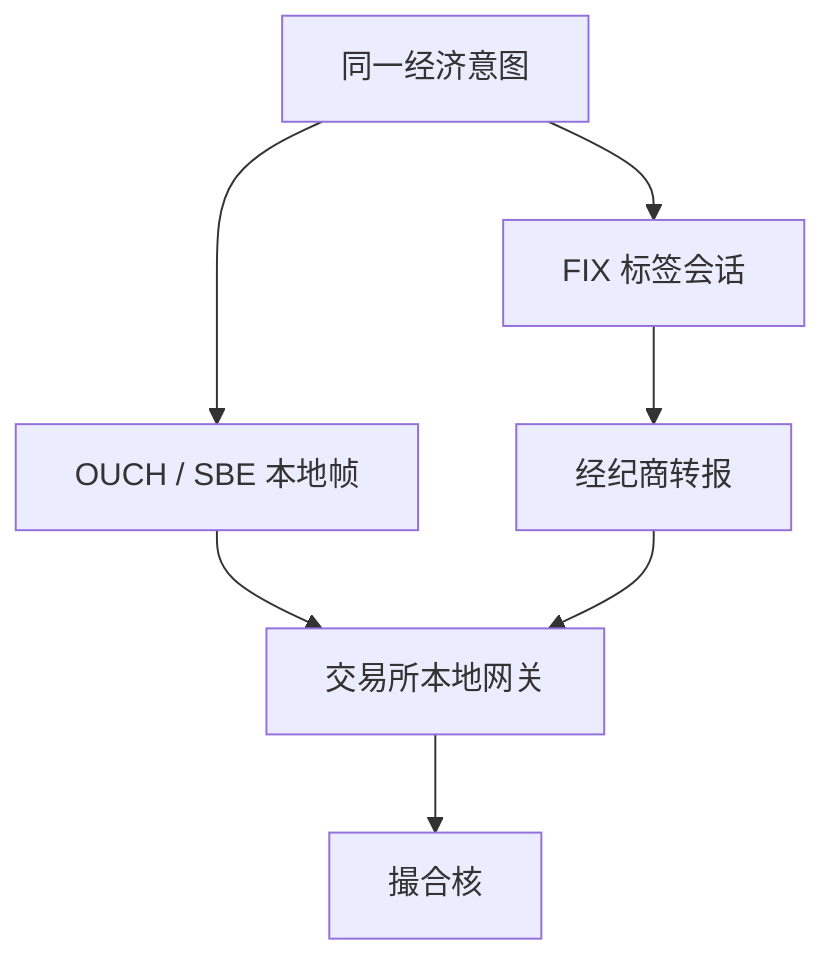

# 二进制协议 OUCH / SBE

当 FIX 的文本标签成为延迟预算里可见的一截，交易所把同一生命周期收成定长或模板化的二进制帧：字段位置即契约，解析不再扫描等号。

<footer>—— NASDAQ OUCH 规格；CME Group, Simple Binary Encoding (SBE)；对照 FIX Trading Community 对 FAST/SBE 的说明</footer>

[上一课](/quant/fix-protocol)把机构订单语言停在 FIX。本课的缺口是**交易所本地端口**：OUCH（纳斯达克一类订单入口）、ITCH（行情）、CME MDP 的 SBE 模板。策略意图不变，编码与会话假设变了。后课快照与增量建立在这些帧上。不把二进制当成「更快的 FIX 全文翻译」——字段子集通常更小，语义更贴撮合核。

## 问题

FIX 为人类与多对手方互操作优化：标签可扩展、版本可混。本地端口为核的入队优化：定长头、整数价格（tick 的整数倍）、会话内序号、尽量零拷贝。OUCH 的新订单、改单、撤单、被拒、已接受、已成交是紧凑结构体；价格与数量的单位在规格里写死。问题是：同一 ClOrdID 生命周期在 FIX 柜台与 OUCH 端口上如何对齐。经经纪商转报时，你看见 FIX，经纪商对交易所可能是 OUCH；你的延迟预算必须声明测的是哪一跳。

SBE 把「模板 ID + 版本 + 定长块 + 可选变长」做成可代码生成的编解码。CME MDP 3.0 用它推增量行情与统计。模板升级不兼容时，旧解码器会静默读错字段——这比 FIX 漏标签更危险，因为没有标签名可对。研究管道必须把模板版本写入数据血缘，不能只存「CME 二进制 dump」。

### 整数价格与字节序是契约

二进制价格几乎总是 `int64` 乘以规格中的 `PriceRatio` 或最小变动。把 IEEE 浮点打进端口，或者在本机用 double 往返后再比较 tick，会在边界价上错一档。字节序（SBE 默认 little endian）与对齐填充必须按规格，不能按本机 C 结构体布局臆造。OUCH 的用户自定义字段更少，防自成交、时效、展示量以枚举存在；A 股本地二进制接口则把涨跌幅、股东账户、订单类型编码进私有头——同一「二进制」不可混用解码器。

ITCH 是行情，OUCH 是订单入口，二者订单号空间相关但通道分离。用 ITCH 重建的簿去核对 OUCH 成交，必须对齐引擎序号或订单号，而不是对齐「差不多同一毫秒」。

## 方法

解码层只做规格映射：帧 → 内部事件（与上一课内部订单对象同构）。禁止在解码器里做策略。代码生成（SBE XML 模板 → 编解码）优于手写偏移，但生成物要进版本控制，模板变更必须出差异报告。会话层仍有序号与心跳；二进制不免除重连重放。测试用交易所认证工具或仿真器对拍，字段级黄金样本留在仓库。

延迟测量分段：网卡时间戳、用户态收包、解码完成、风控完成、发送完成。把「OUCH 比 FIX 快」写成一个数字是无意义的，除非固定同一主机、同一核、同一报文意图。FAST（FIX Adapted for Streaming）曾用于行情压缩，与 SBE 是不同代的二进制思路：FAST 偏压缩，SBE 偏定长可预测。选择由交易所决定，研究只声明。

### 与 FIX 网关并存时的身份映射

许多机构同时跑 FIX 到 EMS、二进制到托管主机。内部必须有一张表：策略单号 → FIX ClOrdID → 交易所 token。事故回放按这张表拼接，而不是按时间窗口模糊匹配。部分成交在二进制里可能是一条 execution 帧加剩余量；不要假设一定有 FIX 那种多次 35=8 文本。

## 机制

定长帧把解析从「扫描」变成「偏移」，抖动下降，这才是对时间优先的贡献：入核前的 CPU 时间更可预测。它不改变核内 FIFO。若应用在解码后仍做内存分配、日志 flush、锁竞争，二进制的优势会被吃掉——后课内核旁路处理这一段。行情 SBE 增量与订单 OUCH 仍可能不同通道、不同网卡，时钟校准见后课时钟课。

模板化编码使「向前兼容」变成显式版本协商。忽略版本、强行解码，是状态机腐败的常见原因，症状与丢包相似：簿对不上、成交价不在 BBO。处理同上一课：停用，冷启动。

## 边界

本课不提供利用二进制端口插队、抢跑或构造畸形帧的方法。畸形帧属于对交易所系统的攻击面，研究只需把规格校验当硬拒。私有协议无公开规格时，以会员文档为准，不要用纳斯达克 OUCH 去猜上交所二进制。

加密 websocket JSON、REST 下单延迟特征不同，不要标成 SBE。ISO 20022 是清算报文，不走撮合端口。

## 小结

- OUCH/SBE 把订单与行情收成定长或模板帧，解析可预测，字段子集更贴核。
- 价格用整数 tick；模板版本是血缘字段；与 FIX 并存时要显式映射单号。
- 二进制不改变撮合优先规则，只改变入核前的抖动。
- 出处：NASDAQ OUCH；CME SBE / MDP 3.0 规格；FIX Trading Community。
