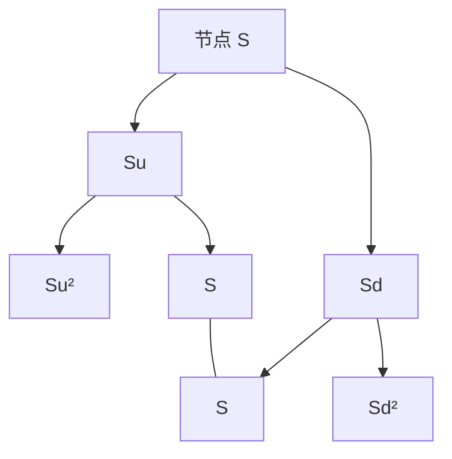

# 二叉树与三叉树

    
把连续的对数正态运动收成每期上涨或下跌两态，用风险中性概率对末端支付倒推贴现，即可在代数上复现 Black-Scholes，并自然处理提前行权。

    <footer>—— Cox, Ross and Rubinstein, Option Pricing: A Simplified Approach, Journal of Financial Economics, 1979</footer>

[上一课](/quant/bsm)用动态复制把欧式期权写成 PDE 的解，价格不显式依赖 $\mu$；几何布朗运动与连续无摩擦交易是闭式解的前提。缺口是美式、障碍、转债这类需要在每个结点比较「现在行权 / 继续持有」的合约：连续公式不直接给出可算网格。Cox–Ross–Rubinstein 用每期两态复制，步数加密后收敛到同一极限；三叉树再匹配局部波动与显式差分。本课写 CRR 与三叉构造，不重推 Black-Scholes 公式。美式倒推见 [提前行权](/quant/american-exercise)。

## 问题

[BSM](/quant/bsm)给出欧式闭式，但对美式最优停时并不直接给出可算的网格：要把「现在行权」和「继续持有」在每个点上比较。需要一种离散市场：每期证券数与随机状态数匹配，市场完全，唯一的无套利价格由复制给出。二叉树用最少的分支做到这一点。还需要证明：当步长 $\Delta t\to 0$ 且涨跌幅按波动率标定，离散价格趋向几何布朗运动下的欧式公式，否则「简化」只是另一个模型，而不是同一极限。

三叉树要回答的是另一句话。两态在二维因子或局部波动下分支不够，或显式差分稳定性差。中间态（常取不跳）提供额外自由度，可同时匹配漂移、方差，有时还匹配峰度，并与 [PDE 有限差分](/quant/option-pde) 的显式格式一一对应。问题是在保持无套利概率的前提下布置节点，避免负概率，并在美式倒推时沿用与二项相同的 $\max(\text{行权},\text{持有})$。

### 完全市场与两态复制

单期两态：股票现价 $S$，下期 $Su$ 或 $Sd$，债券一期增长 $e^{r\Delta t}$（或离散因子 $R$）。期权下期价值 $V_u$、$V_d$。持有 $\Delta$ 份股票与 $B$ 现金，使

$$
\Delta\cdot Su + B e^{r\Delta t} = V_u,\qquad \Delta\cdot Sd + B e^{r\Delta t} = V_d.
$$

解出 $\Delta=(V_u-V_d)/(S(u-d))$，现价 $V=\Delta S+B$ 不含对 $u$、$d$ 发生的主观概率。把 $V$ 写成

$$
V = e^{-r\Delta t}\bigl(p^* V_u + (1-p^*)V_d\bigr),\qquad p^*=\frac{e^{(r-q)\Delta t}-d}{u-d},
$$

$p^*$ 是使股票贴现期望成立的概率。$0<p^*<1$ 当且仅当 $d<e^{(r-q)\Delta t}<u$，即涨跌夹住远期，否则树本身可套利。

树里的 $p^*$ 不是历史涨跌频率。历史频率对应真实测度 $\mathbb{P}$；定价只用 $p^*$。用过去涨跌次数去填二项概率，是把计量与无套利混在同一格点上。

## 方法

Cox-Ross-Rubinstein 取

$$
u=e^{\sigma\sqrt{\Delta t}},\qquad d=u^{-1}=e^{-\sigma\sqrt{\Delta t}},
$$

再按上式算 $p^*$。对数收益的条件方差在 $\Delta t$ 阶上匹配 $\sigma^2\Delta t$，且 $ud=1$ 使树在对数上重组：经过 $n$ 步，节点由上涨次数唯一确定，节点数为 $n+1$ 而非 $2^n$。$n$ 期欧式看涨是

$$
C = e^{-rT}\sum_{k=0}^{n}\binom{n}{k}(p^*)^k(1-p^*)^{n-k}\max(Su^k d^{n-k}-K,0),
$$

$T=n\Delta t$。中心极限定理下该和趋向 Black-Scholes。Jarrow-Rudd 风险中性树把 $p^*$ 固定为 $1/2$，改 $u$、$d$ 去匹配均值与方差；Tian 用矩匹配调整 $u$、$d$。参数化不同，有限 $n$ 的偏差不同，极限通常一致。

### 三叉树的节点与概率

Boyle 的三叉在每步给出上、中、下三态，中间常取 $S$，上、下为 $Su$、$Sd$，三个风险中性概率 $p_u,p_m,p_d$ 由匹配 $e^{(r-q)\Delta t}$ 与 $\sigma^2\Delta t$（有时再加一个峰度或稳定性约束）解出。Kamrad-Ritchken 取对数空间等距

$$
u=e^{\lambda\sigma\sqrt{\Delta t}},\qquad m=1,\qquad d=e^{-\lambda\sigma\sqrt{\Delta t}},
$$

$\lambda\geq 1$ 控制间距；$\lambda=1$ 退化接近二项极限，$\lambda=\sqrt{3}$ 一类取值在精度与稳定之间常见。Hull-White 在短期利率树上用三叉匹配漂移随状态变化的过程，思想相同：局部漂移改概率或改中心分支，而不是改几何 $u$ 的定义。重组仍然关键——若 $ud=m^2$，二维格子保持稀疏。

美式倒推在每个节点取

$$
V=\max\bigl(\text{内在价值},\; e^{-r\Delta t}\mathbb{E}^*[V_{\mathrm{next}}]\bigr).
$$

欧式则禁止第一项。障碍期权在节点碰到障碍时改边界，离散观察与连续观察要区分：树的时间网格把连续障碍变成离散抽样，通常会高估或低估敲入敲出，需要把障碍移到最近节点或加密时间步。

## 机制

树是离散的完全市场：每步的或有索取权都能被标的与债券复制，因而有唯一价格。加密时间后，复制策略的 $\Delta_n$ 趋向 Black-Scholes 的 $\Delta$，这是收敛的内容，不只是价格数字接近。重组使计算量为 $O(n^2)$：每个节点只看它的两个或三个后继。不重组的树（例如某些美式亚式用路径依赖状态）要把路径统计量扩进状态，复杂度随状态维数指数上升，那已接近动态规划，而不是经典 CRR。

三叉与显式有限差分是同一族对象。对数价格的差分网格、时间步与空间步满足 CFL 型约束时，显式格式的权重就是三叉概率；负概率对应不稳定差分。因此「树」和「PDE 网格」在实现上经常是同一段循环，只是边界与变量变换的说法不同。局部波动 $\sigma(S,t)$ 可以写进节点依赖的 $u$、$d$ 或概率，这是离散版的 [Dupire](/quant/dupire) 思想，但校准稳定性差，实践中更常在 PDE 上做。

CRR 的 $d=1/u$ 保证重组，不保证 $p^*$ 在 $\sigma$ 很小或 $r$ 很大时仍落在 $(0,1)$。短期深虚值、高利率或分红很大时，要检查概率，必要时换 Jarrow-Rudd 或缩小 $\Delta t$。

### 障碍、离散观察与不重组

连续障碍在树上变成「是否碰到某层节点」，观察频率被 $\Delta t$ 钉死，未加密时敲出概率有偏，常见修补是把障碍移到最近网格线，或在步内用布朗桥补触及概率。亚式要把迄今平均当作第二状态，重组消失，节点随路径计数增长。离散股利在除权日平移 $S$，短时间内树不再重合，计算量从 $O(n^2)$ 升到接近路径数。这些都不是 CRR 公式的失败，而是马尔可夫状态变厚之后网格不再便宜。

## 边界

二项、三叉都是马尔可夫网格：下一期只依赖当前 $S$（以及日历时间）。路径依赖要增维；随机波动要第二棵因子树或二维格。跳跃破坏「下一步只邻接节点」，需要非局部连接或另建模型。美式看跌在 CRR 上标准且稳健；美式亚式、回望则对观察频率敏感。连续股利的 CRR 用 $q$ 改 $p^*$；离散股利使树在除权日平移，重组可能被破坏，常用手续是把股利从节点值里减掉并接受短暂不重组，或把股票拆成「不确定部分 + 贴现股利」。

收敛不是单调的：欧式价格常呈偶数/奇数步振荡，实践上取较大 $n$ 或做 Richardson 外推。三叉并不自动更快：自由度多了，负概率与校准噪声也多。Glasserman 指出，树是偏倚方法——步长有限时有离散偏差，与蒙特卡洛的方差误差不同；比较两种算法要分开偏差与方差。对高维篮子，树的节点爆炸，应改 [蒙特卡洛](/quant/mc-pricing)。

把 CRR 极限说成「证明了 Black-Scholes」在教学上可以，在历史上不准确：Black-Scholes-Merton 已在 1973 年用 PDE 给出公式。CRR 的贡献是离散复制、美式倒推与收敛，以及让无套利概率可见。

## 小结

- Cox-Ross-Rubinstein（1979）用两态重组树复制期权，风险中性概率 $p^*=(e^{(r-q)\Delta t}-d)/(u-d)$。
- $u=e^{\sigma\sqrt{\Delta t}}$、$d=1/u$ 匹配波动并使节点重组；步数 $n\to\infty$ 时欧式价趋向 Black-Scholes。
- 美式在每个节点比较内在价值与贴现后继期望，这是树相对闭式解的主要用处。
- 三叉树（Boyle, Kamrad-Ritchken, Hull-White）用三态匹配更多矩，并与显式差分对应。
- $p^*$ 落在 $(0,1)$ 是无套利的离散条件；参数化失败时要换标定或加密步长。
- 高维与强路径依赖使网格爆炸，应转向模拟；树是低维美式与障碍的工作马。
- 出处：Cox, Ross and Rubinstein, *Journal of Financial Economics*, 1979；三叉见 Boyle, *Journal of Financial and Quantitative Analysis*, 1988，以及 Kamrad and Ritchken, *Management Science*, 1991。
