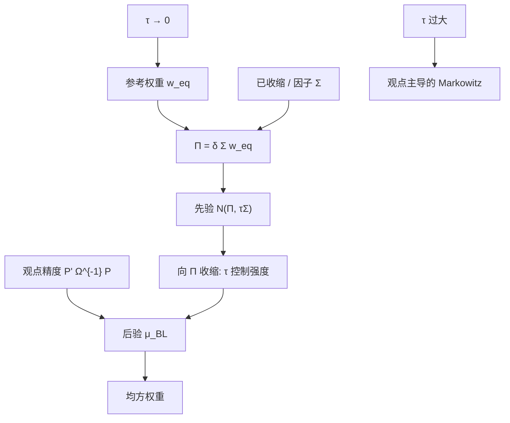

# Black-Litterman 先验收缩

    
把超额收益的先验中心钉在均衡隐含 $\Pi$ 上，并用 $\tau\Sigma$ 作为先验协方差，等于对 $\mu$ 做一次朝市场（或参考组合）的收缩；$\tau$ 是收缩强度，不是又一个可估的波动参数。

    <footer>—— 据 Black and Litterman, 1992；收缩与混合估计对照 Theil–Goldberger 以及均值的 James–Stein 传统</footer>

[Black-Litterman](/quant/black-litterman) 写反向优化、观点合并与无观点回到 $w_{\mathrm{eq}}$。[观点](/quant/bl-views) 写 $P,Q,\Omega$ 的工艺。本篇只写**先验这一侧如何构成收缩**：$\mu\sim\mathcal{N}(\Pi,\tau\Sigma)$ 把历史截面均值换成均衡锚，精度 $(\tau\Sigma)^{-1}$ 决定锚有多硬，后验均值是 $\Pi$ 与观点隐含均值的精度加权。它补的是与 [协方差收缩](/quant/cov-shrinkage) 正交的那一层——BL 收缩 $\mu$，Ledoit–Wolf 收缩 $\Sigma$——以及 $\tau$ 过小 / 过大时组合分别变成「只许微调市场」还是「观点即真理」。不要与观点矩阵混为一谈。

## 问题

截面 $\hat\mu$ 的噪声主导 Markowitz：估计误差最大化把权重赶到样本里碰巧高的方向。James–Stein 一类收缩把 $\hat\mu$ 拉向总均值或因子均值，能降低二次损失，但总均值在资产定价里往往没有均衡地位——现金、债券、新兴市场的无条件均值本来就不应被拉成同一个数。Black–Litterman 的主张是：收缩的靶子应是让参考组合均方最优的 $\Pi=\delta\Sigma w_{\mathrm{eq}}$，而不是 $\bar{\mu}\mathbf{1}$。这样，沉默时持仓等于市场（或基准），说话时只在观点子空间离开锚。

问题是把「收缩」说清楚：收缩强度由谁决定、靶子错了会怎样、与直接把 $w$ 向 $w_{\mathrm{eq}}$ 混合有何不同。实务里有人把 $\tau$ 当成「先验不确定等于样本均值标准误」，再用 $T$ 年数据估一个 $\tau\approx 1/T$；有人把 $\tau$ 拧到 $10^{-6}$ 让观点几乎无效。两种做法都把先验协方差当成了可观测方差，而公式里 $\tau\Sigma$ 是对均衡偏离的信念，不是 $\mu$ 的高频实现方差。

### 靶子是 $\Pi$，不是历史均值，也不是零

收缩向零是假设超额不可预测且市场不要求溢价，切点会塌到现金，与「持有市场」冲突。收缩向 $\hat\mu$ 的总均值是 James–Stein 在 i.i.d. 同均值时的靶，资产类之间不同溢价时偏误大。$\Pi$ 按风险模型分配溢价：高 $\beta$、高边际风险的资产得到更高隐含超额，这与 [CAPM](/quant/capm) 叙事一致，也与用 [ERC](/quant/erc) 当 $w_{\mathrm{eq}}$ 时的「伪均衡」相容——后者 $\Pi$ 不再是 CAPM 超额，收缩靶变成「让风险平价均方最优的伪 $\mu$」，文档必须改名。靶子选错，收缩越强，系统性偏误越大：$\tau\to 0$ 时你精确地持有一个错误锚的最优组合。

$\delta$ 缩放 $\Pi$ 的绝对水平，不改变无约束切点的构成。收缩讨论的是 $\mu$ 相对 $\Pi$ 的散布 $\tau\Sigma$，不是 $\delta$。把风险厌恶与 $\tau$ 一起拧，权重变化无法归因。

## 方法

先验精度 $(\tau\Sigma)^{-1}$。$\tau$ 小，精度高，后验被钉在 $\Pi$ 附近；$\tau$ 大，先验平坦，观点（以及若你错误地放入的历史 $\mu$）主导。标准后验均值

$$
\mu_{\mathrm{BL}}=\bigl((\tau\Sigma)^{-1}+P^\top\Omega^{-1}P\bigr)^{-1}\bigl((\tau\Sigma)^{-1}\Pi+P^\top\Omega^{-1}Q\bigr)
$$

是两条正态的精度加权。无观点时 $P$ 空，$\mu_{\mathrm{BL}}=\Pi$，这是收缩的固定点。有观点时，仅在 $P$ 的行空间里把 $\mu$ 从 $\Pi$ 拉开，拉开距离随 $\Omega^{-1}$ 相对 $(\tau\Sigma)^{-1}$ 上升。He–Litterman 的权重直觉：偏离 $w_{\mathrm{eq}}$ 的主动头寸沿 $\Sigma^{-1}P^\top$ 方向，幅度被 $\tau$ 与 $\Omega$ 共同缩放。因此校准应看主动风险 $\sqrt{(w-w_{\mathrm{eq}})^\top\Sigma(w-w_{\mathrm{eq}})}$，而不是看 $\tau$ 的「无偏估计」。

与 Ledoit–Wolf 的分工：先把 $\Sigma$ 收成可用的风险模型，再进入 $\Pi=\delta\Sigma w_{\mathrm{eq}}$ 与先验协方差 $\tau\Sigma$。若 $\Sigma$ 病态，$\Pi$ 在噪声特征上出现荒谬溢价，收缩会把这些荒谬精确地写进无观点组合——锚本身已经坏了。顺序是修 $\Sigma$，再定 $\delta$，再定 $\tau$，最后才是观点表。$\Omega$ 的启发式 $\Omega\propto P(\tau\Sigma)P^\top$ 把观点不确定与先验在该方向上的不确定绑在同一 $\tau$ 上：$\tau$ 一改，观点的相对信心也改，这是实现里隐藏的耦合。若希望观点信心独立于 $\tau$，应把 $\Omega$ 按绝对预测误差设定，并在文档里切断这条比例。

### $\tau$ 的操作定义是权重敏感度

常见起点 $\tau\in[0.01,0.05]$ 来自原文量级与后续工程惯例，不是定理。操作定义：插入一条标准相对观点（例如 $Q=1\%$ 年化、$\Omega$ 用 Idzorek 六成信心），看受影响资产类的权重变化是否在投委会可接受的带宽内（例如相对基准 1–3 个点）。变化过小则增大 $\tau$ 或减小 $\Omega$；变化把组合翻成几乎全是观点则反向。约束激活时，无约束敏感度与可交易敏感度不同，应用最终可交易 $w$ 校准，否则会把约束的影子价格误当成 $\tau$ 过大。

把样本均值当「观点」再靠 $\tau$ 往 $\Pi$ 拉，形式上像贝叶斯收缩，但 $P=I$、$Q=\hat\mu$ 使 BL 退化成向 $\Pi$ 收缩的 James–Stein，均衡锚只剩靶子的作用，稀疏观点的优点消失。这在 $N$ 很大的个股上有时是诚实的：你并没有 $k\ll N$ 条观点。此时应降低对「Black–Litterman」商标的依赖，承认这是带均衡靶的均值收缩，并更严地修 $\Sigma$。

## 机制

机制是精度矩阵相加所诱导的**向 $\Pi$ 的收缩**。后验均值可写成 $\mu_{\mathrm{BL}}=(I-A)\Pi+A\mu_{\mathrm{view}}$，其中 $A$ 只在观点张成的子空间非零。正交补上完全是 $\Pi$，这比「把 $w$ 与 $w_{\mathrm{eq}}$ 做凸组合」更细：凸组合在权重空间各方向同等混合，BL 在收益空间按 $\Sigma$ 的几何混合，高相关资产被连带，低相关资产少动。连带是特征：收缩靶通过 $\Sigma$ 传播。若 $\Sigma$ 是强因子模型，未提及的资产仍会随因子观点移动；若 $\Sigma$ 近对角，连带弱，未提及资产几乎钉在 $\Pi$ 对应的权重上。

$\tau$ 与主动风险近似同向（观点固定时）：$\tau$ 加倍，先验变松，观点拉得更开。但关系被 $\Omega$ 是否随 $\tau$ 缩放而改变。过小的 $\tau$ 让任何有限信心的观点都几乎无效，组合退化成参考组合加约束，BL 成为昂贵的恒等映射。过大的 $\tau$ 让先验失去锚，退化成带 $P\mu=Q$ 约束的 Markowitz，历史问题回来。可用区间是让「沉默 = 市场、开口 = 可控偏离」成立的那一段。

后验协方差若也送进优化器，观点方向的方差被压低，优化器会在该方向加杠杆「实现」观点。只替换均值、协方差仍用 $\Sigma$，是更保守的收缩：$\mu$ 动了，风险预算没假装更确定。两种都应在文档里二选一，不要一天换一次。

### 参考组合换了，收缩靶就换了

$w_{\mathrm{eq}}$ 从市值改成基准、战略配置或风险平价， $\Pi$ 跟着改，收缩的经济学从 CAPM 变成「相对该参考的偏离有成本」。这合法，而且往往更符合委托：客户要你相对基准收缩，不要相对全球市值。风险是口头仍称均衡。因子投资里用因子溢价当 $\Pi$ 的一部分，则收缩靶是定价模型；定价模型拒绝，靶子偏误与 $\tau\to 0$ 叠加。应定期用无观点组合是否仍等于参考持仓做回归测试：约束、正则、交易成本一加，固定点会漂，漂了就要么把参考改成含约束的反向优化，要么承认 BL 只在无约束层收缩。

## 边界与工程取舍

不要用 $\mathrm{Var}(\hat\mu)$ 的对角去替代 $\tau\Sigma$ 还声称是 BL：靶子与相关结构都变了。不要在 $\Sigma$ 未收缩时精细校准 $\tau$。不要把 $\tau$ 与 $\Omega$ 同时当自由参数做样本内夏普最优——那是用历史 $\mu$ 反校准先验，取消锚。多币种下 $\Pi$ 与 $Q$ 必须同一超额定义，否则收缩会把货币溢价当「观点残差」吃掉。非均方目标（CVaR、回撤）没有 $\Pi=\delta\Sigma w$ 这一条反向优化，不能把同一套先验收缩叙事原样搬过去；那些目标要另做参考组合的一阶条件。

个股多空上大量 $w_{\mathrm{eq}}\approx 0$， $\Pi\approx 0$，收缩靶接近零超额，观点几乎决定一切，均衡修辞变弱。应显式降低 $\tau$ 的话术权重，或把参考改成可交易的基准组合（指数权重），让靶子重新有质量。

BL 先验收缩与「把优化器的解向基准做 50/50」不是同一算子。后者在权重空间，不管 $\Sigma$；前者在 $\mu$ 空间，经 $\Sigma^{-1}$ 进权重。相关结构一变，同样的 $\tau$ 对应不同的权重混合比。

## 小结

- Black–Litterman 先验 $\mathcal{N}(\Pi,\tau\Sigma)$ 是朝均衡（或参考组合）隐含超额的收缩，靶子是 $\Pi$ 不是 $\bar\mu$ 或 0。
- $\tau$ 是锚的硬度，应用插入观点后的主动风险来校准，不是用 $\mu$ 的样本方差去 MLE。
- 先修 $\Sigma$ 再反向优化；病态 $\Sigma$ 会让收缩精确地钉在错误锚上。
- 无观点时固定点为参考组合；$\Omega\propto P(\tau\Sigma)P^\top$ 会把 $\tau$ 与观点信心耦合，需有意识选择。
- 换参考组合即换收缩靶；非均方目标不能沿用 $\delta\Sigma w$ 公式。
- 出处：Black & Litterman, *FAJ*, 1992；混合估计见 Theil–Goldberger；均值收缩对照 James–Stein；协方差收缩对照 Ledoit–Wolf；权重直觉见 He & Litterman, 1999。
