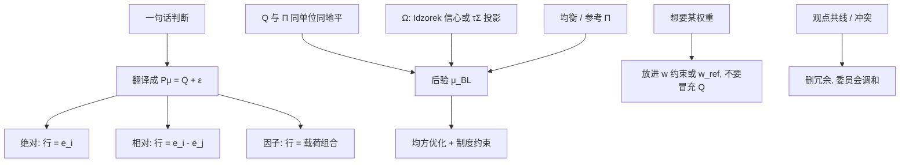

# Black-Litterman 观点

    
观点是对超额收益的线性观测，不是对权重的指令；把「我想超配」写成很小的 $\Omega$，只是让后验 $\mu$ 间接去挤权重，路径仍应走 $P\mu=Q+\varepsilon$。

    <footer>—— 据 Black and Litterman, 1992，以及 He and Litterman, 1999 对观点如何推动权重的说明</footer>

[上一课](/quant/industry-country-neutral)要求全球持仓同时约束行业与国家暴露；真的行业或国别观点应走 Black-Litterman 或显式倾斜，中性删的是未声明的粗暴露。缺口是观点这一侧：[Black-Litterman](/quant/black-litterman) 框架已有均衡 $\Pi$ 与贝叶斯合并，失败多半不是后验公式，是 $P,Q,\Omega$ 在说权重、双重计数、或用历史均值冒充 $Q$。本课钉观点工艺：绝对 / 相对 / 因子三类、信心校准、共线检查。不重讲双重中性的格子。后课风险预算再平衡默认观点表已经和 $w$ 盒分层。

## 问题

行业/国家中性删的是未声明暴露；声明了的判断要进 $P\mu=Q+\varepsilon$，不能再写进另一道盒约束冒充观点。投资者的语言是「日本股票相对美国会多赚 2%」「油价上涨利好能源」「这只股票目标价隐含 15% 上行」。BL 只接受对 $\mu$ 的线性观测 $P\mu=Q+\varepsilon$。三种语言要先翻译：相对收益观点变成 $P$ 的一行差向量；因子观点变成载荷组合；目标价要扣掉已经在 $\Pi$ 里的均衡超额，只把**增量**放进 $Q$，否则双重计入市场已有的风险溢价。翻译错了，后验均值在错误的方向上精确。

第二问题是稀疏与冲突。真正有信心的观点通常远少于 $N$。BL 的优点正是未提及的资产保持与市场一致的相对结构。若把量化信号对每一只股票都生成一条绝对观点，BL 退化成「带 $\tau\Sigma$ 先验的截面 $\mu$」，均衡锚变弱，接近普通贝叶斯收缩。若两条观点经济上互斥且 $\Omega$ 都很小，后验锁在中间，两边的人都认为模型没听话。观点表需要像因子暴露一样做共线性诊断，而不是越多越「信息充分」。

### 观点不是权重约束

「把能源提到 8%」是约束或再平衡指令，应放进优化器的 $w$ 盒，或把参考组合改成带战略超配的 $w_{\mathrm{ref}}$。硬把它写成 $Q$，再把 $\Omega$ 拧到机器精度去逼近 8%，在有换手、行业、杠杆约束时往往不可行，求解器在 $\mu$ 与约束之间撕裂。正确分层：战略权重进 $w_{\mathrm{eq}}/w_{\mathrm{ref}}$；对收益的判断进 $P,Q,\Omega$；制度进约束。三层分开，影子价格才可读。

$Q$ 的单位必须与 $\mu$ 一致：都是超额、同一货币、同一对冲定义、同一地平（月或年）。把「明年 2%」与日度 $\Sigma$ 混用，后验会被 $\tau\Sigma$ 的尺度搞乱。先把 $Q$ 与 $\Pi$ 写成同一年化超额，再决定 $\tau$。

## 方法

**绝对观点。** $P$ 的第 $k$ 行是 $e_i$（或一组资产的权重向量，如市值加权日本），$Q_k=q$。适用于「该资产（类）的超额是 $q$」。$q$ 应是相对无风险或相对你 $\Pi$ 所用的同一超额定义。

**相对观点。** $P$ 的一行是 $e_i-e_j$ 或两个组合的权重差，$Q_k=q$ 表示 $i$ 相对 $j$ 多赚 $q$。这是 BL 原文最干净的用法：不要求你能估绝对水平，只要求价差。$P$ 行应归一（权重和为零）以免尺度与绝对观点混用时数量级混乱。

**因子观点。** 若 $\mu$ 在资产空间，对因子 $k$ 的观点是 $P=b_k^\top$（或更一般 $P=v^\top B^\top$），$Q$ 为因子超额。等价于对因子组合发观点。量化系统常把截面信号收成少数因子 $Q$，而不是 $N$ 条个股绝对观点——稀疏性回到 BL 的设计意图。个股残差观点另用对角 $\Omega$ 的一小块，且信心应低于因子层。

$\Omega$：对角起步，$\Omega_{kk}=P_k(\tau\Sigma)P_k^\top/\eta_k$，$\eta_k$ 为信心倍数；或 Idzorek 法：指定信心百分比，在「无该条观点」与「该条 $\Omega\to 0$」的权重之间插值，反推 $\omega_k$。后者对投委会更友好，因为他们懂「六成把握」，不懂协方差。非对角 $\Omega$：同一宏观情景下的多条观点应相关，避免把一次石油冲击算成能源绝对、运输相对、通胀挂钩三次独立信息。

### 校准：看权重，不要看 $\mu$ 的似然

$\tau$ 与 $\Omega$ 没有高频 MLE。校准顺序：无观点时确认 $w$ 回到 $w_{\mathrm{eq}}$（无额外约束时）；插入一条相对观点，检查受影响资产的权重变化是否与信心直觉同阶（He–Litterman：沿 $\Sigma^{-1}P^\top$）；再插入第二条，检查交叉影响是否可解释。用后验 $\mu$ 去对历史均值做似然，是在用 BL 解决它故意不用历史均值的问题。约束很多时，无约束 BL 权重与可交易权重差距大，应用可交易 $w$ 的变化来校准，或先在无约束层校准再把约束当作实施，不要反复拧 $Q$ 去逼一个不可行的 8%。

量化 $Q$ 的来源：预测模型的输出要先做成与 $\Pi$ 同地平的超额，再决定是绝对还是相对（相对更稳）。把样本均值当 $Q$ 等于放弃均衡锚。信号的标准误可映射为 $\Omega$，但须防止 $N$ 条强相关信号产生虚假精度：应先把信号正交或收成因子观点。

## 机制

机制是精度矩阵相加。$P^\top\Omega^{-1}P$ 只在观点张成的子空间注入信息；正交补上 $\mu$ 仍由 $\Pi$ 决定。因此一条「A 相对 B」不会让 C 的 $\mu$ 无故跳开，C 只通过 $\Sigma$ 的相关被带动——带动是特征：与 A 高相关的资产会像被间接观点击中。若不想要这种连带，应对 $\Sigma$ 做更强的因子结构，或把观点写到因子层而不是个股层。

信心 $\Omega$ 小，后验协方差在该方向坍缩，优化器会用杠杆与对冲去「实现」观点，直到约束挡住。看起来像观点成功，其实是可行集在表达观点。$\Omega$ 过大，观点等于没说。Idzorek 百分比把这件事翻译成权重空间的凸组合，避免在协方差空间里拧一个没有直觉的 $\omega$。观点插入前后的主动风险（$w-w_{\mathrm{eq}}$ 的方差）是比 $Q$ 本身更好的监控：主动风险突然从 0 跳到 8%，通常是 $\Omega$ 过小或 $P$ 的尺度错了。

参考组合若已是 [ERC](/quant/erc) 或风险平价，反向优化的 $\Pi$ 不是 CAPM 超额，观点变成「相对风险平价的倾斜」。合法，但文档应改名，以免有人用市场有效去检验你的 $\Pi$。观点工艺不变：$P\mu=Q+\varepsilon$。

### 冲突、共线与空观点

两条相对观点若线性相关（A–B 与 B–C 与 A–C），第三行是冗余，小 $\Omega$ 会让 $\Omega^{-1}$ 爆炸。应删冗余或把三条收成两条并让 $\Omega$ 相关。方向冲突（A 跑赢 B 同时 B 跑赢 A）时，后验折中；若来自两个分析师，应在观点委员会层先调和，不要让矩阵当和事佬还声称两人都被纳入。完全没有观点时不要生成假 $P$（例如用微小噪声），直接跳过更新。量化系统每天全市场扫描产生的「观点」应先做阈值：只有 $|q|$ 超过均衡不确定性一定倍数才进 $P$，否则 BL 每日换手来自信号噪声，需要再叠 [换手惩罚](/quant/turnover-penalty)。

## 边界与工程取舍

不要用 BL 观点去实现不可交易的权重目标。不要在 $\Sigma$ 未收缩时对个股发强绝对观点：$\Pi$ 本身已经在噪声特征方向上荒谬，观点只是再推一把。不要把 CVaR 或回撤目标的「观点」塞进 $\Pi=\delta\Sigma w$ 这套均方反向优化。个股多空上 $w_{\mathrm{eq}}\approx 0$，均衡锚弱，观点主导——应降低 $\tau$ 叙事，把它当成带先验的主动模型，并收紧 $\Omega$ 的下限以免单只股票锁死后验。

多币种：$P$ 必须在与 $\Sigma$ 相同的超额定义上（对冲或未对冲）。对冲后的「日本股票」观点不含日元，未对冲 $\Sigma$ 却含货币，后验会把外汇当成实现股票观点的通道。分类变更、停牌名单变更会使 $P$ 的资产映射错位，观点应绑定证券标识与日期，而不是绑定下标 $i$。约束下校准必须看可交易权重；只看无约束 BL 解会系统性过估观点的实现度。

原文的观点是全球资产类上的少数宏观判断。把同一套修辞用到 3000 只股票的每日信号，技术上能跑，设计意图已经换了。此时更应比较：BL 相对「直接把信号当 $\mu$ 再收缩」是否还值得那一次反向优化。

## 小结

- BL 观点是 $P\mu=Q+\varepsilon$：绝对、相对、因子三类；权重目标不是观点，应进约束或参考组合。
- $Q$ 与 $\Pi$ 必须同一超额定义与地平；相对观点通常比绝对更稳，量化信号宜收成少数因子 $Q$。
- $\Omega$ 用 Idzorek 信心或 $P(\tau\Sigma)P^\top$ 的倍数；校准看插入前后的权重与主动风险，不看对历史均值的似然。
- 共线与冲突要在进矩阵之前处理；全市场每日弱信号会把 BL 变成吵的截面 $\mu$。
- 个股多空上均衡锚弱，约束下观点不能完全实现，须用可交易 $w$ 校准。
- 出处：Black & Litterman, *FAJ*, 1992；He & Litterman, Goldman Sachs, 1999；Idzorek, 2005；实现讨论见 Satchell & Scowcroft 以及 Meucci 对 BL 的综述。
