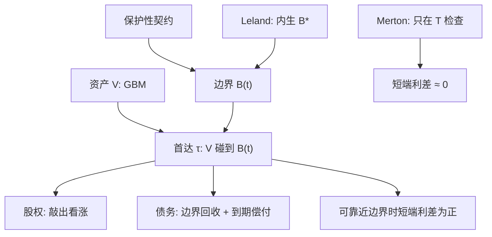

# Black-Cox 首达

    
保护性契约把违约从「只在到期看一眼」改成「资产碰到边界即移交」；公司债的定价变成带障碍的或有要求权。

    <footer>—— Black & Cox, Valuing Corporate Securities: Some Effects of Bond Indenture Provisions, Journal of Finance, 1976</footer>

Merton（1974）只在债务到期日检查偿付。Black 与 Cox（1976）引入保护性契约：当企业资产 $V$ 首次触及一条时间依赖的边界 $B(t)$，债权人接管，股权清零。违约时间是首达时 $\tau=\inf\{t:V_t\le B(t)\}$，债务在到期前就可以违约。这把公司债变成障碍期权：股权是敲出看涨，债权人获得边界上的回收加上未敲出时的到期偿付。本篇写首达公式从哪来、指数边界为何可解、以及 Leland（1994）如何把边界改成股权最优的内生选择。它补上 [Merton 结构模型](/quant/merton-structural) 的短端缺陷，并与 [简化形式强度](/quant/reduced-form-intensity) 对照：首达违约对看着 $V$ 的人是可料的，强度违约可以不可料。随机利率的首达见 Longstaff 与 Schwartz（1995）。

## 问题

契约存在是因为股东会在 Merton 世界里转移资产、增加波动、推迟到到期才让债权人发现资不抵债。安全条款、净财富约束、抵押触发，近似为「$V$ 低于某条线即加速到期」。定价问题变成：在 GBM 资产上，带一条吸收边界，求股权与各优先级债务的价值。若边界是常数或指数，首达密度有封闭形式（反射原理、逆高斯），可写出债券价格。若边界由股权最大化内生决定，还要加平滑粘贴，这是 Leland 的工作。

问题是可观测性与短端。首达模型能产生正的短端利差，只要当前 $V$ 靠近边界——明天就可能碰到。但若 $V$ 远高于边界，连续路径下极短期限的违约概率仍然很小，短端 CDS 的「跳到违约」成分要靠边界贴得很近，或靠 Zhou 一类的资产跳跃。结构首达解释契约，不一定拟合 CDS 曲面。

### 可料违约与强度的信息差别

若市场连续观察 $V$，当 $V$ 从上方走向 $B$，违约被预见，$\tau$ 是可料停时，强度在到达前可以是零、在到达时爆炸。CDS 的短端若显示突然违约的价格，市场信息比连续 $V$ 更少，或 $V$ 有跳。Duffie–Lando（2001）指出会计噪声会使结构违约在投资者的过滤下变成带强度的过程。Black–Cox 原文是完全信息首达，不是带噪声的强度。写「Black–Cox 等于强度模型」是错的。

边界 $B(t)$ 不是 CDS 回收率。首达时债权人得到 $B(\tau)$ 的某个函数（或 $V$ 本身），再按绝对优先在债券间分配。回收率 $R$ 是简化形式的参数；这里回收由资本结构和边界水平内生出来。

## 方法

资产仍是 GBM。Black–Cox 取指数边界 $B(t)=C e^{-\gamma(T-t)}$（或等价参数化），使 $V_t/B(t)$ 仍有可处理的漂移。未违约时股权满足带障碍的 PDE，在 $V=B(t)$ 处 $E=0$，在 $T$ 且 $V\gt D$ 时 $E=V-D$。债务 $B_{\mathrm{debt}}=V-E$。首达密度对 GBM 对数是已知的，生存概率

$$
\mathbb{Q}(\tau\gt t)=\mathbb{Q}\big(\inf_{s\le t} V_s \gt  B(s)\big)
$$

可用 $N(\cdot)$ 的组合写出。于是零息公司债的风险中性期望可拆成：在 $\tau\gt T$ 时得到约定本金，在 $\tau\le T$ 时得到边界回收的折现。这比 Merton 多出一截「提前接管」的现金流。

Leland（1994）把债务写成永续票息，破产成本与税盾进入企业总价值，股权选择使价值最大化的边界 $B^*$，条件是平滑粘贴。Leland–Toft（1996）再引入有限期限债务滚动，得到利差期限结构随杠杆和到期的比较静态。Longstaff–Schwartz（1995）让利率随机（Vasicek 型）并保留常数边界，数值解首达，信用与利率相关进入利差。这些是 Black–Cox 的直接后裔：违约仍是资产碰到某条线。

### 数值：首达比欧式更脆

离散时间监控会漏掉两次观察之间的穿障，障碍期权那一套连续监控修正（Broadie–Glasserman–Kou 一类）在这里同样适用。Monte Carlo 对首达要细时间步或用布朗桥，否则低估违约、高估股权。树必须把边界放在节点上或用插值，见障碍产品的监控问题。校准 $\sigma_V$ 与 $B$ 时，二者对短端利差高度共线：既可以把边界抬高，也可以把波动加大。应用股权市值钉住 $V$，用契约条款或历史触发钉住 $B$ 的量级，剩下给 $\sigma_V$，而不是把 $B$ 当自由参数去拟合整条 CDS。

## 机制

契约把「看跌只在 $T$ 行权」改成「障碍一碰就行权」。债权人提前接管，避免 $V$ 在到期前被掏空到远低于 $D$。对债权人，这通常提高债务价值、降低利差中源于资产替代的那一块；对股东，障碍敲出了看涨的下侧路径，股权更像敲出期权。比较静态：边界越高（契约越严），股权越便宜、债务越安全，直到过度严厉摧毁税盾或投资（Leland 权衡）。Merton 是边界放到 0 或只在 $T$ 检查 $D$ 的极限。

短端利差来自当前距离边界的尺度 $x=\ln(V/B)$。$x$ 小，首达很快，短端利差高； $x$ 大，短端仍低，中段由 $\sigma_V$ 决定。市场若给远离困境的发行人仍然定价出 50bp 的 6M CDS，纯扩散首达解释不了，需要跳或信息不完全。这是结构模型在投资级短端的系统偏差，不是某一个发行人的特例。

「安全条款提高债务价值」在 Black–Cox 里是定价结果，前提是边界触发真的移交控制权。执行中的谈判、自动冻结和 DIP 融资会把边界变成软的，模型利差会偏安全。法律实现是模型风险。

### 与可转债、对手方

可转债的转股是另一条自由边界，赎回是发行人的边界，违约可以是 Black–Cox 式的资产边界或强度跳。完全结构处理维度高，实务用股价加强度。对手方若用结构相关：两个企业的 $V_1,V_2$ 相关，联合首达给出违约相关，比高斯 Copula 更有微观，校准同样缺违约样本。CVA 引擎很少真的跑双公司首达，多用强度相关；结构图景用来设计压力，而不是逐日标记。

## 边界与工程取舍

不要用 Black–Cox 封闭公式给复杂契约（多次触发、流动性契约、维持担保比例）标价而不改边界定义。不要把 Leland 的永续债公式用到两年到期的高收益债上。不要忽略破产成本：首达时 $V$ 不等于债权人所得，打一个 $\alpha$ 的损失会同时改变边界激励（若内生）和外生边界下的回收。利率不是常数时，确定 $r$ 的公式会把国债久期误当成信用。

与强度模型的工程选择：有可交易 CDS 且需要拟合短端，用强度；要解释契约变更、资本结构操作、或从股权反推相对信用，用首达或 Merton。二者可以混合：用结构生成 $\lambda_t=\lambda(V_t)$，再在强度公式里定价，相关内生，CDS 仍可调水平。

Black & Cox, *Journal of Finance*, 1976 的标题强调 indenture provisions，不是「第一个障碍期权论文」的泛称。引用时应落到契约如何改变或有要求权，而不是只写首达密度。

## 小结

- Black–Cox（1976）把违约写成资产对契约边界的首达，公司债成为障碍或有要求权。
- 指数边界下生存概率与债券价格可解析；短端利差在靠近边界时为正，修复了 Merton 只在到期违约的缺陷。
- 完全信息下违约可料，与强度模型的不可料跳不同；会计噪声（Duffie–Lando）是二者的桥。
- Leland（1994）、Leland–Toft（1996）内生边界；Longstaff–Schwartz（1995）加随机利率。
- 拟合投资级短端 CDS 仍常需跳跃或强度；首达的本职是契约与资本结构。
- 出处：Black & Cox, *Journal of Finance*, 1976；Merton, *Journal of Finance*, 1974；Leland, *Journal of Finance*, 1994；Leland & Toft, *Journal of Finance*, 1996；Longstaff & Schwartz, *Journal of Finance*, 1995。
