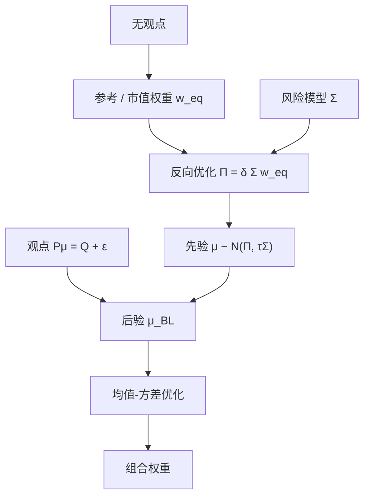

# Black-Litterman

先让市场组合在均衡里成为最优，得到隐含超额收益；再把投资者的观点当成带噪声的线性观测，贝叶斯更新后才送进均值–方差。

<footer>—— Black & Litterman, Global Portfolio Optimization, Financial Analysts Journal, 1992</footer>

直接把历史均值塞进 [Markowitz](/quant/markowitz) 会得到不可用的权重。[估计误差与收缩](/quant/cov-shrinkage) 修 $\Sigma$，对 $\mu$ 往往仍无办法。Black 与 Litterman（1991, 1992）把 $\mu$ 的先验放到均衡上：若大家用同一 $\Sigma$ 做均方，市值权重 $w_{\mathrm{eq}}$ 反推出隐含超额 $\Pi=\delta\Sigma w_{\mathrm{eq}}$。投资者若对某些资产或价差有观点，写成 $P\mu=Q+\varepsilon$，与先验合并得到后验均值，再优化。本篇写反向优化、观点矩阵、$\tau$ 与 $\Omega$ 的角色，以及它为什么是 CAPM 式均衡在组合构建里的工程化，而不是又一个因子模型。

## 问题

截面上历史均值噪声极大，但市值权重每天可观测、且已经是真实资金加总后的持仓。若承认市场是（近似）均方最优，则 $\mu$ 不能远离让 $w_{\mathrm{eq}}$ 最优的那个向量。这给出先验中心 $\Pi$，而不是「每个资产历史均值相等」。投资者仍然可以不同意市场：认为 A 相对 B 会多赚 2%，或某个行业有绝对超额。问题是如何把这些稀疏、异质的观点，以与观点信心成比例的方式嵌进 $\Pi$，并且在没有观点的资产上保持与市场一致的相对权重，而不是把未提及的资产权重大幅甩开。

普通贝叶斯「$\mu\sim\mathcal{N}(\hat\mu,\cdot)$」若 $\hat\mu$ 仍是历史均值，只是把崩溃变得平滑一点。Black–Litterman 的识别来自均衡，不来自时间序列。它需要一个风险模型 $\Sigma$ 和一个风险厌恶 $\delta$（或市场夏普），还需要 [CAPM](/quant/capm) 式的叙事：市值组合是有效的。Roll 批判对这里同样适用：你用的 $w_{\mathrm{eq}}$ 只是可交易市场的一个代理。

### 观点必须写成对 $\mu$ 的线性观测

一条观点是「资产 $i$ 的超额是 $q$」或「$i$ 相对 $j$ 是 $q$」，即 $P$ 的一行是单位向量或 $(1,-1,0,\ldots)$。观点不是「把权重提高到 5%」——那是约束，应放进优化器，不要伪装成 $Q$。信心不是对权重的信心，是对超额收益预测误差的方差 $\Omega_{ii}$。把「很确信要超配」写成很小的 $\Omega$，会通过后验 $\mu$ 间接改变权重，但路径是收益，不是直接钉权重。混用两种语言是实现里最常见的错误。

$\Pi=\delta\Sigma w_{\mathrm{eq}}$ 里的 $\delta$ 是平均风险厌恶，常用市场超额除以市场方差来校准。改 $\delta$ 会等比例缩放所有隐含超额，切点的构成不变、杠杆变。对相对权重，观点比 $\delta$ 更重要。

## 方法

均衡先验：$\mu\sim\mathcal{N}(\Pi,\tau\Sigma)$，$\tau$ 小表示对均衡较有信心（先验协方差是 $\Sigma$ 的一个比例，不是又估一套）。观点：$P\mu=Q+\varepsilon$，$\varepsilon\sim\mathcal{N}(0,\Omega)$，$P$ 为 $k\times N$，$k$ 通常远小于 $N$。后验均值（Theil–Goldberger 混合估计）为

$$
\mu_{\mathrm{BL}}=\big((\tau\Sigma)^{-1}+P^\top\Omega^{-1}P\big)^{-1}\big((\tau\Sigma)^{-1}\Pi+P^\top\Omega^{-1}Q\big).
$$

后验协方差可相应写出，再送入均方优化；也可只替换均值、协方差仍用 $\Sigma$。若无观点，$P$ 空，$\mu_{\mathrm{BL}}=\Pi$，最优权重回到 $w_{\mathrm{eq}}$（在无额外约束时）。这是方法的锚：沉默则持有市场。

$\Omega$ 的常用启发式：与观点方差成比例，$\Omega=\mathrm{diag}(P(\tau\Sigma)P^\top)$ 或其倍数，即观点的不确定与先验在该方向上的不确定同阶。Idzorek 把「信心百分比」翻译成 $\Omega$ 的缩放。He 与 Litterman（1999）强调直觉：观点把权重从市场沿 $\Sigma^{-1}P^\top$ 的方向推开，推开的量随信心增加。实现时应对 $P$ 的行做尺度检查（绝对观点与相对观点不要数量级混乱），并在优化里保留制度约束。

### 反向优化与参考组合

$w_{\mathrm{eq}}$ 不必是全球市值。可以是基准指数、战略配置、或风险平价持仓——任何你愿意在无观点时持有的参考组合。这时 $\Pi=\delta\Sigma w_{\mathrm{ref}}$ 不再是 CAPM 均衡，而是「让该参考组合均方最优的伪超额」。叙事要从均衡改成基准跟踪：Black–Litterman 变成一种把观点翻译成相对基准的超额的装置。这合法，但应在文档里改名，以免有人用 CAPM 检验来评价你的 $\Pi$。

## 机制

机制是贝叶斯精度矩阵相加。先验精度 $(\tau\Sigma)^{-1}$ 把质量放在均衡方向；观点精度 $P^\top\Omega^{-1}P$ 只在 $P$ 的行空间里注入信息。正交于观点的方向，$\mu$ 仍由 $\Pi$ 决定，因此未提及的资产不会因为一次相对观点而全面重排——它们只通过 $\Sigma$ 的相关被间接带动，这正是人们想要的「观点稀疏、持仓仍分散」。若把历史 $\mu$ 当先验中心，稀疏观点做不到这一点，因为先验本身已经到处是噪声。

与收缩的关系：BL 收缩的是**超额收益向量**，向 $\Pi$ 拉；Ledoit–Wolf 收缩的是**协方差矩阵**，向 $F$ 拉。两者正交，通常应该同时做：$\Sigma$ 用风险模型或收缩估计，再进入 $\Pi=\delta\Sigma w_{\mathrm{eq}}$。若 $\Sigma$ 病态，$\Pi$ 也病态，隐含超额会在噪声特征方向上出现荒谬的大小。先修 $\Sigma$，再反向优化。

$\tau$ 没有「正确」的高频估计。它控制先验相对观点的权重。经验上 $\tau$ 取 $0.01$–$0.05$ 量级是常见起点，应用观点插入前后的权重变化来校准，而不是用 $\mu$ 的样本方差去「估」$\tau$ 再宣称客观。

### 观点冲突与 $\Omega$ 非对角

两条观点可以在经济上冲突（同时要 A 跑赢 B 与 B 跑赢 A）。$\Omega$ 若对角，后验会在精度之间折中，可能得到两边都不满意的 $Q$。若知道观点来自同一宏观情景，应让 $\Omega$ 在对应行相关，避免双重计数。更常见的失误是对同一资产既给绝对观点又给相对观点且 $\Omega$ 很小，后验被锁死、优化器只在其余资产上扭曲。观点表需要像因子暴露一样做共线性检查。

## 边界与工程取舍

Black–Litterman 不产生 alpha：观点 $Q$ 从哪来，模型不负责。它只防止「有观点的地方极端、无观点的地方也极端」。不要在 $\Sigma$ 里用样本协方差还不收缩。不要把 $\Omega$ 设成机器精度来「强制实现观点」——那会让后验协方差在该方向上坍缩，杠杆与约束冲突时出现数值爆炸。不要用 BL 处理非均方目标（回撤、CVaR）还期望同一套 $\Pi$ 公式成立；那些目标的反向优化不是 $\delta\Sigma w$。

参考组合若含不可交易资产或大量现金，反推出的 $\Pi$ 难以解释。多资产、多币种时，$\Sigma$ 必须在同一超额收益定义下（对冲或未对冲），否则 $\Pi$ 的货币溢价会与观点打架。约束很多时，无约束 BL 权重与最终可交易权重差距大，应把约束放进优化，而不是反复拧 $Q$ 去逼近已经不可能的无约束解。

原文针对全球债券与股票的战略配置，因子是资产类，不是 3000 只个股。把 BL 用到个股多空时，$w_{\mathrm{eq}}$ 接近零的股票隐含超额也接近零，观点会主导——这可以，但均衡锚变弱，更接近「带先验的主动组合」，应降低对 $\tau\Sigma$ 的修辞依赖。

## 小结

- Black–Litterman（1991/1992）用均衡（或参考组合）反推隐含超额 $\Pi$，再与线性观点贝叶斯合并，解决历史 $\mu$ 不可用的问题。
- 无观点时回到参考权重；观点只在 $P$ 的方向上拉动，其余资产经 $\Sigma$ 间接调整。
- $\tau$ 与 $\Omega$ 控制先验相对观点的精度，应用权重变化来校准，而不是假装有唯一MLE。
- 必须先有良好的 $\Sigma$；BL 收缩均值，不替代协方差收缩或因子风险模型。
- 观点是对超额收益的陈述，不是对权重的约束；两者应分开放。
- 出处：Black & Litterman, *Journal of Fixed Income*, 1991；*Financial Analysts Journal*, 1992；直觉见 He & Litterman, Goldman Sachs, 1999。
