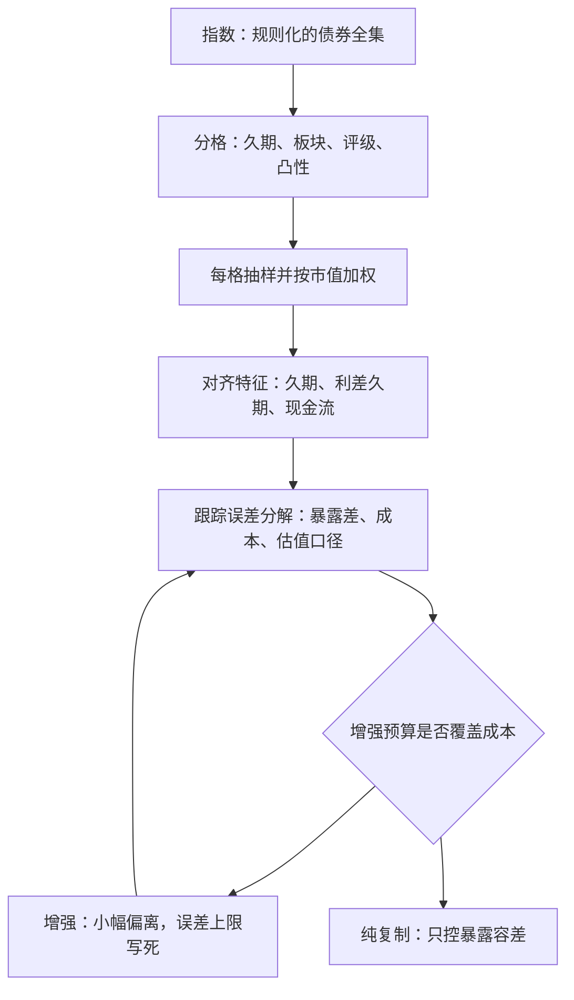

# 债券指数化

股票指数买一篮子就有了，债券指数只能近似：几千只场外券、多数日子不成交，复制注定是特征复制而非持仓复制。

<footer>—— 据 Fabozzi, Bond Markets, Analysis and Strategies 指数化章节整理</footer>

[上一课](/quant/bm2-ldi)把基准从市场指数换成负债函数；本课回到市场基准，但保留同一事实——基准是给定的，复制是受约束的。债券指数化要回答的问题因此不是「买什么」，而是：当逐券复制不可能时，跟踪误差应该落在哪个维度上，又该为消除它付多少成本。

## 问题

完全复制在债券市场是纸面方案：指数成员以万计，许多券最小面额大、无成交、做市商不报价；指数按月调仓，到期与降级的剔除券要在窗口期内接回。更要命的是计量层：场外成交稀薄，指数里相当一部分「价格」是估值商标记，实测跟踪误差里混着口径而非全是损失。于是目标改写为：在成本预算内，让组合与指数的**风险特征**重合——久期、利差久期、现金流分布、板块与评级权重——把逐券的差异留给抽样。这与 [跟踪误差的口径问题](/quant/benchmark-tracking-error) 一脉相承：先说清误差怎么量，再谈怎么压。

## 方法

主流做法是分层抽样（单元法）：按久期桶、板块、评级、凸性把指数切成格子，每格内按市值加权选券，使组合的加权平均久期、利差久期与现金流分布对齐指数。格子是暴露的预算表——每个因子给一个容差带，越界即调仓。更进一步是用因子模型做跟踪误差最小化：给定协方差，在流动性约束下解出持仓子集。增强型指数化允许小幅偏离（久期 $\pm$ 一格、利差倾斜），用超额收益覆盖成本，但增强预算要写死：年化跟踪误差上限写进授权文件，否则「增强」会漂移成主动管理——漂了多远，可用 [active-share 一类的集中度口径](/quant/active-share) 事后审计。

## 机制

跟踪误差的构成决定了钱花在哪。抽样缺口是因子暴露之差，来自格子容量与选券质量；交易与持有成本来自调仓窗口的买卖价差，在剔除券的回补上最贵——这与 [债券成交与 TRACE 的流动性账](/quant/bond-liquidity-trace) 直接相关：非活跃券的成本主要由价差而非佣金构成。第三块是「假误差」：估值时滞让指数收益滞后于可执行价格，实测误差因此被低估，经济上的误差比报表上大。还有一个结构性事实：债券指数按债务余额加权，等于按谁的债多谁权重大——最大发行人内生地主导指数，这是债券指数与股票指数在治理上的分岔，也解释了为什么单元法必须单设发行人集中度的格子。

按 TRACE 的成交记录，任意一个交易日里有相当比例的公司债没有任何成交；指数当日的报价多来自估值商标记。跟踪误差里因此有一部分是口径，不是损失——引用误差数字要先问计价来源。

## 边界

单元法控制的是格子层面的暴露，格子内部的分散与个券风险不被控制；优化器给出的「最优子集」对协方差输入敏感，样本期一换权重就跳。指数化本身不免疫曲线风险——它就是要按指数的口径承担曲线风险，对冲基准之外的偏离属于增强，不属复制。调仓日效应（剔除券被全市场同时卖出）不是抽样能消除的，只能提前用流动性与成本模型定价。最后，指数成员规则（到期剔除、降级剔除）是指数的一部分：不读规则手册的复制者，会在每次调仓窗口意外地接住最贵的一棒。

## 小结

- 债券指数化的形态是特征复制：对齐久期、利差久期、现金流与板块权重，而非逐券持仓。
- 跟踪误差三块：暴露差、交易成本、估值口径，预算应花在前两块并审计第三块。
- 增强型指数化要有写死的误差上限，否则漂移成主动。
- 市值加权等于债务余额加权，最大发行人内生主导指数，集中度须单独设格。
- 出处：据 Fabozzi 指数化章节整理；误差口径与流动性背景见本站跟踪误差与 TRACE 相关课。
