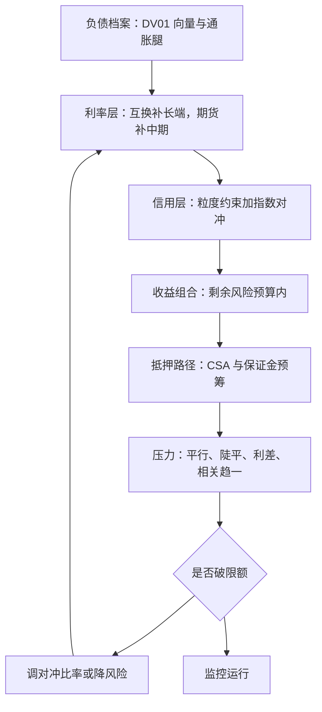
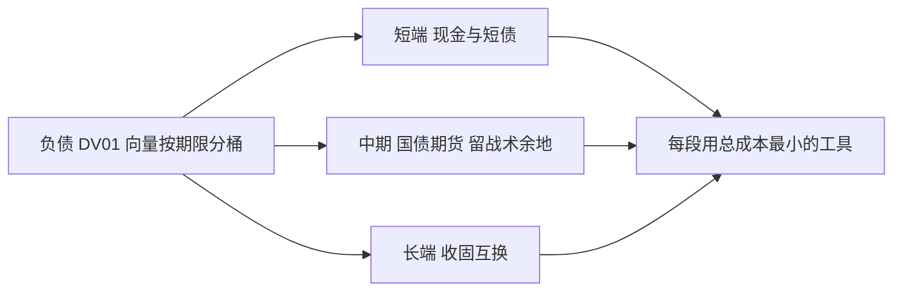

# 债券组合案例

案例不新增工具，只考验次序：先负债，再利率层，后信用层，最后把抵押与条款放进压力里——顺序错了，每个工具单独都对，合起来是错的。

<footer>—— 据 Fabozzi, Bond Markets, Analysis and Strategies 组合管理章节的流程整理</footer>

[上一课](/quant/bm2-credit-diversification)把信用层的目标写成损失分布，本课程的工具至此齐备：免疫的匹配循环、LDI 的切分、指数化的特征复制、期货与互换的分工。本课把它们按正确顺序装进一台组合——一个养老金的资产负债案例，从负债档案走到压力报告。数字为教学口径，方案结构为正题。

## 问题

一台养老金：负债现值 100，加权久期 12，支付谱跨 3 到 30 年，一半支付挂通胀；资金比率 100%；治理要求一年内资金比率下行不超过 5 个百分点，回报目标由收益组合承担。要做的决策有四个：负债匹配用什么工具组合、对冲比率定多少、收益组合多大、压力怎么定。缺口的陷阱在次序：先想收益再想对冲的组合，会在利差走阔的那个月同时吃利率与信用两刀；先定风险单位的组合，每一刀都有对应的账本。

术语翻译：资金比率 100% 就是「用来还债的资产现值」恰好等于「要还的负债现值」——比率掉到 95%，意味着同样一笔债，资产只够还九成五。治理要求「一年内下行不超过 5 个百分点」，就是给这个比率画一条不得跌破的警戒线。

## 方法

第一步，负债档案：按 [关键期限 DV01](/quant/key-tenor-dv01) 分桶，3 到 30 年各桶的 DV01 向量是全部后续决策的风险单位；通胀腿单列，名义工具对它失明。第二步，利率层：长端（20 年以上）用 [收固互换](/quant/bm2-swaps-in-portfolio) 覆盖，中期用 [国债期货](/quant/bm2-treasury-futures) 覆盖并保留战术调整的余地，短端留现金与短债；对冲比率按预算定在八成——以负债久期 12 计，每 100 个基点平行的负债一阶变动约 12%，八成对冲后残余约 2.4%，这个数写进限额。第三步，信用层：收益组合内的信用敞口按 [分散的算术](/quant/bm2-credit-diversification) 构造，系统层用指数对冲掉一部分利差贝塔。第四步，抵押路径：互换 CSA 与期货保证金的极端需求预筹现金，触发线写进治理文件（[LDI 一课](/quant/bm2-ldi) 的判据）。第五步，[压力测试](/quant/pf-stress-testing)：平行 ±200 个基点、陡化与平坦化、利差 +150 个基点、相关趋一，各场景同时触发追保。

术语翻译：DV01 就是「利率动一个基点（0.01%），组合价值变多少」。负债久期 12 意味着利率平行上 100 个基点，负债现值约变动 12%；八成对冲后剩下 2.4%——这就是写进限额的那个残余数字的来历。

## 机制

次序为什么这样排：负债定义风险单位，一切敏感度换算成对负债的口径，这是 LDI 立下的判据；利率层先于信用层，因为 [因子分解](/quant/curve-pca) 的证据显示水平因子承载了国债收益的大部分方差，主战场在曲线；信用层的规模由损失分布的尾部预算决定，不由期望收益决定——期望收益在 EL 里与相关无关，风险全在 UL；工具按总成本比较：期货便宜但带 CTD 刻度漂移，互换灵活但带抵押条款，现券最贵但兑现凸性与 carry——每一段负债用总成本最小的工具去匹配。抵押路径是约束不是事后：2022 年的教训是它在传导链的最上游。

直觉类比：「相关趋一」的压力场景像全城同时断电——平时债券与股票、信用与利率互为对冲，靠的是它们不同时出问题；危机里所有资产一起跳水，分散的算术失灵。压力报告必须单列这个场景，就是给「对冲同时失效」留一次演习。

本案例的数字都对得上：负债 DV01 每 100 个基点约 12，对冲八成剩 2.4，利差 +150 个基点与相关趋一的场景把信用层尾部压到限额边缘——压力报告的价值不在某个数字，而在每个数字都有一条写明的条款与之对应。

## 边界

案例的数字是教学口径：真实负债的现金流与通胀挂钩比例要按精算档案重算，监管折现率与经济口径的差会让同一台组合有两张损益表。案例没写的事也不少：跨币种负债的汇率腿、通胀工具的细节、证券化产品的负凸性，各是独立课题；收益组合的 alpha 来源全部外生假定，本课程不负责证明它存在。最要紧的边界是：这是一台「不输在结构上」的组合，不是一台「一定赢」的组合——结构保证的是坏情形有条款、有账本、有触发线，收益仍来自市场给的那些风险溢价。

## 小结

- 次序即方法：负债档案、利率层、信用层、抵押路径、压力报告，不可交换。
- 风险单位是关键期限 DV01 向量，对冲比率按预算定并写成限额。
- 工具按总成本比较分配到各期限段：期货、互换、现券各管一段。
- 抵押与追保路径预筹并设触发线，压力场景必须包含相关趋一。
- 出处：据 Fabozzi 组合管理章节的流程整理；各工具机制见本课程相应各课，压力判据见压力测试相关课。
