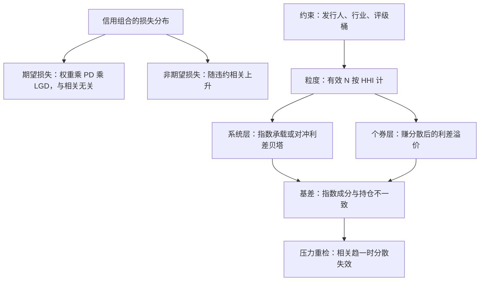

# 信用组合的分散

信用收益的上界是利差，下界是违约。这种不对称使分散从品味变成算术：个券的跳跃必须摊薄，利差的贝塔则要明码持有。

<footer>—— 据 Gupton, Finger and Bhatia, CreditMetrics 技术文档（1997）与 Fabozzi 相关章节整理</footer>

[上一课](/quant/bm2-swaps-in-portfolio)解决了利率层的工具问题：久期可以在现券、期货与互换之间按成本调配。信用层的问题性质不同——它的坏消息是跳跃的，利差以基点计收，违约以面值计亏。本课写信用组合的分散：不是为了平均收益，而是把左尾摊薄到预算之内，并把摊不薄的那部分明码标价。

## 问题

信用组合的收益结构天生不对称：持有一只券最好的情形是收到全部利差与本金，最坏的情形是损失大半个面值。所以单券的违约风险——个券跳跃——无法靠定价补偿，只能靠分散摊薄；而全市场利差走动的系统性部分摊不薄，任何组合都满仓持有它。这就是信用分散的核心结构：可分散的用权重管理，不可分散的用对冲与预算管理。缺口在于「分散」常被当成名字数量：持仓 100 个发行人就自称分散，但相关性、行业重叠与权重倾斜可以让有效分散只剩一半——分散需要一个可度量的定义，而不是一张持仓清单的直觉。

## 方法

度量先行。集中度用有效 $N$：按权重算赫芬达尔指数，$N_{\text{eff}} = 1/\text{HHI}$，这是组合粒度的单一读数。约束分层：发行人上限、行业上限、评级桶与久期桶各给带宽，落在 [指数化一课](/quant/bm2-bond-indexing) 同样的格子里，只是格子内换成损失分布的语言。期望损失 $EL = \sum_i w_i \cdot PD_i \cdot LGD_i$ 与相关无关，分散不改变它；非期望损失——损失分布的标准差与尾部——随违约相关上升，这才是分散真正要压的对象。据此分层配置：系统性利差贝塔用 CDS 指数承载或对冲（[CDS 指数与基差](/quant/rc-cds-index-basis) 的口径），个券层只留有定价优势的名字赚分散后的溢价。压力必须含相关趋一的场景，因为那是分散失效的定义时刻。

## 机制

分散的算术在哪里生效：若违约相互独立，损失分布的标准差随名字数按开方收缩，几十个名字就能把个券跳跃压成背景噪音；一旦相关上升，收缩因子失效——危机时违约相关趋于 1，可分散部分向不可分散部分坍缩。CreditMetrics 一族的模型把这个结构写成迁移矩阵加相关结构：组合的尾部由「共同因子打头、个券兑现殿后」的路径生成，所以尾部的边际贡献集中于高相关块，权重小不等于贡献小。这与 [2020 年案例](/quant/rc-case-map) 的判据同源：相关是压力里的状态变量，不是样本内的常数。机制的另一半是代价：粒度要花钱，冷门券的价差与搜索成本随分散度上升——[债券流动性账](/quant/bond-liquidity-trace) 里那本账单在信用层最厚。

前十发行人占 40% 权重、其余 90 个平分 60% 的组合：HHI 约 0.020，有效 N 约 50——名义上 100 个发行人，有效分散只有一半。名字数量从不等于粒度。

## 边界

上限约束不等于尾部约束：行业上限各自合规，行业间相关上升时组合照样失守，压力场景必须跨行业设相关。指数对冲只对成分精确，持仓与成分的差是基差，压利差时基差往往先动（见信用与指数基差课）。违约相关本身难以估计，股权代理与利差代理给出的是区间不是点——模型输出的尾部数字要带区间报。评级是滞后指标，迁移风险先于违约出现，只盯违约率的组合会错过一半的坏消息。最后，LGD 有自己的分布与周期，回收率在系统性压力下系统性走低，分散的算术里它是另一个被低估的输入。

## 小结

- 信用分散的分工：可分散的个券跳跃用权重摊薄，系统性利差贝塔用指数承载或对冲。
- 度量先行：有效 N 按 HHI 计，期望损失与相关无关，非期望损失才是分散的对象。
- 相关是状态变量：压力下趋于 1，分散的收益恰在最需要时消失。
- 粒度有价：冷门券的价差与搜索成本随分散度上升，预算要写在方案里。
- 出处：据 Gupton, Finger and Bhatia, CreditMetrics（1997）与 Fabozzi 相关章节整理；相关与基差的判据见本站信用组合与 CDS 指数相关课。
