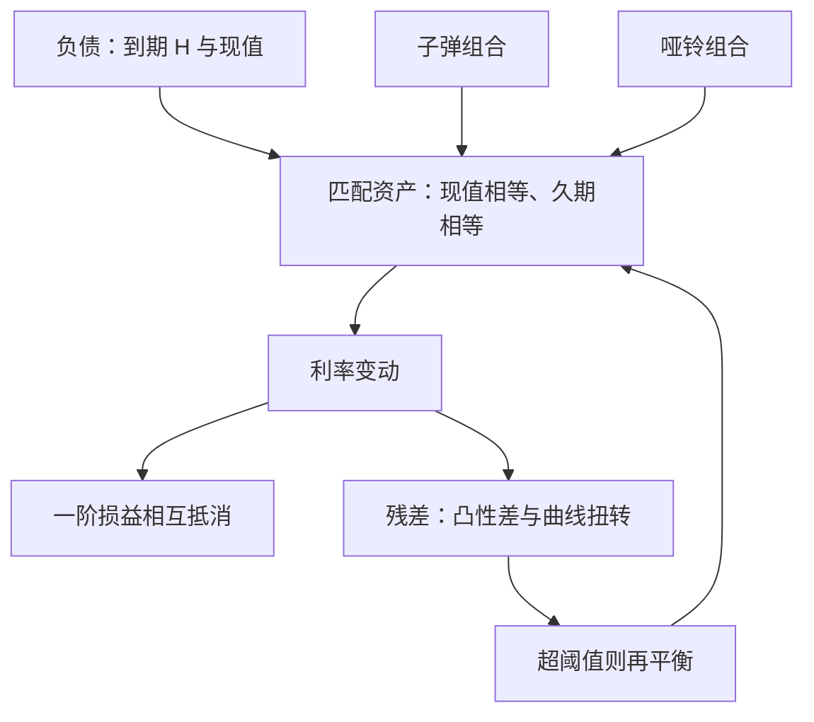

# 久期免疫

免疫不是消灭利率风险，而是让资产与负债在第一次导数上互相抵消——剩下的二阶项与曲线形状，才是组合管理真正要谈判的东西。

<footer>—— 据 Redington, Review of the Principles of Life-Office Valuations, Journal of the Institute of Actuaries, 1952 整理</footer>

[上一课](/quant/qo-map)把利率与信用两条线收进三个案例，判据落在资金链与条款上；2022 年 gilt 螺旋那一案，主角正是没管好负债匹配的债券组合。本课程转向持有方视角，重讲「拿着一张负债表怎么管债券」：先写最干净的版本——久期免疫，再谈 LDI、指数化与期货互换，最后收在信用与案例。本课要回答：一笔确定日期的负债，如何选资产让组合在一阶上不感知利率。后课默认已经读完本课。

## 问题

[久期与凸性](/quant/duration-convexity)把久期定义为价格对收益率的敏感度，那是测量；本课把久期当工具用。缺口在这里：一家机构三年后要付一笔定额负债，今天把钱放进国债，收益率一变，资产现值与负债现值同时动、幅度却不同——负债端由[自助曲线](/quant/curve-bootstrap)折现，资产端由自己的到期结构决定，缺口恰好落在一阶导数上。「买一只到期日相同的债券」看似解决，可市场未必有那个到期、流动性未必接得住，于是问题变成：用可得的券拼出与负债同现值、同久期的组合，并在时间与利率都漂移时保持住这个匹配。

## 方法

免疫条件有两条：资产现值等于负债现值，资产 Macaulay 久期等于负债久期，即 $D_A V_A = D_L V_L$。负债在 $H$ 年且市场恰有 $H$ 年零息债时，买入持有即完全匹配；否则用付息债拼装，组合久期按市值加权逼近 $H$。同等久期下仍有结构选择：子弹（集中在中段）与哑铃（短长两端）久期相同、凸性不同，这是留给后文机制的伏笔。匹配不是一次性的：时间流逝让付息债的久期比目标到期掉得慢，利率变动又改变久期本身，所以免疫是一个「匹配—漂移—再平衡」的循环，再平衡频率在交易成本与漂移缺口之间定价。

## 机制

免疫为什么成立：价格变动按泰勒展开，一阶项是 $-DV\,\Delta y$，两端口径相同即相互抵消，与 $\Delta y$ 的正负无关。剩下的残差有两类。其一是二阶项 $\tfrac{1}{2}(C_A V_A - C_L V_L)\Delta y^2$：哑铃比子弹凸性大，平行大幅移动时占便宜——凸性差是免疫组合唯一「免费」的方向性优势。其二是曲线形状：单一久期只对水平因子免疫，陡平化带来的损益是一阶的、不会被抵消。[Litterman 与 Scheinkman 的主成分分解](/quant/curve-pca)说明国债收益的方差绝大部分由水平、陡峭、曲率三因子承载，所以严格的免疫应把 [关键期限 DV01](/quant/key-tenor-dv01) 按桶对齐，而不是只对一个标量。经典的重投资机制也在此处：利率上行造成的资本损失由再投资收益的上升补偿，补偿之所以恰好兑现，靠的正是上述匹配与再平衡纪律。

持有不动不等于保持免疫：面值购入的 10 年期、3% 年付票息债 Macaulay 久期约 8.8 年；一年后降到约 8.0 年，而免疫目标只剩 9 年——缺口近 1 年。不同时再平衡，免疫就随时间悄悄失效。

## 边界

免疫的保证只对收益率的小幅平行移动成立。大幅移动时凸性差进入主导，曲线扭转时单久期匹配甚至不保证方向。久期也不覆盖信用：国债久期对利差变动失明，含信用资产的组合要另配利差久期口径。多笔负债时标量匹配不够，要么按桶对齐 DV01 向量，要么直接现金流匹配——后者对曲线形状免疫但要为每个支付日找券，长端往往买不到。最后，免疫目标用的是折现口径的负债，监管口径与经济口径的折现率不同时，「免疫了什么」要先在纸面上说清，否则两条口径的缺口会在报告里互相揭短。

## 小结

- 免疫条件：资产与负债现值相等、久期相等，一阶损益对平移相互抵消。
- 匹配是循环不是动作：时间与利率都让久期漂移，再平衡频率是成本与缺口的交易。
- 残差有两类：凸性差（二阶）与曲线扭转（一阶），后者要求按关键期限桶匹配。
- 久期免疫不覆盖利差风险，也不自动处理多负债与口径差异。
- 出处：据 Redington（1952）与 Fabozzi 相关章节整理；因子分解口径出自 Litterman and Scheinkman, Journal of Fixed Income, 1991。
