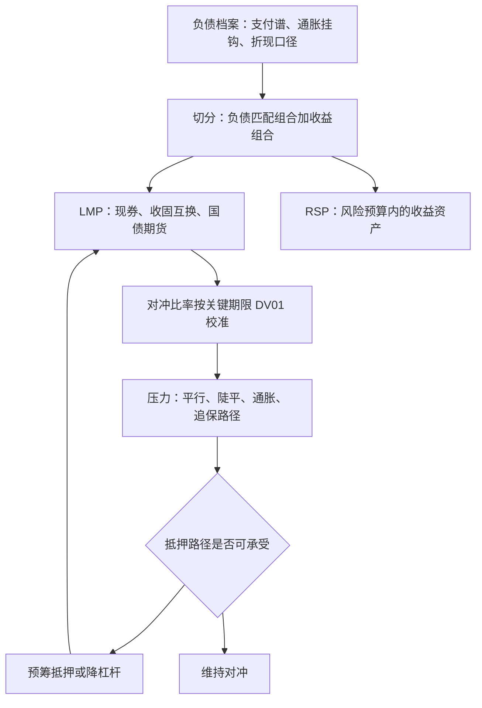

# 负债驱动投资 LDI

养老金的成绩不是同类排名的百分位，而是资金比率的变动——LDI 把这句话从口号变成资产负债表结构。

<footer>—— 据 Fabozzi, Bond Markets, Analysis and Strategies 相关章节整理</footer>

[上一课](/quant/bm2-duration-immunization)把单笔负债对平移曲线免疫，且只有一阶保证。真实的养老负债是一串跨几十年的支付，一半还挂通胀；久期免疫由此升级为 LDI：以负债为基准管理资产，把组合切成负债匹配与收益追逐两个模块。本课写这场升级的三个问题：负债怎么成为基准、对冲用什么工具、杠杆与抵押把哪些新风险接了进来。

## 问题

上一课的免疫目标是单个到期日的标量；LDI 的基准是一个负债函数：支付日谱、通胀挂钩比例、折现口径（经济或监管）。业绩不再对指数衡量，而看资金比率 $F = V_A / V_L$ 的变动——资产与负债必须放在同一张账上对冲。缺口有二：其一是期限，负债久期常在 12 年以上，长端现券既贵又稀薄，纯现券匹配吃不消；其二是资本，把全部资产锁进长债，收益追逐仓位就没有预算了，可养老金的缴费与待遇调整恰恰需要那部分收益。LDI 的设计目标因此是：用尽量少的资本把负债敏感度对冲掉，把省下的资本留给收益组合。

## 方法

第一刀是切分：负债匹配组合（LMP）与收益追逐组合（RSP）。LMP 的工具阶梯从实到虚：现金流匹配（每个支付日找券，最稳但资本最重、长端常买不齐）、久期向量匹配（按 [关键期限 DV01](/quant/key-tenor-dv01) 分桶对齐）、衍生品覆盖（收固定利率的利率互换补长端久期，国债期货补中段，通胀互换挂通胀腿）。对冲比率是决策变量而不是常数：按资金比率目标与风险预算定，通常留一部分敞口给缴费来源。RSP 在剩余风险预算内配股权与另类，其约束只有一条——它的尾部不得击穿资金比率的下限。

## 机制

衍生品为什么在 LDI 里是必需品而非点缀：互换与期货不占本金，同样的 DV01 只占用零星保证金，省下的现金进入 RSP——这是资本效率的正收益。但「不占本金」是记账口径，抵押是真实的：CSA 追保与期货逐日盯市把利率风险转成流动性风险，杠杆则把转换放大。2022 年 9 月的英国把机制演示成案例：长端收益率上行触发 LDI 基金追保，被迫抛售 gilt，收益率再上行——[抵押品与资金链](/quant/rc-collateral-funding)的折价—杠杆螺旋在国债市场重演，直到英格兰银行入场。[上一课](/quant/bm2-duration-immunization)立的判据在此升级为治理条款：对冲方案必须连同抵押路径一起过压力，只压曲线不压追保的压力测试测不到真正的死因。

据英格兰银行金融政策委员会事后记录，事件前 LDI 基金杠杆普遍在数倍量级；9 月 28 日宣布的长端国债购买计划规模上限约 650 亿英镑。杠杆倍数各家统计口径不一，引用时须带出处与日期。

## 边界

现金流匹配对任何曲线形状都免疫，但资本占用与长端流动性常常不允许；互换覆盖长端却留下互换—国债基差，利差走阔时「已对冲」的报表仍会动（[互换利差](/quant/swap-spread)一课的口径）；通胀挂钩负债要用真实利率工具对冲，名义久期匹配会漏掉实际利率腿。折现口径是另一个暗坑：监管折现率滞后于市场时，资金比率与经济现实脱节，对冲比率定在哪条曲线上要事先声明。最后，LMP 与 RSP 的切分不是防火墙：RSP 的尾部损失同样压资金比率，抵押告急时最先被卖的往往是它——切分只是让责任清楚，不改变一张资产负债表的事实。

## 小结

- LDI 把基准从指数换成负债函数，业绩口径改为资金比率的变动。
- LMP/RSP 切分：用最少资本对掉负债敏感度，把资本留给收益组合。
- 工具阶梯：现金流匹配、久期向量匹配、互换与期货覆盖，按资本效率与流动性选择。
- 衍生品把利率风险转成抵押与流动性风险，压力必须触发追保路径。
- 出处：据 Fabozzi 相关章节整理；2022 年英国事件口径见英格兰银行金融政策委员会记录与[利率信用案例](/quant/rc-case-map)。
