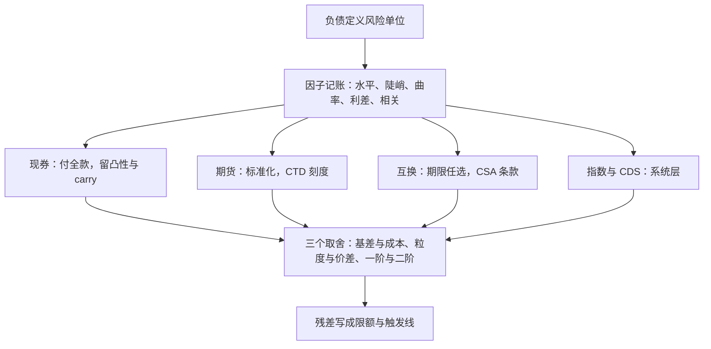

# 债券组合收束

债券组合管理的全部内容，是把一张负债表与一条曲线之间的距离，用可交易的工具与可执行的条款补上——工具决定快慢，条款决定生死。

<footer>—— 据 Fabozzi 相关章节整理；因子分解口径出自 Litterman and Scheinkman, Journal of Fixed Income, 1991</footer>

[上一课](/quant/bm2-case)把工具按次序装进一台完整组合，从负债档案走到压力报告。本课程到此收束：本课把八课收成一张地图——策略空间、工具空间、风险空间，以及反复出现的三个取舍，判据各归各课，不重讲。

## 问题

收束的问题是「什么在泛化」。八课之后留下的不应是几张参数表，而是一套决策程序：风险单位由负债定义；暴露沿因子分解记账；工具按含抵押的总成本选；所有模型管不住的残差写成限额与触发线。检验收束是否成立的方法是反向走一遍：给定任一台债券组合，能否在半小时内说出它的负债基准是什么、每个桶用什么工具覆盖、利差与相关记在哪本账、抵押缺口在哪条触发线后面——答不上来的那一项，就是它的结构漏洞。

## 方法

三个空间并成一张图。策略空间从浅到深：单笔负债的 [久期免疫](/quant/bm2-duration-immunization)、以负债函数为基准的 [LDI](/quant/bm2-ldi)、以市场指数为基准的 [指数化](/quant/bm2-bond-indexing)、以及主动管理信用损失分布的 [分散](/quant/bm2-credit-diversification)——四者共用一套风险语言，只是基准从单点换成函数再换成分布。工具空间按资金占用与条款密度排列：现券（付全款、留凸性与 carry）、[期货](/quant/bm2-treasury-futures)（标准化、CTD 刻度、逐日盯市）、[互换](/quant/bm2-swaps-in-portfolio)（期限任选、CSA 条款）、指数与 CDS（系统层承载）。风险空间沿用 [曲线 PCA](/quant/curve-pca) 的三因子加利差与相关：任何组合都是在这几个方向上的头寸表，[关键期限 DV01](/quant/key-tenor-dv01) 向量是它的可执行写法。

## 机制

三个取舍贯穿全部八课，值得点名。其一，基差与成本：期货与互换比现券便宜，便宜的部分以基差形式回收——CTD 切换、互换—国债利差、指数成分差，都是在工具省下的钱里埋着的头寸；用工具前先问基差记在哪本账。其二，粒度与价差：分散的算术要求名字多、权重匀，流动性的账单随冷门券上升，粒度最终是花价差买来的。其三，一阶与二阶：免疫只保一阶，凸性差与曲线扭转是真实的损益，把二阶当「高阶小量」的组合作在大幅移动的年份把一阶省下的全部还回去。三条取舍之下是同一条暗线：抵押与流动性是传导链的上游，2022 年的 gilt 螺旋把这条线写进了所有方案的治理条款——[利率信用案例](/quant/rc-case-map)收束时的判据，在本课程以组合的口径再次兑现。

收束自查的三问：基准是负债函数还是指数、每个久期桶的覆盖工具与其基差账本、压力场景里有没有追保路径——三问答不全，组合的结构性风险就没有写完。

## 边界

本课程的边界与它的口径绑定：曲线本身如何构建是 [自举曲线](/quant/curve-bootstrap) 的领地，参数族的光滑问题见 [Nelson–Siegel](/quant/nelson-siegel)；利差与 XVA 的资金链在利率信用深化课程里；组合层面的压力与归因分别有专门的深化课程。本课程没有写的还有：跨币种负债与汇率对冲、通胀工具的细节、证券化产品的负凸性、以及 alpha 的来源——这些都是相邻课程的题目，不是收束能代答的。最后，地图上每个工具的条款都会随制度漂移：保证金规则、基准利率、指数编制方法都在变，收束留下的是决策程序，不是参数表。

## 小结

- 策略空间共一套风险语言：免疫、LDI、指数化、信用分散，差别只在基准是点、函数还是分布。
- 工具空间按资金与条款排列：现券、期货、互换、指数，选择标准是含抵押的总成本。
- 三个取舍贯穿全课：基差与成本、粒度与价差、一阶与二阶。
- 风险空间是三因子加利差与相关，可执行写法是关键期限 DV01 向量。
- 出处：据 Fabozzi 相关章节整理；因子分解出自 Litterman and Scheinkman, Journal of Fixed Income, 1991，各课判据见本课程相应课。
