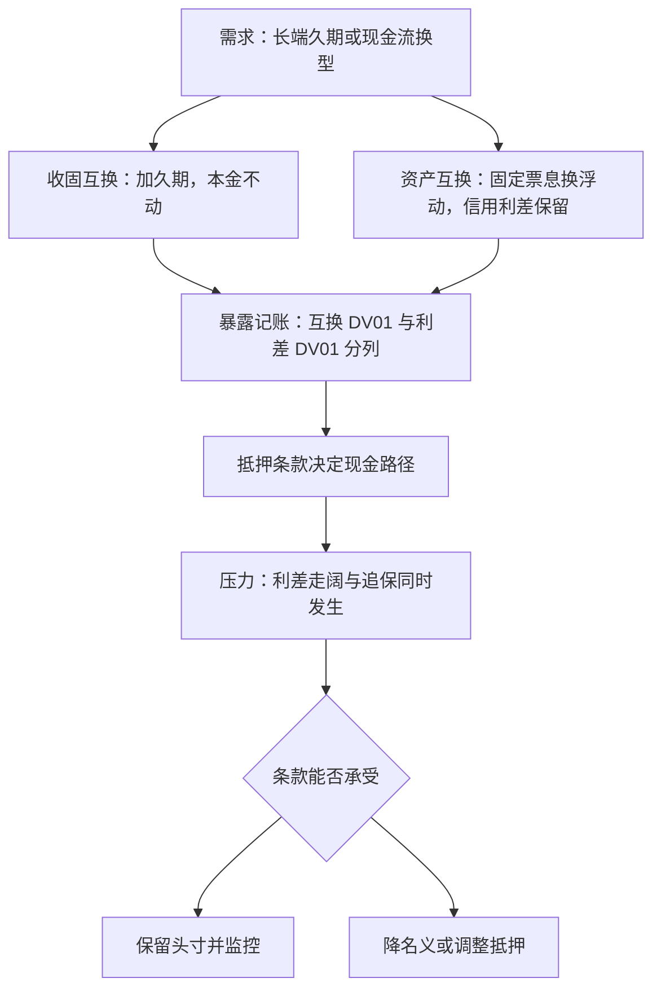
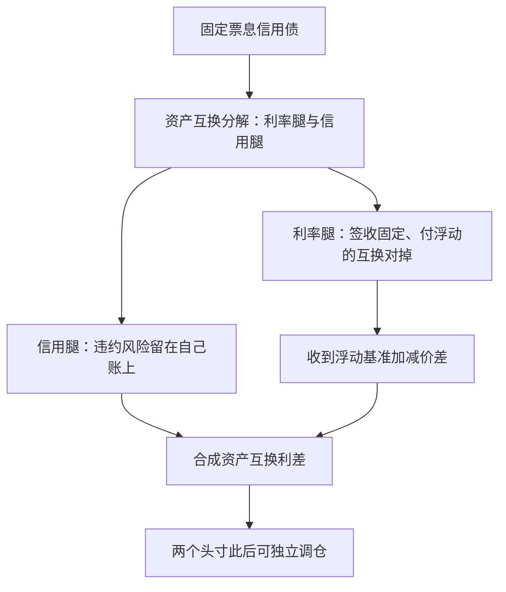

# 互换在组合里

互换不挪动本金，只换现金流的利率形态；于是久期管理多了一种不必卖券、不必备货的工具——代价是签下一个对手方与一纸抵押条款。

<footer>—— 据 Fabozzi, Bond Markets, Analysis and Strategies 互换章节整理</footer>

[上一课](/quant/bm2-treasury-futures)把久期交给交易所合约，刻度受交割篮与离散到期档位的限制。互换补上另外半张地图：期限任选、条款可定制、长端照样有深度。本课写互换进入组合的两种基本动作——加久期与换现金流——以及随之而来的利差敞口、抵押与对手方问题。

## 问题

期货够不着的部分有两种。其一是期限：30 年档的负债久期，期货只有临近档位，插档误差大；互换的 20 年、30 年报价连续且有真实流量。其二是现金流形态：一只固定票息信用债在组合里的问题是「利率久期占预算、利差才是想要的东西」；一个浮动利率负债方的问题是「怕利率上行」——两者都需要在不卖出资产的前提下改写现金流的固定/浮动属性。互换正是干这个的：名义本金不动，只交换固定与浮动腿。多曲线时代它的折现与投影分属两条曲线（见 [OIS 与多曲线](/quant/multi-curve-ois)），估值先从这条口径开始。

术语翻译：利率互换就是「只换利息、不换本金」的协议。比如名义本金 1 亿元，A 答应每年按固定 3.5% 付息，B 答应按浮动基准付息，每期只结清两边利息的差额——本金从头到尾只在纸面上用来算利息，谁也不用真拿出来。

## 方法

两个基本动作。加久期：收入固定、支付浮动的互换，DV01 集中在固定腿，等效于借入一笔不占本金的固息头寸；长端负债匹配用它补期货够不到的桶，暴露按互换 DV01 与利差 DV01 两个口径分别记账（后者即 [互换利差](/quant/swap-spread) 的敞口）。换现金流：资产互换是买债加支付固定的一揽子交易，把固定票息债变成合成浮动，投资者保留信用风险、收到的利差是相对浮动基准的资产互换利差——「利率归互换、信用归自己」的分工由此完成；反向的动作则是负债方把浮动支付换进固定，锁定融资成本。两种动作都 unfunded，但 CSA 让抵押日结：账户里要为利差反向与利率反向各留一条现金通道。

## 机制

互换 DV01 为什么集中在固定腿：浮动腿在每个重置日回到基准，利率变动只影响下一期；固定腿的现值则按整条折现曲线重估。所以收固互换在机制上是一串远期的组合，久期随期限近乎线性增长——这正是它补长端的资格。资产互换的机制则是一次分解：债券价格被拆成利率部分与信用部分，利率部分被互换对掉，剩下的合成浮动利差是市场对信用的报价。这条分解让组合第一次能把「我要信用」与「我不要利率」写成两个独立的头寸。机制的反面是基差：互换曲线与国债曲线是两个市场，2020 年 3 月融资挤压与避险买入同向发生，互换利差数日内大幅走阔——同时持有国债与互换的组合在那一刻才看清这是两个市场的价格。

资产互换不消灭信用风险，只是打包：投资者仍承担债券违约损失，另加互换对手风险。资产互换利差与国债利差（G-spread）分属不同折现曲线，直接比较会错位——先统一口径再谈哪只券「便宜」。

直觉类比：浮动腿像游标卡尺——每次重置都滑回基准，利率变动只影响下一期利息；固定腿像一根整长的定长刻度——整条折现曲线动，它都跟着重估。所以收固互换的 DV01 几乎全在固定腿，近似于一张同期限固息债的敏感度，久期随期限近乎线性增长。

## 边界

无抵押或有抵押不足的互换带对手方风险，估值要计 CVA——这是 [XVA 联动](/quant/rc-xva-linkage) 一课的领地；有抵押的互换则把风险移到条款执行上，2020 与 2022 都验证过抵押渠道优先于价格渠道。期货与互换的分工是成本函数：液体档位期货更便宜，长端与定制条款互换占优，两者并用时还有期货—互换基差要对账。资产互换的退出依赖两个市场的流动性同时在线，压券时往往只剩一个。最后，会计与税务对「合成头寸」的处理可能与经济对冲不一致，方案落地前先过合规口径。

常见误区：初学者以为签完互换对冲就「完工」了，忘了对手方本身可能违约——对手倒下时，你手里那张对冲凭证跟着贬值，估值里为此扣掉的价钱就是 CVA。有抵押（CSA）的互换把这一风险换成条款执行风险：押品给不给、给得快不快，成了新的生死线。

## 小结

- 互换的两个动作：收固加久期（DV01 在固定腿）、资产互换换现金流（信用归自己、利率归对手）。
- 暴露分两本账：互换 DV01 与利差 DV01，混记会把利差观点误当利率对冲。
- unfunded 是记账口径，CSA 抵押让风险落在现金通道与条款执行上。
- 期货管液体档位、互换管长端与定制，并用时须对基差记账。
- 出处：据 Fabozzi 互换章节整理；多曲线与利差口径见本站 OIS 多曲线与互换利差相关课。
