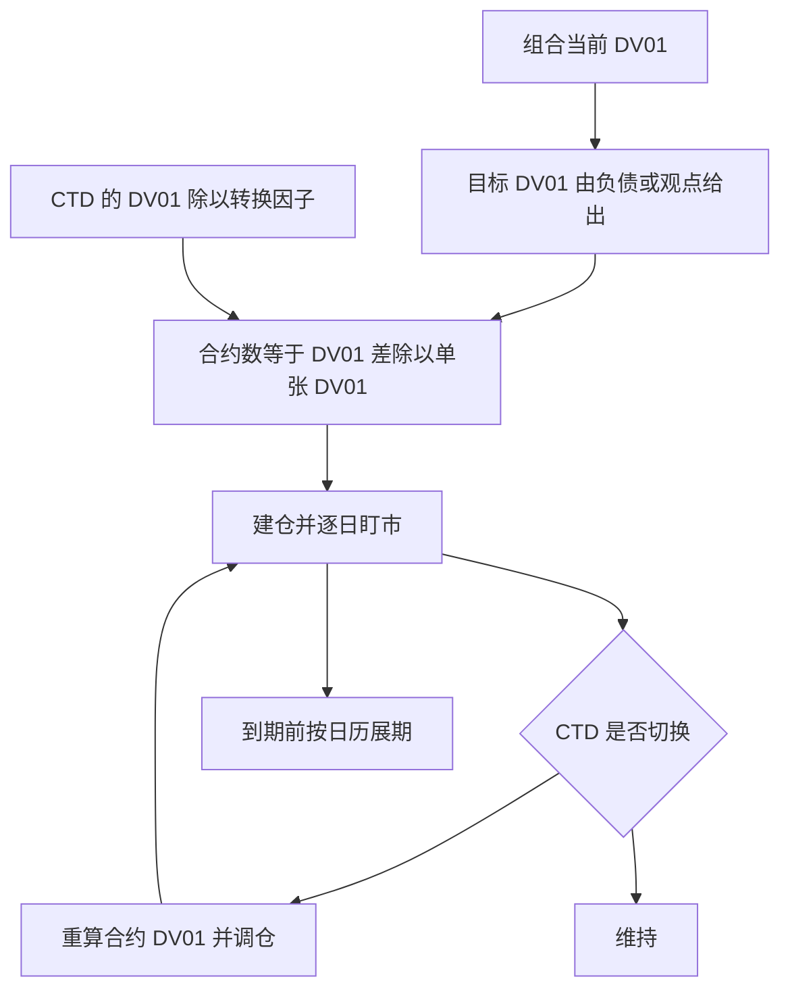
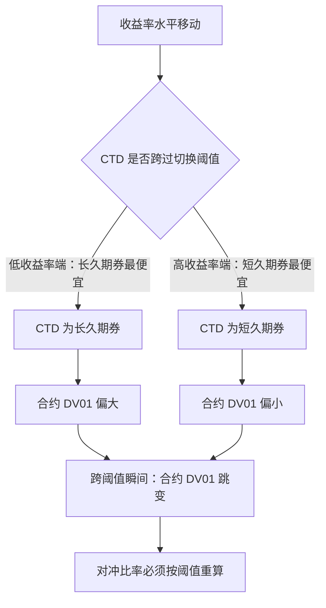

# 国债期货在组合里

国债期货把久期变成一个每天都能拧的旋钮——只是旋钮的刻度不由名义面额书写，由最便宜可交割券书写。

<footer>—— 据 Fabozzi 相关章节整理；交割机制细节见 Burghardt 等，The Treasury Bond Basis</footer>

[上一课](/quant/bm2-bond-indexing)用特征复制逼近指数，误差的另一半根源是现券市场的流动性。本课引入另一种解法：不搬现券，改用一纸合约调久期。国债期货在组合管理里是流动性最好的利率工具之一，但它对冲的从来不是名义标的，而是交割篮里那个随时可能换人的最便宜可交割券（CTD，见 [CTD 与最便宜可交割](/quant/ctd-cheapest)）——本课写它的三种用法与一个核心陷阱。

## 问题

组合需要在中途移动久期：观点变了、负债变了、或者 [LDI](/quant/bm2-ldi) 的对冲比率要调。卖现券再买现券要付两腿价差、冲击成本与结算周期，期限段还未必有货。期货解决的问题正是这个：一张合约、逐日盯市、接近零库存占用地加或减 DV01。但合约的机制立刻带来问题——它的标的不是某一只国债，而是一个转换因子归一后的交割篮；空头拥有交割选择权，期货价格实际追踪 CTD。于是「买多少张」不是面额除以合约面值，而是 DV01 口径的换算：合约对利率的敏感度等于 CTD 的敏感度经转换因子调整后的值。

术语翻译：DV01 读作「一个基点的美元价值」——收益率变动 0.01%（1 个基点）时，头寸盈亏多少美元。比如组合 DV01 为 5000 美元，收益率上行 10 个基点，一阶近似下大约亏 5 万美元。所谓「调久期」，操作上就是在调这个数到目标值。

## 方法

对冲比率用 DV01 法：$N = \dfrac{DV01_{\text{目标}} - DV01_{\text{当前}}}{DV01_{\text{合约}}}$，其中 $DV01_{\text{合约}} \approx DV01_{\text{CTD}} / CF$。三种典型用法：一是战术调久期，把组合久期快速移到目标再徐徐用现券替换，期货当过桥；二是 LDI 的长效对冲腿，中期负债段用期货覆盖、把长端留给互换；三是基差观点，当期货相对 CTD 偏贵或偏廉时做净基差（这是交易台用法，组合管理只需避开它的反向伤害）。持有期货还必须管展期：临近交割月流动性整体迁往下一合约，展期窗口与成本要进日历，这与指数调仓一样是制度成本而非意外。

## 机制

为什么合约 DV01 挂在 CTD 上：转换因子把篮内各券折算成名义券的可交割数量，空头按净基差最小选券交割，套利把期货价格钉在 CTD 的隐含价格上。机制的推论是期货久期不稳定：当收益率跨过切换阈值，CTD 从一只券跳到另一只，合约 DV01 随之跳变——且恰恰在市场大幅移动时发生，此时对冲比率的误差最大。这就是交割期权在组合层面的价格：期货便宜一点点流动性，收走一段久期的确定性。另一条机制是逐日盯市：与现券的应计利息不同，期货的盈亏每天以现金结算，保证金路径在极端日是真实的流动性需求——[LDI 一课](/quant/bm2-ldi)的抵押判据在这里同样适用。

一张面值 10 万美元的 10 年期国债期货：若 CTD 久期 6.8、转换因子 0.82，则单张 DV01 约 6.8 × 100000 × 0.0001 ÷ 0.82 ≈ 83 美元；漏掉除以 CF 会把对冲量做错近两成。

直觉类比：转换因子像一张「金条折算表」，把成色各异的可交割券折算成标准券的数量——空头交割哪根都行，按表折算即可。折算后按市价买来最便宜的那根就是 CTD；套利把期货价格钉在这根最便宜的券上，于是合约的久期刻度其实由它书写。

## 边界

期货只对冲国债成分：拿它对冲信用债组合，利差敞口原封不动，还引入国债—信用基差。对冲比率是时变的，CTD 切换、收益率水平变动都会使它漂移，必须按阈值重算而非按日历偷懒。合约到期档位离散（短、中、长各一档），连续曲线上的久期调整只能插档，插档误差在长端最大。最后，逐日盯市与保证金占用的成本在低波动期不明显，在压力期与折价同时出现——用期货替换现券等于把资金风险从市场换成抵押渠道，这笔交换要在纸上算过再做。

常见误区：拿国债期货对冲信用债组合。期货只跟踪国债利率，信用利差走阔时信用债在跌、期货可能纹丝不动——账面上「对冲比率没错」，损失照常发生。这段没人管的损益叫国债—信用基差，记账时必须单列一栏。

## 小结

- 期货调久期的正确单位是 DV01，合约 DV01 等于 CTD 的 DV01 除以转换因子。
- 三种用法：战术过桥、LDI 对冲腿、基差交易；组合管理主要用前两种。
- 核心陷阱是 CTD 切换让合约久期在市场大动时跳变，对冲比率须按阈值重算。
- 展期与保证金是制度成本，进日历、进抵押预算。
- 出处：据 Fabozzi 相关章节与 Burghardt 等 The Treasury Bond Basis 整理；CTD 机制细节见本站 CTD 相关课。
