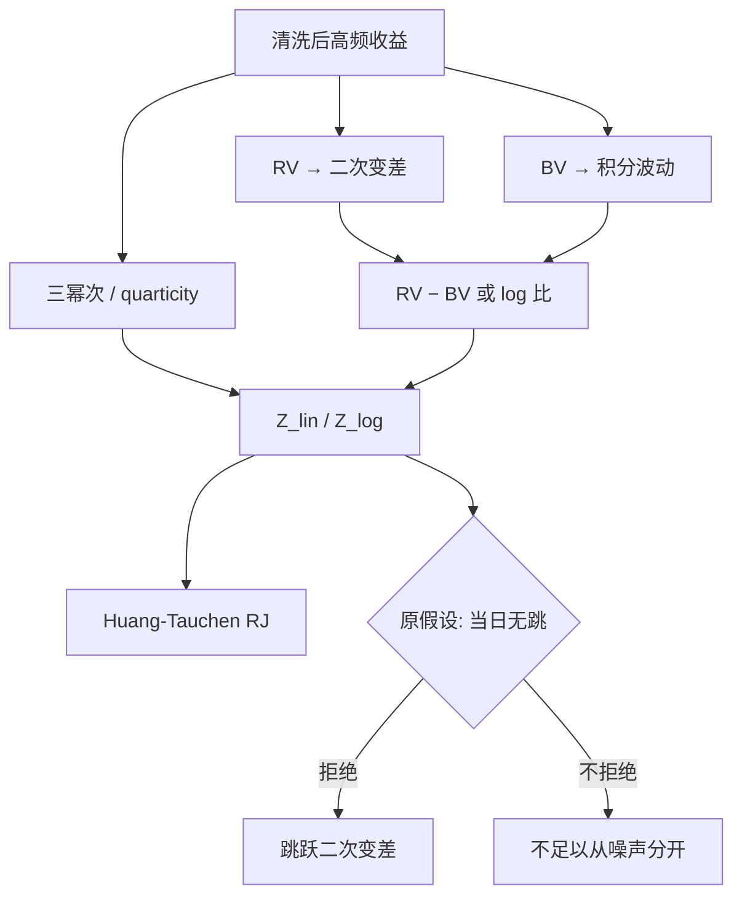

# Barndorff-Nielsen 跳跃检验

已实现方差收敛到积分波动加跳跃平方和；相邻绝对值乘积的双幂次在有限活动跳跃下仍收敛到积分波动。把差用四分位变差标准化，才得到可以读临界值的日度检验。

<footer>—— Barndorff-Nielsen and Shephard, Econometrics of Testing for Jumps in Financial Economics, Journal of Financial Econometrics, 2006</footer>

[跳跃检验](/quant/jump-tests) 一文把 BN–S、Huang–Tauchen、Lee–Mykland 与 Aït-Sahalia–Jacod 放在同一张地图上，说明「检出跳」不等于可交易预测。本篇收窄到 Barndorff-Nielsen 与 Shephard 的 2004 年幂变差与 2006 年检验理论：线性差、比率、对数三种统计量如何从同一对 $(RV,BV)$ 出来、渐近方差里的 $\theta$ 从哪来、有限样本为何偏，以及相对跳跃份额 $\mathrm{RJ}$ 何时比 $Z$ 更好用。不在这里展开局部窗口定位或无穷活动幂变差；那些仍指向综述文。对象是：**在网格 $\Delta\to 0$、噪声可忽略、跳跃有限活动时，如何检验当天是否有跳、跳对二次变差贡献多大。**

## 问题

对数价格为半鞅时，二次变差 $[X]_t=\int_0^t\sigma_u^2 du+\sum_{s\le t}(\Delta X_s)^2$。已实现方差 $\mathrm{RV}_n=\sum_{i=1}^n r_i^2$ 估左边；风控与对冲常常只要第一项积分波动 $IV$。朴素阈值「格子收益是否很大」依赖未知的 $\sigma$，且开盘季节性会把连续波动标成跳。需要一个对有限次跳稳健的 $IV$ 估计，再把 $\mathrm{RV}-IV$ 变成有渐近分布的检验。

Barndorff-Nielsen–Shephard（2004）给出双幂次变差。2006 年检验文把 $\mathrm{RV}-\mathrm{BV}$ 的波动用已实现三幂次（或四分位变差）估出来，从而在原假设「当天无跳」下得到标准正态。问题从构造稳健变差，变成构造 **size 可校准的日度检验**，并说明比率与对数形式如何改善有限样本。

### 双幂次只对有限活动干净

一次跳只污染一格 $r_i$。$\sum |r_{i-1}||r_i|$ 里，跳与邻居的乘积相对 $\sum r_i^2$ 是更低阶项，网格加密后概率消失，故 $\mathrm{BV}\to_p IV$。若两格连续大跳，或无穷活动把许多中等跳撒在格子上，分离失败。2006 年理论的原假设是连续伊藤过程加（可忽略的）噪声；备择是有限活动跳。把闪崩式的连续多笔大单叫做「一天内许多跳」，BN 统计量仍可能拒绝，但拒绝的是「连续路径」，不是复合泊松强度模型。

用当天的 RV 去标准化「最大格子收益」，阈值被跳自己抬高，检验偏保守。BN 的分母必须来自对跳稳健的 quarticity，不能来自 RV。这是 2006 年检验相对朴素阈值的全部要点。

## 方法

记 $\mu_1=\sqrt{2/\pi}$。已实现双幂次

$$
\mathrm{BV}=\mu_1^{-2}\sum_{i=2}^{n}|r_{i-1}||r_i|.
$$

无跳时 $\mathrm{RV}-\mathrm{BV}$ 的阶是 $\sqrt{\Delta}$，渐近方差由 $\int\sigma^4$ 与一个可由高斯矩算出的常数 $\theta$ 决定。已实现三幂次 $\mathrm{TP}$ 估 $\int\sigma^4$。线性统计量

$$
Z_{\mathrm{lin}}=\frac{\mathrm{RV}-\mathrm{BV}}{\sqrt{\theta\,\Delta\,\mathrm{TP}}}
$$

在原假设下 $\to_d N(0,1)$。比率形式 $Z_{\mathrm{ratio}}$ 用 $\mathrm{RV}/\mathrm{BV}-1$ 再标准化，对数形式用 $\log\mathrm{RV}-\log\mathrm{BV}$。Huang–Tauchen 推荐对数或最大调整版本，因为 $\mathrm{BV}$ 在有限样本里常略低于 $IV$，线性差偏正，名义 5% 检验实际 size 偏大。实务默认应报对数 $Z$ 与相对份额

$$
\mathrm{RJ}=\frac{\mathrm{RV}-\mathrm{BV}}{\mathrm{RV}},
$$

后者跨日可比，但不自带临界值，显著与否仍看 $Z$。

**有限样本修正。** 相邻 $|r|$ 正相关（季节性、波动聚类）让 BV 下偏。先除日内季节性因子，或用交错双幂次、最大调整双幂次减轻「大收益旁边还是大收益」的污染。网格不要用到噪声主导的 tick：噪声抬高 RV、破坏相邻乘积极限，假跳激增。先预平均或降到五分钟一类工程点，再算 $Z$，并在报告里写网格。

### 多重检验与功效

一年约 250 个日度检验。不调整则期望十几个 5% 假跳日。Bonferroni 过严，假发现率更合适，见 [FDR / Romano–Wolf](/quant/fdr-romano-wolf)。功效对小跳弱：跳占当天 $IV$ 的几个百分点时，$Z$ 常常不拒绝。因此「未拒绝」不能写成「连续路径已证实」，只能写成「在该网格与该显著性下，跳贡献不足以从噪声里分开」。把 $Z$ 当交易信号，是把事后分解当成预警。

与 HAR 预报的接口：HAR-CJ 需要日度 $C$ 与 $J$。$J=\max(\mathrm{RV}-\mathrm{BV},0)$ 是估计，不是检验。可以每天都拆，也可以只在 $Z$ 显著时把差记为跳、否则把全部 RV 记为连续。前者把噪声差也叫做跳，后者把小跳并进连续。预报文献里两种都有，比较时必须声明。

## 机制

连续部分的二次变差是许多小增量平方和；跳是稀疏大项。平方和把跳留下，相邻乘积把跳的阶打低。分母 quarticity 描述无跳时差的波动：$\sigma$ 高的日子，$\mathrm{RV}-\mathrm{BV}$ 即使无跳也更大，不标准化就会在高波动日过度拒绝。这与「开盘 3σ」必须用局部 $\sigma$ 同一逻辑，只是 BN 用全天积分四次变差，不定位哪一格。

对数变换把乘性有限样本偏差收成加性，比率把水平差换成相对差，二者在 RV、BV 接近时与线性等价，在 BV 偏小时更稳。这是数值机制，不是新的概率极限。签名图提供事前诊断：噪声让 RV 在高频上翘；跳让 RV 在所有频率抬一截。先看签名图再做 $Z$：上翘为主时先去噪声。

Barndorff-Nielsen–Shephard 的渐近是 $\Delta\to 0$ 且无噪声。五分钟是噪声与偏差之间的工程点。换网格若跳日清单大变，应怀疑噪声，而不是改写价格过程的活动指数。

### 从日度 $Z$ 到对冲与产品

方差互换浮动腿跟总二次变差，BN 分解解释 IV−RV 在公告日的裂口有多少来自跳。CPPI 一类路径依赖产品的缺口由再平衡窗口里的跳驱动，日度 $Z$ 只能事后标记「那天有跳」，不能替代窗口内最大不利增量的直接测量。期权对冲若假设连续路径，显著跳日应触发限额或跳附加，而不是把 $Z$ 阈值做成开仓信号。

## 边界与工程取舍

无穷活动、微观噪声、隔夜缺口、错价，都会破坏 2006 年定理。隔夜应单独一项，不要塞进第一格再进 BV。稀疏成交的小盘上，五分钟格里大量零收益，BV 与 TP 不稳定，应降频或换已实现核后再检验。多元共同跳需要向量变差，单名 $Z$ 的同时拒绝不等于共同跳检验。

不要用日收益绝对值替代高频 BN：日收益把跳与当天连续波动加总。不要在未清洗 tick 上算 BV。不要把 Huang–Tauchen 的 $\mathrm{RJ}$ 与 $Z$ 的 p 值混报成一个数。定位跳时刻用 Lee–Mykland，本篇的 $Z$ 不回答「哪一分钟」。

同一天用预平均 BN 与朴素五分钟 BN，结论常不一致。模型卡应冻结：网格、是否季节性调整、线性/对数、$Z$ 临界值如何对 250 次检验校正。把三种设定的并集叫做「跳日」，会把检验变成数据挖掘。

## 小结

- BN–S（2004/2006）用双幂次估 $IV$，用 quarticity 标准化 $\mathrm{RV}-\mathrm{BV}$，得到日度跳跃检验。
- 对数与比率形式改善有限样本 size；相对份额 $\mathrm{RJ}$ 便于跨日比较，显著性仍看 $Z$。
- 噪声、季节性、多重检验与小跳功效构成主要工程误差；先签名图与降噪，再检验。
- 拆分 $C$ 与 $J$ 供 HAR-CJ 使用时，须声明是每日拆还是仅在显著日拆。
- 出处：Barndorff-Nielsen and Shephard, *Journal of Financial Econometrics*, 2004 与 2006；Huang and Tauchen, 2005；综述定位见 [跳跃检验](/quant/jump-tests)。
