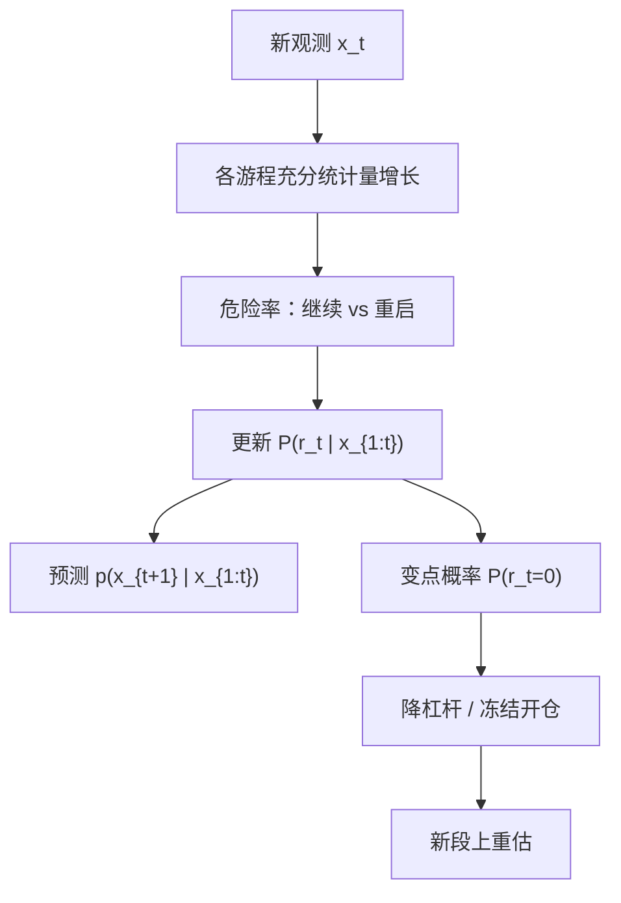

# BOCPD 在线变点检测

我们维护「当前段已持续多久」的后验；每个新观测到来，质量要么在原段上更新，要么按危险率开启一段新的参数，整个过程是一次在线的消息传递，不必在全样本上重切。

<footer>—— Adams and MacKay, Bayesian Online Changepoint Detection, 2007</footer>

[Bai–Perron](/quant/bai-perron) 在全样本上用动态规划切多段，是事后估计。[CUSUM / MOSUM](/quant/cusum-mosum) 沿时间累加残差，对照渐近带做检验。[HMM](/quant/hmm-regime) 假定离散状态会按转移矩阵回来。Adams 与 MacKay（2007）的贝叶斯在线变点检测（BOCPD）问的是另一件事：数据流式到达，在每个 $t$ 给出**当前游程长度**（run length）$r_t$ 的后验 $P(r_t\mid x_{1:t})$，从而得到「最近一次变点在哪」的在线信念，以及下一观测的预测分布。本篇写游程后验、危险率、共轭指数族，以及它为何不能替代 Bai–Perron 的全局切段，也不能当成无成本的交易开关。

## 问题

设观测 $x_t$ 在相邻变点之间 i.i.d. 来自参数 $\theta$，变点时 $\theta$ 重抽。记 $r_t$ 为 $t$ 以来已过去的长度（$r_t=0$ 表示 $t$ 本身是变点）。BOCPD 的状态是 $r_t$ 的离散分布，而不是「现在是体制 1 还是 2」。与 HMM 的差别：变点模型通常不假设旧 $\theta$ 按固定概率回来；新段是新参数。与 Bai–Perron 的差别：不在全样本最小化 SSR，不给出历史所有切点的联合最优，只向前滤波。

需要的产品有两件。其一，$P(r_t=0\mid x_{1:t})$ 或 $P(r_t\le h\mid x_{1:t})$，用于「是否刚刚换了」。其二，预测 $p(x_{t+1}\mid x_{1:t})=\sum_{r}p(x_{t+1}\mid r_t=r,x_{1:t})P(r_t=r\mid x_{1:t})$，用于在线概率预测、异常分数或仓位缩放。问题是危险率（变点发生的先验概率）与观测模型一旦定错，后验会要么天天重启，要么几年不认账。

### 游程后验而不是单次检验

CUSUM 给出一条路径与一条带，穿带是检验决策。BOCPD 给出整条后验质量函数：可以同时认为「80% 可能仍在 40 天的段上、15% 可能昨天刚断」。把后验压成「若 $P(r_t=0)>0.5$ 则平仓」是一种滤波器，损失了校准信息。更干净的接口是：用预测分布的宽度或变点概率去**降杠杆**，真正的开平仍用经济止损。Adams–MacKay 原文是算法与消息传递，不是交易规则。

在线的含义是 $P(r_t\mid x_{1:t})$ 只用到 $t$。用全样本平滑 $P(r_t\mid x_{1:T})$ 去回测「当时该不该停」，含 $\mathcal{F}_T$，与 HMM 平滑概率不能进回测是同一条禁令。可复现路径只允许滤波。

## 方法

**危险率。** $H(\tau)=P(\mathrm{changepoint}\mid r=\tau)$。常数危险率对应几何间隔，记忆少，实现简单；若认为变点像制度日历那样成团，需时变或协变量危险率，否则周末与数据发布会看起来像参数跳。金融日收益上，波动聚集会使常参数高斯观测模型把 GARCH 当成天天变点——应先对 $x_t$ 做波动标准化，或把观测模型换成 Student-$t$ / 显式波动状态，再跑 BOCPD。

**共轭更新。** Adams–MacKay 在指数族共轭先验下，每个可能的游程对应一组充分统计量，新点到达时：对所有 $r$ 做增长更新（$r\leftarrow r+1$），再按危险率把质量送到 $r=0$ 的新段，新段用先验。复杂度随 $t$ 线性增长，实践中截断很小的 $P(r_t)$ 尾部（剪枝），使内存有界。截断过狠会系统性地不承认长段。

**与回归、价差。** 对配对残差或因子回归残差做 BOCPD，原假设仍是「段内参数恒定的生成模型」，不是「存在协整」。形成期是否有协整仍用 [Gregory–Hansen](/quant/gregory-hansen) 或经济判断；BOCPD 放在交易期做顺序监听，分工与 CUSUM 相同，但输出是后验而不是穿带。

### 顺序水平与多重警报

每个 $t$ 都看 $P(r_t=0)$ 会带来持续监测的多重问题。与 Chu–Stinchcombe–White 一类顺序检验类似，应控制的是整段监测期的虚假重启率，而不是单日 5%。实践上：冷却期（一次高变点概率之后 $h$ 日内不再计数）、或对后验做时间平滑。否则 MOSUM 式的刷屏会换成贝叶斯刷屏。异方差未处理时，虚假重启在危机周成串出现，看起来像「结构天天断」，其实是模型里没有波动状态。

## 机制

贝叶斯更新把「这段数据还像同一 $\theta$」的证据累积在长游程上；一次与当前后验预测严重不合的观测，把质量推向短游程。危险率是先验推力：即使数据温和，足够长的段也会被先验认为该结束——若 $H$ 过大。这解释了调参：太高的常数危险率制造周期性假变点；太低则在真断裂后仍粘在旧 $\theta$ 上很久。与 HMM 对比：HMM 的 $p_{12}$ 是回到有限标签；BOCPD 的新段参数来自先验，不承诺回到旧均值。指数权重切换更像 HMM；一次会计口径或一次法规更像变点。

预测分布是游程后验的混合，因此在刚发生的疑似变点附近自动变宽。用这个宽度去缩放仓位，比用点估计 $\hat\theta_t$ 更一致：你不确定段是否已断，就不该用旧半衰期的全仓 OU 规则。这与 [体制断裂风险](/quant/regime-break-risk) 的产品含义对齐。

### 和 Bai–Perron、CUSUM 的产品分工

月末或季末、需要「历史上有几段、切在哪、置信区间」时，用 Bai–Perron。交易日、需要「到目前为止该不该怀疑刚断」时，用 CUSUM 或 BOCPD。CUSUM 有渐近带、假设更透明；BOCPD 有校准的预测分布、对共轭模型更自然。不要用 BOCPD 的 MAP 游程去代替 BP 的全局 $\hat\tau$，也不要用 BP 的全样本切点去验证「当天滤波是否该报警」——后者含未来。形成期结束用 GH/BP 验一次关系是否还在；交易期用 BOCPD/CUSUM 监听。

MAP 游程 $\arg\max_r P(r_t\mid x_{1:t})$ 在后验扁平时会乱跳。应报告后验质量或期望游程 $\mathbb{E}[r_t\mid x_{1:t}]$，并把决策绑在阈值与冷却上，而不是绑在 MAP 的逐日标签。

## 边界与工程取舍

高斯共轭对收益太瘦；未标准化的平方收益会把波动体制标成均值变点。多元 BOCPD 在资产数稍大时，共轭协方差的自由度消耗极快，宜对残差或因子做，而不是对原始高维收益做。剪枝阈值、危险率、$t$ 分布自由度都是超参，必须在训练段预指定，禁止看着危机周调到「刚好抓住」。

不要把变点概率当方向信号。不要在停牌日把 0 收益喂进似然。tick 级微观结构使相邻观测强相关，i.i.d. 段内假设失败，应先降频。Adams–MacKay 的算法是通用在线推断，金融上的价值是顺序信念，不是新的 alpha 因子。

出处：Adams and MacKay, Bayesian Online Changepoint Detection, 2007。事后多断裂见 Bai and Perron, 1998。递归残差 CUSUM 见 Brown, Durbin and Evans, 1975。HMM 见 Hamilton, 1989。顺序监测见 Chu, Stinchcombe and White。

## 小结

- BOCPD 在线维护游程长度后验与预测分布，是滤波，不是全样本切段。
- Adams–MacKay（2007）用危险率与共轭指数族做线性增长的消息传递；实践中剪枝并先处理波动聚集。
- 输出应接口到降杠杆与预测带宽，而不是 MAP 游程的开平。
- 与 Bai–Perron、CUSUM、HMM 分工：事后切段、穿带检验、来回体制、在线变点信念。
- 回测只用滤波后验；平滑含未来。
- 出处：Adams and MacKay, 2007；对照 Bai–Perron、BDE CUSUM、Hamilton HMM。
