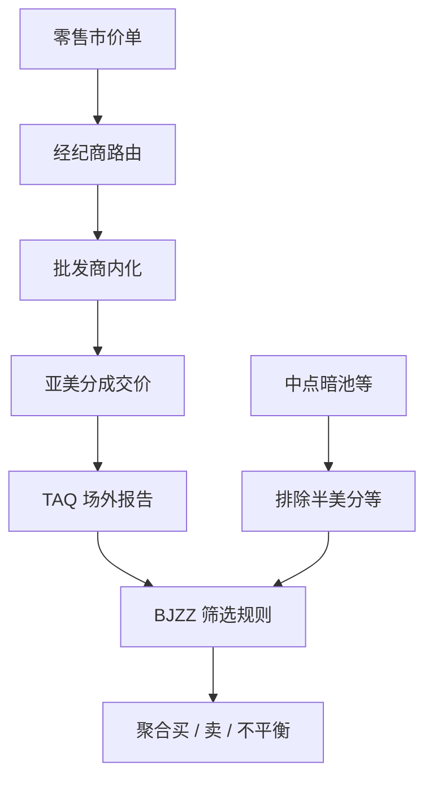

# Boehmer 零售流识别

    
美国股票的零售市价单大量在场外以亚美分价格成交：公开成交回报里因此留下一类可统计的痕迹——它识别的是带零售特征的聚合流，不是任何一个人。

    <footer>—— Boehmer, Jones, Zhang and Zhang, Tracking Retail Investor Activity, Journal of Finance, 2021</footer>

微观结构长期缺少「零售」这一可公开复现的标签。账户数据不可分享，[Lee–Ready](/quant/lee-ready) 只判断主动方向，不判断客户类型。Boehmer、Jones、Zhang 与 Zhang（BJZZ）利用美国零售经纪商把市价单卖给批发商、批发商再以亚美分价格改善并在 FINRA TRF 上报的制度事实，从 TAQ 的场外成交里构造零售买入与卖出的日度（及更高频）代理。本篇写这一识别的经济学来源、算法口径、以及它与 [PFOF](/quant/pfof-payment-flow) 的关系。它是学术测量，用于研究零售流与收益、流动性、波动的平均关联；不是追踪个人、不是还原某经纪商客户名单，更不是教人去「跟单」。

## 问题

公开成交带有价格、量、时间、报告场所。美国场内成交多在整美分或买卖价差的中点附近；零售市价单经批发商内化后，常见的是在买价之上或卖价之下几个亚美分成交，从而既给出价格改善，又让批发商保留剩余价差。BJZZ 的观察是：这类亚美分、且偏离半美分中点的场外成交，在样本期内高度集中于零售渠道。于是可以从公开带上估计零售主动买与主动卖，而不需要账户级数据。

问题是代理的污染与覆盖。并非所有零售都走亚美分改善；部分机构暗池成交也在场外；半美分中点更常与中点暗池有关，必须排除。批发商客户结构随时间变化——监管、PFOF 辩论、零佣金之后，同一价格痕迹的含义会漂移。识别必须始终说「零售代理」，并报告规则与样本期，而不是说「我们认出了散户是谁」。

### 公开带上的价格痕迹

TAQ 中报告在 FINRA TRF（常见交易所代码 D）的成交，构成场外样本。BJZZ 在其中筛选价格的亚美分部分落在特定区间的记录：略高于整美分的视为零售买的价格改善形态，略低于整美分的视为零售卖，并排除落在半美分上、更像中点撮合的观测。方向因此来自价格相对整美分的位置，而不是来自报价比较——这与 Lee–Ready 不同，也因此不能在没有亚美分报告的市场里原样搬用。A 股公开成交没有这一批发商亚美分机制，不存在可翻译的「BJZZ 代码」；硬套只会把随机的价位尾数当成零售。

亚美分是报告价格的制度产物，不是「散户指纹」。算法在统计意义上富集零售市价流，对任何单笔成交的客户类型没有法律或事实上的指认。研究应只发布聚合序列与回归，不试图反推账户或经纪商客户。

## 方法

构造步骤应可复现。锁定证券、日期、TAQ 版本与场外代码。应用 BJZZ 的亚美分区间与中点排除。按日（或按选定的日内窗口）加总零售买量、卖量，定义不平衡

$$
\mathrm{RIMB}_t = \frac{B_t - S_t}{B_t + S_t}
$$

或用金额加权的变体。与全市场主动流对比时，场内成交仍用 Lee–Ready 或报价规则，避免把两套方向算法混成一个「市场零售」。滞后与同期回归要声明：零售不平衡对次日收益的预测，是平均关联，包含风险补偿、流动性供给与注意力，不是可执行的信号说明书。复制应报告：覆盖率（代理成交占场外、占全市场的比例）、与已知零售活动公开指标（若有）的相关、以及把中点成交加回来时结论是否翻转——这是稳健性，不是调参。

与 PFOF 的连接：没有批发商支付与亚美分改善，这一痕迹会变淡。因此 BJZZ 序列同时是零售活动与零售订单路由制度的函数。制度一变，序列的经济学含义要重新校准，而不能把 2000 年代系数沿用到任意年份。

### 不能做什么：识别边界

不能把代理用于点名。不能把某只股票某分钟的零售买当成「某论坛用户在买」。不能与经纪商泄露或爬取的账户数据拼接——那是另一类不可公开、通常不可合法用于研究发表的数据。学术用法是横截面与时间序列上的聚合：哪些股票在哪些日子零售不平衡高，事后收益与流动性如何。个体层面的再识别不在方法里，也不应被「提高精度」的借口加进去。

覆盖缺口：限价单进入公开市场的零售、不以亚美分改善的零售、不以市价单形式出现的零售，都会漏掉。被漏掉的部分可能恰恰更有耐心。把 BJZZ 不平衡解释成「全体散户观点」，会把市价零售的急躁当成全体零售的急躁。写论文时应称「可识别的场外亚美分零售流」。

## 机制

机制落在美国零售订单的路由：经纪商把可立即成交的零售单送到批发商，批发商选择内化并给出亚美分改善，成交上报 TRF。批发商愿意支付 PFOF，是因为这批流的平均毒性低于公开市场的混合流，见 Glosten–Milgrom 与 [毒性](/quant/toxic-flow) 的框架——平均上较少与知情交易对撞，价差捕获的期望为正。亚美分改善是这一契约在成交价上的可见残差。BJZZ 测量的是残差的数量与方向，从而间接测量零售市价需求。

价格影响上，零售市价买仍消耗流动性，只是消耗发生在批发商的内部化里，公开簿上不一定出现对等的吃单。因此 BJZZ 流与 [OFI](/quant/ofi-cont) 可以同时为正也可以分道：场内簿的不平衡反映可见档，零售代理反映场外内化。研究应对两者分别回归，而不是把零售不平衡当成 OFI 的子集。短期收益关联可能来自风险承担与注意力同步，而不是来自零售拥有私人公司信息；BJZZ 原文及后续讨论应被当作「平均可预测性」而不是「散户知情」。

### 与 meme 事件样本的关系

在 [meme 事件](/quant/meme-short-squeeze) 的窗口里，零售代理往往急剧放大，这与公开报道的参与结构一致，但识别规则本身没有变：仍然是场外亚美分痕迹的加总。事件窗口里批发商行为、报告延迟与停牌会改变覆盖率，系数不能与平静期直接比。正确做法是把事件当制度与流动性的压力测试，报告代理的量能与不平衡，而不是用算法去「抓带头的人」。后者既无学术定义，也超出公开带的信息集。

把 BJZZ 序列接到交易系统当信号，先要面对制度漂移、执行上你并不是批发商、以及可预测性衰减。本篇只讨论识别。任何实盘含义都需要独立的容量与成本研究，且不得依赖非公开客户数据。

## 边界

规则依赖美国 TAQ 的报告惯例与 PFOF 生态。欧洲、香港、内地没有可对齐的亚美分 TRF 痕迹。即使在美国，批发商开始更多以整美分或中点成交时，代理会失效。高频上，单笔噪声大，应聚合。错报、延迟报告、符号变更会污染尾数。不要用 BJZZ 替代 Lee–Ready 去做全体市场方向。不要把「零售买」写成道德判断。

不要发布可变相识别个人的细切片（极小股票、极短窗、与外部用户名对齐）。聚合到足够多的姓名与足够长的窗，是研究伦理的一部分，与统计精度同样硬。

出处论文的贡献是可复现的公共代理，从而让零售活动进入可辩论的计量，而不是进入监控。使用该代理时，应保持同一精神：测量流，不测量人。

## 小结

- BJZZ 用场外亚美分成交构造零售市价流的公共代理，识别的是聚合痕迹，不是个人。
- 方向来自价格相对整美分的位置；须排除中点类成交，并始终称代理。
- 覆盖随 PFOF 与批发商实务漂移；跨市场不可原样搬用。
- 与 OFI、Lee–Ready 是不同对象，应分开进入回归。
- 禁止与账户级数据拼接或做再识别；事件窗口只报告聚合。
- 出处：Boehmer, Jones, Zhang and Zhang, *Journal of Finance*, 2021。
