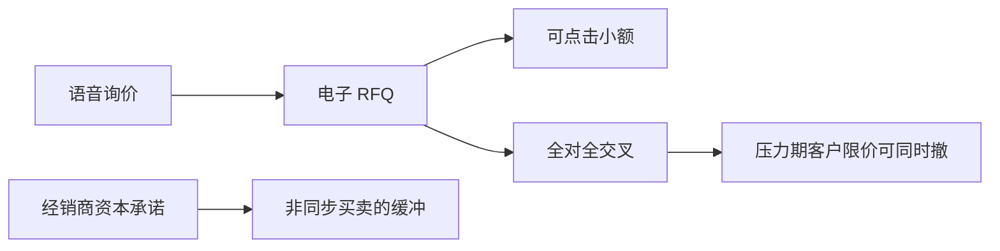

# 债券电子化与全对全

电子化可以只是把电话 RFQ 搬上网，中心仍是经销商存货；全对全则试图让客户与客户直接相遇。后者看起来像股票限价簿，契约异质与资本承诺一变，深度仍可能是指示性的。

<footer>—— O'Hara and Zhou, The electronic evolution of corporate bond dealers, Journal of Financial Economics, 2021；Bessembinder, Jacobsen, Maxwell and Venkataraman, Journal of Finance, 2018</footer>

[RFQ 平台](/quant/rfq-platforms) 把询价报文化。缺口是债券这条腿走得更远：电子 RFQ 普及之后，出现客户对客户的全对全（all-to-all）匹配。[TRACE](/quant/bond-liquidity-trace) 已经用打印看到事后透明压低成本；本课写事前协议如何变——经销商是否仍提供资本承诺，还是退成代理。不重写询价生命周期会计，不把期限溢价的宏观决定拉进来。

## 问题

金融危机之后，经销商资产负债表更贵，公司债里「用存货连接非同步买卖」的传统供给下降。Bessembinder 等人记录资本承诺与流动性的变化：打印可以仍在，愿意扛隔夜风险的主体变少。电子 RFQ 加快搜索，部分替代语音，但不自动产生公共深度。全对全让买方看见卖方客户的意向（或反过来），平台做交叉而不是先买进自己的账。问题是：全对全是在恢复拍卖市场的厚度，还是在经销商撤退之后用客户限价去填一个本来就不适合 CLOB 的资产？O'Hara 与 Zhou（2021）跟踪电子化如何改变经销商行为与市场质量，对象正是这一演变，而不是「债券终于像股票了」。

同质的国债、活跃的投资级大券，电子与全对全走得远；高收益、冷门、复杂条款仍停在 RFQ 与语音。分层比口号重要。

### 全对全不是全国保护报价

即使平台展示可点击价格，通常没有 Reg NMS 式订单保护，没有全国时间优先，尺寸一变价格就不再承诺。客户挂单还要担心信息泄露：债券持仓本身是信号。全对全的「簿」更接近暗池加指示性报价，而不是 [LOB](/quant/lob-structure) 的公共阶梯。把全对全深度加进冲击模型当可重复供给，会在压力期发现对手与你一起消失——客户限价不是做市资本。

指数纳入、ETF 申赎把非弹性流同步到同一天。全对全若没有经销商存货做缓冲，冲击更像收盘拍卖里的强制同步，而不是 Kyle 噪声掩护。

## 方法

按渠道拆量：语音、电子 RFQ、可点击、全对全。质量：相对基准的加价、回复率、经销商净存货变化、大额成交的延迟披露是否仍被使用。识别电子化效应要用平台渗透或规则变化，不能用时间趋势——同一时期资本监管、ETF 扩张与透明度规则一起动。Bessembinder 等强调资本承诺：看经销商是否仍在客户买卖之间取中间、隔夜持仓是否下降。O'Hara–Zhou 看电子渠道如何改变做市进入与价差。TRACE 打印是结果，渠道来自平台或研究文件的标志。

不要把股票有效价差公式套在全对全中点上；中点往往不可成交。继续用分层规模的往返成本与变现时间。

## 机制

电子 RFQ 降低搜寻摩擦，加价下降，与 Duffie 比较静态一致。全对全进一步削弱经销商的双边垄断，但把即时性公共品从资本转到客户挂单。平静期活跃券上，客户限价可以很厚，看起来像股票近端；压力期或评级事件，客户意向与经销商存货一齐收缩，螺旋比有义务做市的股票更快——债券通常没有 LULD 式公共停机。ETF 做市商成为新的中间层：他们在全对全与 RFQ 上进出，把篮子冲击传到个券，又把个券冲击传回股票腿。

对执行：活跃投资级小额可以用电子；目标面值仍要假设 RFQ 沉默。全对全填成是概率，失败后回到经销商询价，两段时钟都要进实施缺口。

## 边界

美国投资级电子化不能代表中国银行间、欧洲公司债或贷款。市政债、ABS 有自己的报告与平台。可转债同时走股票通道，不要只用债券电子份额去估转债冲击。下一课换资产：外汇的电子化更早、层级不同，last look 把「可点击」又写成可撤销的期权。

「全对全占比上升」本身不是质量。若同时经销商存货下降，平均加价可以下降而尾部变现成本上升。

## 小结

- 电子 RFQ 压缩搜索成本；全对全改变谁提供即时性，不自动复制股票保护簿。
- 经销商资本承诺与电子渠道是两件事实，必须同时读。
- 活跃券与冷门券、平静与压力，电子化的符号可以相反。
- 出处：O'Hara and Zhou, *JFE*, 2021；Bessembinder, Jacobsen, Maxwell and Venkataraman, *Journal of Finance*, 2018；对照 Edwards, Harris and Piwowar 的透明度结果。
