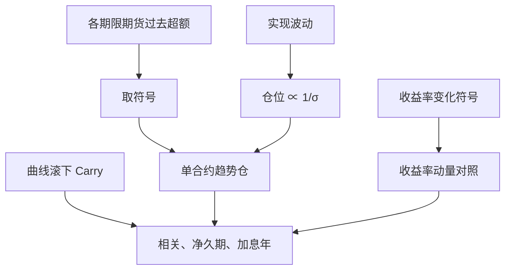

# 债券趋势

国债期货上的时间序列动量不是久期的被动多头：信号看的是债券自身过去超额的符号，仓位还要按波动缩放；收益率曲线的滚下是 Carry，不是趋势。

<footer>—— 据 Moskowitz, Ooi & Pedersen, Time Series Momentum, Journal of Financial Economics, 2012 对国债期货样本的处理整理</footer>

[上一课](/quant/fx-carry-mom)把外汇写成两维：Carry 用利率差或远期升水，动量用过去收益；美元因子不是套息。缺口是债券这条腿多了一层坐标：你可以跟踪期货价格、跟踪收益率、也可以跟踪某一关键利率的变动。本课只写 **债券趋势** 与[久期](/quant/duration-convexity)、曲线[Carry](/quant/carry-everywhere) 如何分开。不重讲 HML-FX。不要把 60/40 里债券的长期牛市夏普叫做趋势 alpha。

## 问题

外汇已经把收入腿与价格路径拆开。国债期货的超额同时含滚下、票息与价格变动：TSMOM 若对总收益取符号，期限溢价会混进趋势。缺口是坐标：用期货总收益的符号，趋势里已经含了 Carry；用收益率变化的符号再乘久期，得到「收益率动量」，与价格动量差一个负号和一个时变久期。复制必须先锁定坐标，否则 2010 年代的久期牛市会被重复计算。

第二个问题是哪一条曲线、哪一个合约。2 年与 30 年可以走相反的趋势：短端跟政策、长端跟期限溢价与通胀。把「债券」当成单一资产做 TSMOM，等于让久期最长、波动最大的合约说话。跨期限的趋势是曲线形态交易，不是单一 TSMOM。与[收益率曲线因子](/quant/yield-curve-factors)对照：水平、斜率、曲率是截面分解；趋势是每个合约自己的时间序列。

### 价格动量与收益率动量差一个负号

对久期 $D$ 的债券，价格收益近似 $-D\Delta y$ 加上 Carry。价格上涨趋势等价于收益率下行趋势，但 Carry 为正时，价格可以涨而收益率几乎不动。TSMOM 原文用期货超额收益，已经把展期算进收益，因此与纯 $\mathrm{sign}(-\Delta y)$ 不完全相同。若研究目标是货币政策方向，收益率动量更干净；若目标是可交易的期货盈亏，应保留总收益符号。两者应并列表，而不是互相改名。

个券现货的趋势还要处理拍卖、新券旧券切换与 CTD 切换。文献主结果在流动国债期货。不要用信用债或可转债的价格动量去验证 2012 年国债期货结论。

## 方法

合约：2、5、10、30 年国债期货或对应的国际品种（Bund、Gilt、JGB）。每月看过去 1、3、6、12 个月超额，主结果常在 12 个月；持有约 1 个月。单合约仓位与实现波动成反比，目标波动在组合层再对齐。也可以做截面：同一日期多过去强的期限、空过去弱的期限，那是期限之间的相对趋势，净久期不必为零——因为波动缩放后 30 年的单位风险仍可能主导。

检验：对每个合约回归未来收益于过去收益符号；再报告与被动多头久期、与曲线 Carry（roll-down）的 α。Carry 高的长端在收益率不变时赚钱；趋势在收益率继续沿过去方向走时赚钱。两者可以同号（收益率下行的牛市里 Carry 与趋势一起正），也可以反号（收益率上行时 Carry 仍可能为正、趋势为负）。这正是分开持有的理由。

### 波动缩放在债市里几乎就是久期缩放

债券波动大致随久期上升。$\sigma_{\mathrm{tgt}}/\hat\sigma$ 会自动降低 30 年相对 2 年的名义张数，使组合接近风险平价而不是名义等权。不加缩放时，趋势盈亏被长端主导，短端信号几乎看不见。缩放不是把信息变多，只是让各期限的趋势有相近的发言权。政策转向时短端波动先跳，缩放会立刻砍短端杠杆——这既减回撤，也可能在加息初段少赚。

## 机制

风险：期限溢价随增长与通胀预期变化，已实现的债券收益会留下趋势；做多「已涨的债券」等于做多某种久期择时。套保：养老金与保险持续买入长久期，提供给趋势一侧一条慢变量，但解释不了空头腿在加息周期里的盈利。行为：投资者对政策路径反应不足，随后再定价，形成中期收益率趋势。2022 年是压力测试：通胀冲击让收益率趋势持续为负，价格 TSMOM 做空债券期货，与 60/40 的债券腿相反。

与外汇、商品 TSMOM 的差别在于约束。债券有明确的政策反应函数与有效下限：零利率附近波动压缩，趋势信号变弱、仓位被缩放放大名义久期，一旦加息开启，杠杆与方向一起出错。曲线形态可以自己做趋势：陡峭化持续时，2s10s 价差动量是另一条策略，不应并进单一 10 年合约的 TSMOM 而不声明。

### 把滚下从趋势里拿出来

商品期货的过去十二个月含大量展期；国债期货同样含 roll 与便宜交割期权。若动量用总收益、Carry 用同一段曲线斜率，两条腿双计。干净的做法是：趋势用经过久期调整的价格或用收益率变化，Carry 独占 roll-down 与票息。若坚持用总收益 TSMOM，就不要再宣称相对 Carry 的正交 alpha，除非回归里已经控制了当期斜率。

中国国债期货有交割与基差制度，趋势回测必须换月到成交活跃合约，并处理节假日与夜盘缺失。直接套用 CME 国债的十二个月窗口，会把不存在的交易时段写进收益。

## 边界与工程取舍

换月、CTD 切换、最便宜可交割券的期权价值，属于成本与噪声，不是附录。目标波动定高了，杠杆与回撤按比例放大。股票—债券相关变号时，跨类 TSMOM 的债券腿不再自动对冲权益回撤；2010 年代负相关不是定理。信用债的趋势混有违约与利差动量，与利率趋势不可比。

不要把「长期国债平均收益为正」叫做债券趋势。不要把收益率水平当价值、把收益率变化当趋势却用同一张图的两条线当正交因子。不要在已经持有被动长久期的组合里，把债券 TSMOM 的多头年当成独立的第三利润源。实施上优先期货、优先波动缩放、优先分期限报告净久期路径。

出处：Moskowitz, Ooi & Pedersen, *Time Series Momentum*, JFE 2012，其样本含国债期货。跨资产 Carry 见 Koijen 等，2018。期限溢价时变见 Cochrane–Piazzesi 一类预测回归，那是水平预测，不是本篇的符号趋势。不要把两条文献写成同一策略。

## 小结

- 债券趋势是合约自身过去超额（或收益率变化）的符号，加波动缩放；不是被动久期。
- 价格动量与收益率动量差一个负号，且总收益里含 Carry；复制须锁定坐标。
- 分期限的趋势可以相反；单一「债券」标签会被长端波动主导。
- 与曲线滚下相关但不恒等；双计是最常见的报告错误。
- 有效下限与政策转向会改变波动缩放后的名义杠杆，加息年是必测样本。
- 换月与 CTD 是交易成本，不是脚注。
- 出处：Moskowitz, Ooi & Pedersen, Journal of Financial Economics, 2012。
