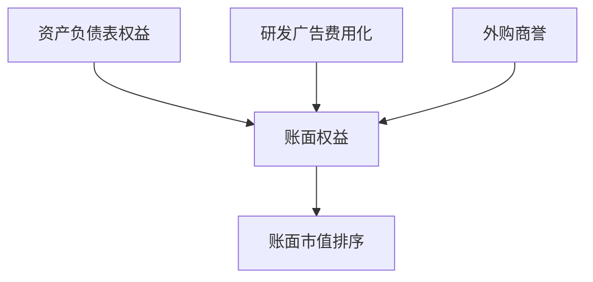

# 账面价值与无形资产

账面权益是会计方程的残差，不是重置成本；研发与品牌大多费用化，于是「便宜」可能只是账上缺了一块资产。

<footer>—— 据 Penman, Financial Statement Analysis；Fama and French, Journal of Financial Economics, 1993 对账面权益的构造整理</footer>

上一课[盈利质量](/quant/earnings-quality)把利润拆成更可持续与更易反转的部分。价值因子用的却是账面权益对市值。账面从[三张表怎么连](/quant/three-statements-link)的权益链来，但权益里缺什么、多了什么，会让 HML 排序比较的不是同一类经济资产。本课只补账面作为因子输入时的缺口，不重写质量定义。

## 问题

Fama–French 的 HML 用 Compustat 账面权益配 CRSP 市值，并在六月形成组合。账面是会计恒等式里的残差：资产减负债减优先股等。研发、广告、人力资本在多数准则下费用化，不进资产，于是知识密集公司账面偏低、账面市值偏高，看起来像成长。反过来，外购商誉进账面，自制品牌不进，并购活跃的公司账面被抬高。缺口是：价值排序在比较**可确认的会计净资产**，不是比较经济净资产。

后课因子来源课会问字段从哪张表取；本课先承认账面不是通用价值尺度，尤其当无形资产占比随行业变化。

### 账面低不是一定低估

低账面市值可以是便宜，也可以是账上没记的无形资产、多年亏损把权益蚀空、或即将退市的残值。质量课已经提示便宜与低质量共线。本课补的是计量：即使利润可持续，账面仍可能因为费用化规则而系统性偏低。用行业中性化或无形资产调整，是承认尺度，不是否定价值溢价。

Lev 等人强调费用化研发会压低账面、压低当期利润并抬高后续利润。价值与盈利因子会同时被这套会计触及。

## 方法

因子用的账面，取 PIT 下当时可用的股东权益，按 Fama–French 惯例调整优先股、并视情况加回递延税与一些储备——细节以你锁定的构造说明为准，不要混用「最新总权益」。市值用形成日的价格乘当时股本，股本口径与下一课稀释一致。

若要减弱无形资产扭曲，常用做法是行业内排序（Fama–French 48 或 GICS），或把累积研发费用资本化后加回账面。后者引入自己的可用日期与摊销假设，必须写进 PIT：不能用今天的研发资本化规则回填二十年。本课不把资本化做成标准定义，只把它标成对账面尺度的可选修正。

研发资本化是可选修正，必须自带摊销年限与 PIT，不能回写进官方 HML。负账面留在宇宙并排除出价值端，规则写死。行业中性吸收费用化差异，不在个股上估品牌。

## 机制

价值溢价的经验结果建立在「会计账面 / 市值」上，不是建立在「重置成本 / 市值」上。会计账面漏记自制无形资产时，排序把科技与消费品牌推进成长端；把并购商誉记进去时，又把收购方推进价值端。行业中性是最便宜的修补：在可比会计规则内比相对便宜。后课行业分类就是为这件事服务，不是为了 macro 故事。

账面可以是负的。负账面公司常被踢出 HML 的价值端或单独处理；无声丢弃会再造幸存者。

复制 HML 时，账面取当时年报权益并按说明书调整优先股，市值取形成日；负账面剔除出价值端但留在宇宙以便报告覆盖。若做研发资本化，摊销年限与可用日期写进同一张来源卡，切勿用今日市值高的科技公司「反推」它们早该被资本化的账面。行业中性是默认修补：在 FF48 或 GICS 内比相对账面市值，避免把会计规则差写成价值溢价。

## 边界

不写无形资产会计准则全文，不估品牌估值模型。商誉减值下一课之后才专讲；股份稀释影响的是市值分母与每股账面，下一课补。后课默认：价值因子的账面是 PIT 会计权益，已知其对自制无形资产有偏，比较默认在行业内或有记录的调整规则下进行。

后课股份稀释会改市值分母，本课的账面分子保持会计权益。不要用「无形资产调整后的经济账面」去复制 French 库还声称一致。负账面、金融股是否入 HML，整段样本只执行一种说明书。自制品牌不进账面这件事，用行业中性吸收，而不是在个股上估一个品牌市值。

账面市值比较的是会计净资产对市值，不是重置成本；后课默认价值排序在行业内或有记录的无形资产规则下进行。

## 小结

- 账面是会计残差，不是经济净资产。
- 费用化无形资产让知识密集公司看起来像成长。
- Fama–French 的 HML 用的就是这块会计账面，六月形成。
- 行业内排序是尺度修补；资本化研发必须自己遵守 PIT。
- 负账面要有规则，不能静默删除。
- 出处：Penman；Fama and French (1993)；无形资产与研发费用化文献（Lev 等）。
