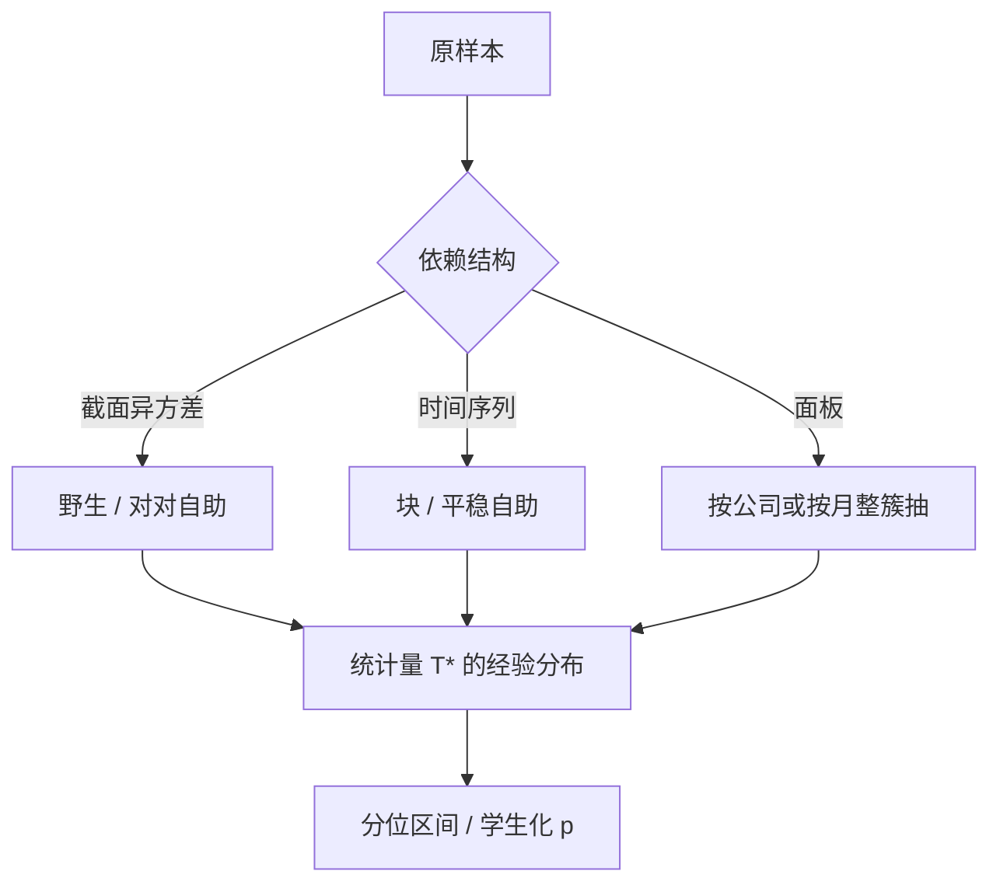

# Bootstrap 在金融

渐近标准误把「样本量已经够大、分布已经够正态」写进临界值；自助法则用样本自己的经验分布去重算统计量，金融里这两条常常同时不成立。

<footer>—— Efron, Bootstrap Methods: Another Look at the Jackknife, Annals of Statistics, 1979；相依数据见 Künsch 块自助与 Politis–Romano 平稳自助</footer>

[聚类标准误](/quant/clustered-se) 仍是一阶渐近：聚类数 $G\to\infty$、$G_c$ 近似正态。金融里 $G$ 经常是 40 个行业、20 年、十几个事件；收益肥尾，一次闪崩主导二次矩。此时三明治的 $t$ 名义水平不可信。自助法用重抽样逼近 $\hat\beta$ 或检验统计量的有限样本分布。本课缺口是：**金融不能对行做 i.i.d. 自助**——那会拆掉 Newey–West 与聚类刚刚承认的依赖。后课固定效应、工具变量会把自助用在更脆的估计量上；这里先把合法的重抽样单位钉死。

## 问题

要对 $T(\hat\theta-\theta)$ 的分布做推断，经典做法用正态极限。Efron 的自助把样本当作总体，从中再抽 $B$ 次，得到 $\{T^*_b\}$，用其分位当临界值。一致性要求自助数据生成过程与真依赖同类：独立则有放回抽观测；时间序列则抽块；面板则抽公司（或抽年）。

问题是选对**重抽样原子**。对日收益回归做普通对对自助（pairs bootstrap），等于宣布残差无序列相关，会把 HAC 问题再藏起来。对重叠长期收益做残差自助而不切块，会低估重叠造成的方差。对象是检验的水平与区间覆盖，不是「再算一个更大的标准误」。

### 哪一种自助对应哪一种依赖

- **对对 / 残差自助**：截面近似独立、异方差（残差自助要同方差或要按 $x$ 分层）。
- **块自助（Künsch）或平稳自助（Politis–Romano）**：时间序列短记忆；块长类似 HAC 带宽。
- **聚类自助**：抽公司或抽月，组内整块保留。
- **野生自助（wild bootstrap）**：异方差、杠杆点；对残差乘 Rademacher 权重，适合肥尾。

自助不是「让结果变显著」的旋钮。若经济上只有 12 次独立危机，无论 $B=10000$ 都变不出第 13 次危机。$B$ 只降低蒙特卡洛误差，不增加信息。

## 方法

**回归。** 对对自助：重抽 $(y_i,x_i)$。残差自助：固定 $X$，重抽 $\hat u$（可野生）。金融截面异方差用野生更稳。报告百分位区间与 $B$；偏差校正（BCa）在强偏斜率（如 $R^2$、夏普）上值得。

**时间序列。** 块长 $L$ 与 Newey–West 的 $L$ 同阶。平稳自助随机切块，对边缘效应更平滑。单位根、长记忆下普通块自助不一致，应换筛自助或先差分。波动预测的 QLIKE 比较用 Diebold–Mariano 的自助版本，见后课 [QLIKE](/quant/qlike-vol-forecast-eval)。

**多重规则。** White 的 Reality Check 与 [Hansen SPA](/quant/hansen-spa) 本身就是自助检验：对最大绩效统计量重抽样。这里的教训是：自助的原假设必须对准你要的命题（有没有优于基准的规则），而不是对准单个系数。

### 与渐近并列，而不是互相替代

大 $T$、薄尾、依赖短，HAC/聚类与自助应接近；不接近时，先查重抽样是否拆了依赖，再查渐近是否太乐观。小样本里自助可以仍偏：块太短像 White，块太长像只有几个观测。应报告块长敏感性。

## 机制

自助有效，是因为经验测度在弱定律下靠近真测度，连续泛函（均值、分位、根）的分布被带着走。依赖数据要把经验测度定义在块上，否则经验测度是错误总体（独立乘积）的。肥尾下均值的自助可以不一致（无限方差）；金融收益接近这个边界，应对收益用稳健泛函，或对 $t$ 统计量自助（studentize）而不是对 $\hat\beta$ 自己。

Studentize 的机制：先除以每次自助样本的标准误，临界值针对 $t^*$ 而不是 $\hat\beta^*$。异方差与偏度对 $t$ 的影响部分被吸收，覆盖通常更好。这是 Horowitz 强调的「对枢轴量自助」。

夏普比率、最大回撤、最优权重是高度非线性泛函，自助分布会很偏。先 studentize，并报告中位数与百分位，不要只报自助标准误再当正态用——那把自助退回一阶渐近。

### 非法自助的典型样子

用全样本估 $\beta$ 再在样本内自助 $t$，却把排序、变量选择、winsor 阈值留在自助之外——过拟合被当成总体特征。合法做法：每条自助路径重做全部预处理。事件研究自助应对事件（公司–日）抽样，而不是对日历日打散事件窗。

## 边界与工程取舍

$T=60$ 个月的因子回归，块自助块长 6 则大约 10 块，分布很噪。高频 tick 上块自助计算贵，应先聚合。GMM 过度识别时，自助权重矩阵要按 Hall 与 Horowitz 的方式中心化，否则过度拒绝。

工程：截面用野生或聚类自助；时间序列用平稳块；$B\ge 999$ 报 p 值网格。不要对已经双向聚类的面板再做拆行自助当「稳健」。不要用自助 p 值替代识别策略。与 [White Reality Check](/quant/white-reality-check) 相连时，自助的是最大统计量，不是单个 alpha。

## 小结

- 金融样本短、尾厚、依赖强时，一阶三明治的名义水平不可靠，应对枢轴量做自助。
- 重抽样原子必须匹配依赖：块对应 HAC，簇对应聚类，禁止拆行 i.i.d. 自助。
- $B$ 只减模拟误差；独立危机次数才是信息量。
- 预处理、选择、重叠必须在每条路径内重做。
- 出处：Efron, *Annals of Statistics*, 1979；块自助见 Künsch, *Annals of Statistics*, 1989；平稳自助见 Politis and Romano, *Journal of the American Statistical Association*, 1994。
